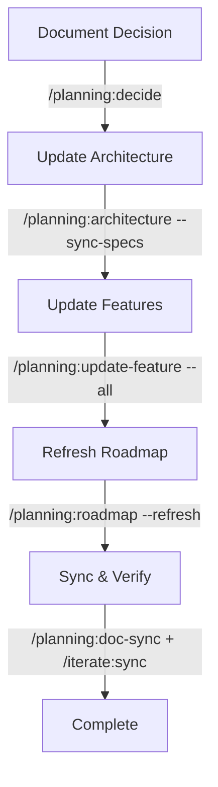

# Systematic Architecture & Documentation Updates

**Quick Reference for Updating Key Planning Documents**

This guide shows how to systematically update architecture, ADRs, roadmap, and specs when requirements change.

---

## 🚀 Quick Update Workflow

### Scenario: Architecture Changed

```bash
# 1. Update architecture (auto-updates affected specs)
/planning:architecture update --sync-specs

# 2. Refresh roadmap based on updated specs
/planning:roadmap --refresh

# 3. Sync everything to memory
/planning:doc-sync redai2
```

### Scenario: New Architectural Decision

```bash
# 1. Document the decision (superseding old one if needed)
/planning:decide "New database approach" --supersede ADR-003

# 2. Update architecture to reflect decision
/planning:architecture update --sync-specs

# 3. Refresh roadmap
/planning:roadmap --refresh
```

### Scenario: Update All Features with Same Change

```bash
# 1. Update all features at once
/planning:update-feature --all "Updated to use new API endpoints"

# 2. Refresh roadmap to reflect changes
/planning:roadmap --refresh
```

---

## 📋 Available Update Flags

### `/planning:architecture <action> [--sync-specs]`

**Flag**: `--sync-specs`
**Purpose**: Automatically update all specs that reference the architecture after changes
**When to use**: When architecture changes affect multiple features

**Example**:
```bash
/planning:architecture update --sync-specs
```

**What it does**:
1. Updates architecture documentation
2. Identifies all specs referencing architecture
3. Auto-updates each affected spec with architecture changes
4. Syncs to Mem0 for tracking

---

### `/planning:roadmap [timeframe] [--refresh]`

**Flag**: `--refresh`
**Purpose**: Regenerate roadmap from current specs and architecture
**When to use**: After spec changes, architecture updates, or feature additions

**Example**:
```bash
/planning:roadmap --refresh
```

**What it does**:
1. Backs up existing roadmap to `ROADMAP.backup.md`
2. Analyzes all current specs
3. Regenerates roadmap with updated timelines
4. Preserves milestones and phases

---

### `/planning:update-feature <spec-number> [changes] [--all]`

**Flag**: `--all`
**Purpose**: Update all features with the same change
**When to use**: When a change affects all features (e.g., new API patterns, architecture shifts)

**Example**:
```bash
/planning:update-feature --all "Updated to use GraphQL instead of REST"
```

**What it does**:
1. Lists all features
2. Confirms with user
3. Updates each feature with the change
4. Updates roadmap
5. Creates ADR if architectural

---

### `/planning:decide [decision-title] [--supersede ADR-XXX]`

**Flag**: `--supersede ADR-XXX`
**Purpose**: Create a new ADR that supersedes an old one
**When to use**: When an architectural decision changes (ADRs are immutable)

**Example**:
```bash
/planning:decide "Switch from PostgreSQL to MongoDB" --supersede ADR-004
```

**What it does**:
1. Creates new ADR with sequential number
2. Links to superseded ADR
3. Marks old ADR as "Deprecated"
4. Explains why decision changed
5. Tracks implementation specs

---

## 🔄 Complete Systematic Update Example

**Scenario**: You're working on redai2 and need to update the entire tech stack from REST to GraphQL.

### Step 1: Document the Decision

```bash
/planning:decide "Migrate API from REST to GraphQL" --supersede ADR-002
```

**Output**: Creates ADR-015, marks ADR-002 as deprecated

---

### Step 2: Update Architecture

```bash
/planning:architecture update --sync-specs
```

**Output**:
- Updates architecture docs with GraphQL patterns
- Auto-identifies affected specs (F001, F002, F003)
- Updates each spec with new architecture
- Syncs to Mem0

---

### Step 3: Update Remaining Features

```bash
/planning:update-feature --all "Updated API calls to use GraphQL"
```

**Output**:
- Updates all features with GraphQL patterns
- Updates tasks.md in each spec
- Updates roadmap automatically

---

### Step 4: Refresh Roadmap

```bash
/planning:roadmap --refresh
```

**Output**:
- Regenerates roadmap from updated specs
- Adjusts timelines for migration work
- Backs up old roadmap

---

### Step 5: Verify Sync

```bash
/planning:doc-sync redai2
/iterate:sync
```

**Output**:
- Confirms all docs synced to memory
- Shows implementation vs spec status

---

## 🎯 When to Use Each Flag

| Flag | Use When | Impact |
|------|----------|--------|
| `--sync-specs` | Architecture changes | Updates all affected feature specs |
| `--refresh` | Specs/features changed | Regenerates roadmap from current state |
| `--all` | Same change to all features | Bulk updates all specs |
| `--supersede` | Decision changes | Creates new ADR, deprecates old one |

---

## ✅ Best Practices

### 1. Always Sync After Updates

```bash
# After any systematic update
/planning:doc-sync redai2
```

### 2. Verify Implementation Alignment

```bash
# Check if code matches updated specs
/iterate:sync
```

### 3. Back Up Critical Docs

Flags automatically backup:
- `--refresh` → Creates `ROADMAP.backup.md`
- `--supersede` → Marks old ADR as deprecated (preserved)

### 4. Update in Order



---

## 🚨 Common Mistakes to Avoid

### ❌ Don't Skip Architecture Updates

```bash
# WRONG - Updates specs without updating architecture first
/planning:update-feature --all "New patterns"
```

```bash
# CORRECT - Update architecture, then specs
/planning:architecture update --sync-specs
/planning:roadmap --refresh
```

---

### ❌ Don't Manually Edit Superseded ADRs

```bash
# WRONG - Editing ADR-002 to change decision
vim docs/adr/002-old-decision.md
```

```bash
# CORRECT - Create superseding ADR
/planning:decide "New decision" --supersede ADR-002
```

---

### ❌ Don't Forget to Sync

```bash
# WRONG - Updates without syncing
/planning:architecture update
# ... then forget to sync
```

```bash
# CORRECT - Always sync after updates
/planning:architecture update --sync-specs
/planning:doc-sync redai2
```

---

## 📊 Impact Analysis

After systematic updates, check impact:

```bash
# See which specs were affected
/planning:analyze-project

# See implementation alignment
/iterate:sync

# Verify task completion
/quality:validate-tasks F001
```

---

## 🔍 Troubleshooting

### Problem: `--sync-specs` doesn't find affected specs

**Solution**: Ensure Mem0 is installed and /planning:doc-sync was run

```bash
# Check if Mem0 available
source /tmp/mem0-env/bin/activate
python -c "import mem0; print('Mem0 installed')"

# If not, sync is skipped (manual updates needed)
```

---

### Problem: `--refresh` overwrites custom roadmap changes

**Solution**: Backup is automatically created, restore if needed

```bash
# Restore from backup
cp docs/ROADMAP.backup.md docs/ROADMAP.md

# Or merge manually
```

---

### Problem: `--all` confirmation prompt

**Solution**: This is intentional - confirms before bulk update

```bash
# Answer "yes" to proceed with bulk update
```

---

## 📚 Related Commands

- `/planning:analyze-project` - Check spec completeness
- `/planning:architecture validate` - Validate architecture
- `/iterate:sync` - Sync specs with implementation
- `/quality:validate-code` - Validate code against specs

---

**Last Updated**: 2025-11-12
**Applies To**: dev-lifecycle-marketplace v2.0+
