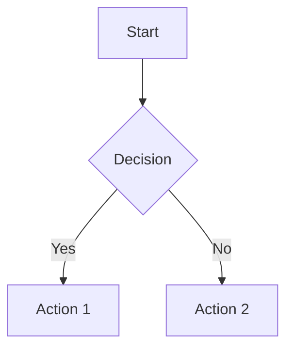
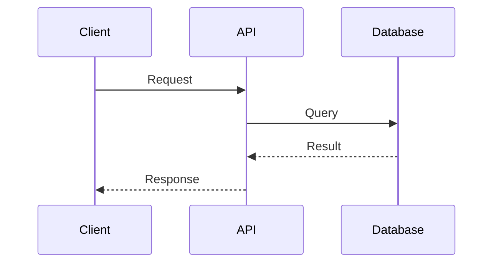
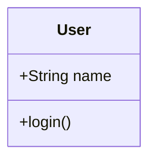
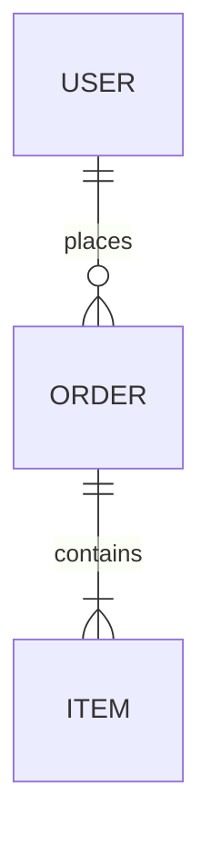
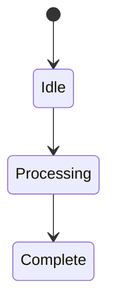
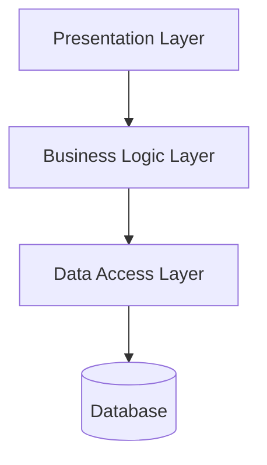
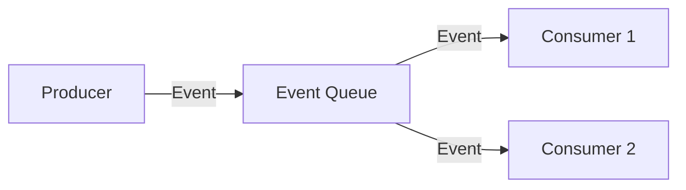
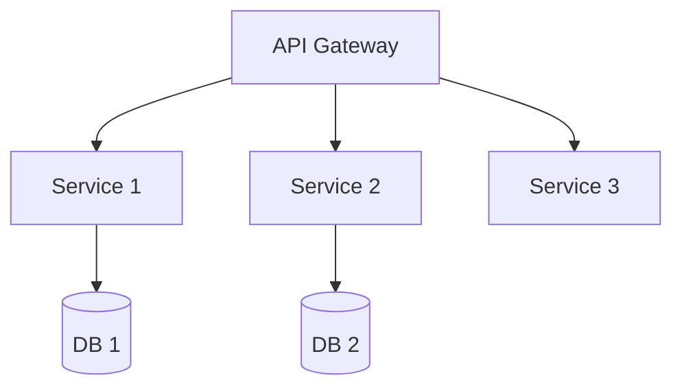

# Architecture Patterns Skill

**CRITICAL: The description field above controls when Claude auto-loads this skill.**

## Overview

Provides comprehensive architecture design capabilities including mermaid diagram generation, architecture documentation templates, diagram validation, and pattern libraries for common architectural styles (microservices, RAG systems, full-stack applications).

## Instructions

### Create Architecture Documentation

1. Use `bash scripts/create-architecture.sh <project-path> <architecture-type>` to scaffold architecture docs
2. Architecture types: `nextjs`, `fastapi`, `fullstack`, `microservices`, `rag`, `generic`
3. Generates complete architecture overview with mermaid diagrams
4. Creates directory structure: `docs/architecture/` with overview, components, data-flow, deployment
5. Includes table of contents and cross-references

### Validate Mermaid Diagrams

1. Use `bash scripts/validate-mermaid.sh <markdown-file>` to check mermaid syntax
2. Validates diagram types: graph, flowchart, sequenceDiagram, classDiagram, erDiagram, stateDiagram
3. Checks for syntax errors, invalid node definitions, broken connections
4. Reports line numbers of errors
5. Provides suggestions for common fixes

### Generate Diagram Placeholders

1. Use `bash scripts/generate-diagrams.sh <output-dir> <diagram-types>` to create diagram templates
2. Diagram types: `component`, `data-flow`, `deployment`, `api`, `security`, `all`
3. Creates markdown files with properly formatted mermaid code blocks
4. Includes comments explaining diagram sections
5. Provides example nodes and relationships

### Update Existing Architecture

1. Use `bash scripts/update-architecture.sh <architecture-file> <section>` to add new sections
2. Sections: `component`, `api`, `security`, `deployment`, `data-flow`
3. Inserts section with proper heading hierarchy
4. Adds mermaid diagram placeholder
5. Preserves existing content and formatting

### Export Diagrams to Files

1. Use `bash scripts/export-diagrams.sh <markdown-file> <output-dir>` to extract diagrams
2. Extracts all mermaid code blocks from documentation
3. Creates individual `.mmd` files for each diagram
4. Names files based on diagram titles or section headings
5. Generates index.md listing all exported diagrams

## Available Scripts

- **create-architecture.sh**: Scaffold complete architecture documentation with diagrams
- **validate-mermaid.sh**: Validate mermaid diagram syntax and structure
- **generate-diagrams.sh**: Create diagram template placeholders
- **update-architecture.sh**: Add new sections to existing architecture docs
- **export-diagrams.sh**: Extract mermaid diagrams to separate files

## Templates

- **architecture-overview.md**: Master architecture document template with TOC
- **component-diagram.md**: Component architecture with relationships
- **data-flow-diagram.md**: Data flow and processing pipelines
- **deployment-diagram.md**: Infrastructure and deployment architecture
- **api-architecture.md**: API design, endpoints, and authentication
- **security-architecture.md**: Security patterns, auth flows, data protection

## Examples

See `examples/` directory for detailed usage examples:
- `example-nextjs-architecture.md` - Next.js 15 App Router architecture
- `example-fastapi-architecture.md` - FastAPI backend with PostgreSQL
- `example-fullstack-architecture.md` - Full stack Next.js + FastAPI
- `example-ai-rag-architecture.md` - RAG system with vector database
- `example-microservices-architecture.md` - Microservices pattern with API gateway

## Architecture Patterns

### Component Architecture Pattern
- Define system components and boundaries
- Show component relationships and dependencies
- Identify shared services and libraries
- Document component responsibilities

### Data Flow Pattern
- Map data movement through system
- Show transformation and processing stages
- Identify data sources and destinations
- Document data formats and protocols

### Deployment Pattern
- Define infrastructure components
- Show service deployment topology
- Identify scaling and redundancy strategies
- Document environment configurations

### API Architecture Pattern
- Design API structure and endpoints
- Define authentication and authorization
- Show request/response flows
- Document rate limiting and caching

### Security Architecture Pattern
- Define security layers and boundaries
- Show authentication and authorization flows
- Identify threat vectors and mitigations
- Document encryption and data protection

## Mermaid Diagram Types

### Graph/Flowchart Diagrams

### Sequence Diagrams

### Class Diagrams

### Entity Relationship Diagrams

### State Diagrams

## Output Standards

- Use mermaid for all diagrams (ensures renderability)
- Include diagram titles and descriptions
- Add comments explaining key components
- Follow consistent naming conventions
- Use proper markdown heading hierarchy
- Include cross-references between documents

## Validation Checks

Scripts perform these validations:
- Mermaid syntax correctness
- Node and edge definitions
- Diagram type compatibility
- Character escaping in labels
- Proper code block formatting
- Complete relationship definitions

## Integration

This skill is used by:
- `planning:architecture` command - Generate architecture docs
- `architecture-designer` agent - Create system designs
- Documentation tools - Include architecture diagrams
- Code generation - Architecture-aware scaffolding

## Best Practices

1. Start with high-level overview diagram
2. Create separate diagrams for each architectural concern
3. Use consistent component naming across diagrams
4. Include legends for symbols and colors
5. Keep diagrams focused and readable (max 15-20 nodes)
6. Document assumptions and constraints
7. Version architecture documents
8. Update diagrams when system changes

## Common Diagram Patterns

### Layered Architecture

### Event-Driven Architecture

### Microservices Architecture

---

**Purpose**: Comprehensive architecture design and documentation
**Used by**: Architecture designers, system planners, documentation tools
