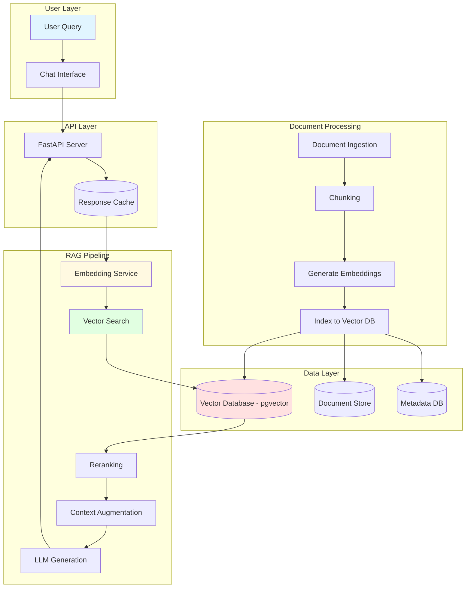
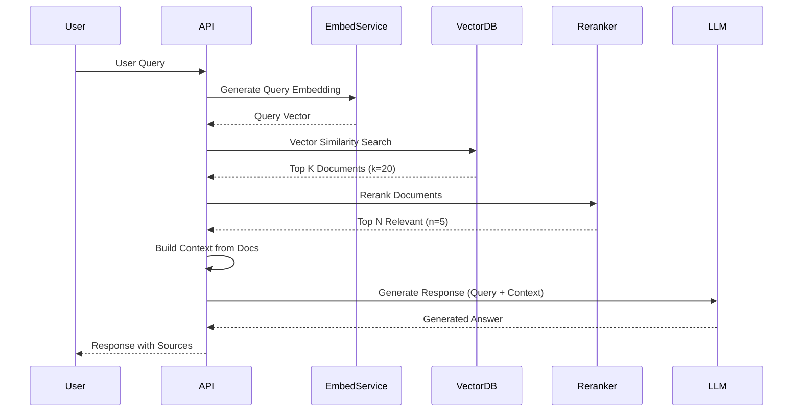
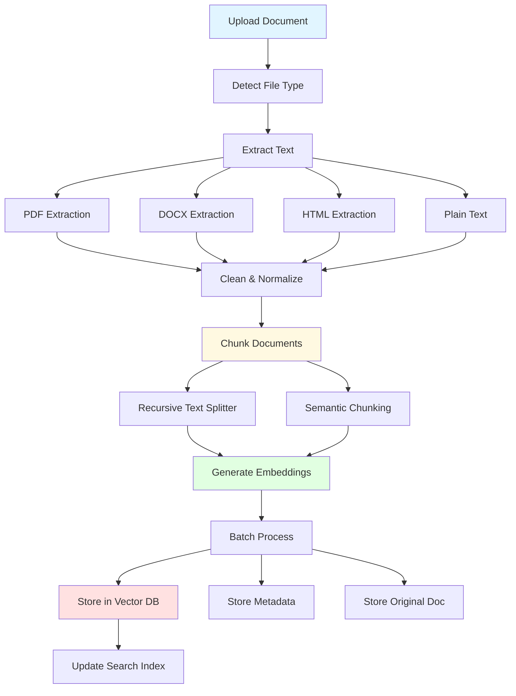
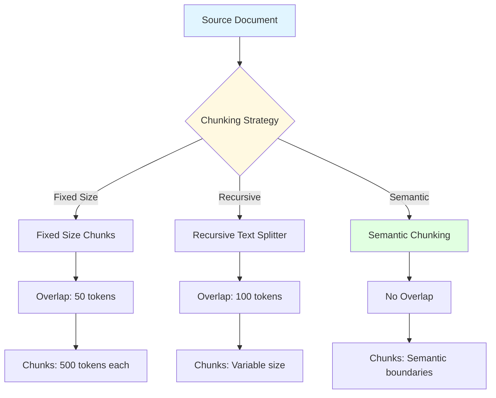
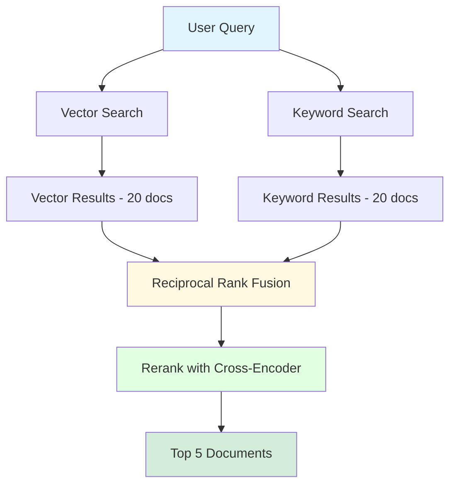
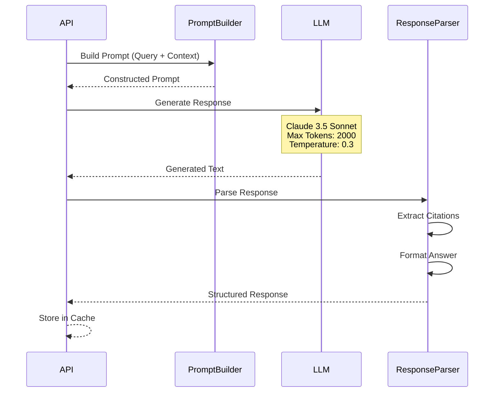
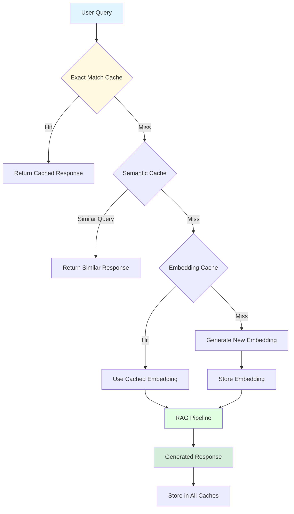
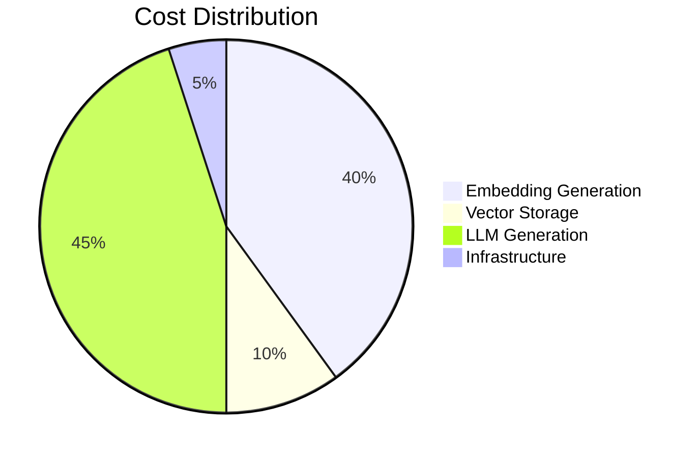
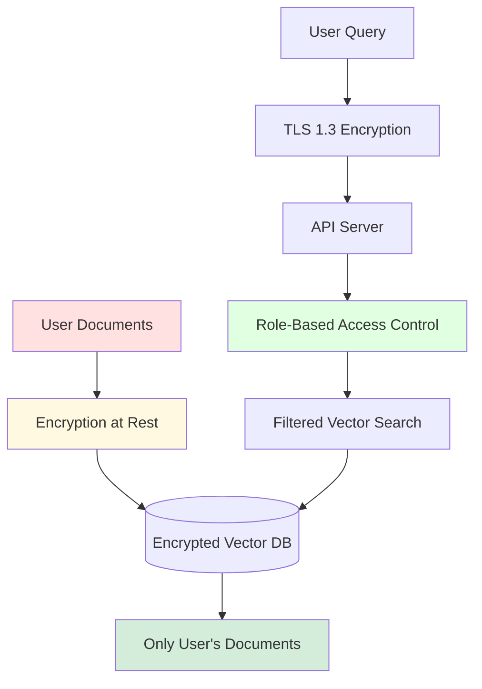

# Example: RAG System Architecture

> **Example Architecture**: Production RAG (Retrieval Augmented Generation) system with vector database
> **Last Updated**: 2025-01-01

## Overview

This example demonstrates a complete RAG system architecture using pgvector for embeddings, LangChain for orchestration, and Claude/OpenAI for generation.

---

## Technology Stack

### AI/ML Components
- **LLM**: Anthropic Claude 3.5 Sonnet / OpenAI GPT-4
- **Embeddings**: OpenAI text-embedding-3-large / Voyage AI
- **Framework**: LangChain / LlamaIndex
- **Vector DB**: Supabase (pgvector) / Pinecone
- **Document Processing**: Unstructured.io / LangChain Document Loaders

### Backend
- **API**: FastAPI (Python 3.12+)
- **Database**: PostgreSQL 16 with pgvector extension
- **Cache**: Redis for response caching
- **Queue**: Celery for async document processing

### Infrastructure
- **Hosting**: Vercel (API) + Supabase (Database)
- **File Storage**: S3 / Vercel Blob
- **Monitoring**: LangSmith / Weights & Biases

---

## High-Level Architecture



---

## RAG Pipeline Flow

### Query Processing



---

## Document Ingestion Pipeline

### Processing Flow



---

## Vector Database Schema

### Supabase with pgvector

```sql
-- Enable pgvector extension
CREATE EXTENSION IF NOT EXISTS vector;

-- Documents table
CREATE TABLE documents (
    id UUID PRIMARY KEY DEFAULT gen_random_uuid(),
    filename TEXT NOT NULL,
    file_type TEXT NOT NULL,
    file_size INTEGER NOT NULL,
    upload_date TIMESTAMPTZ NOT NULL DEFAULT NOW(),
    user_id UUID NOT NULL,
    metadata JSONB,
    CONSTRAINT fk_user FOREIGN KEY (user_id) REFERENCES users(id)
);

-- Document chunks with embeddings
CREATE TABLE document_chunks (
    id UUID PRIMARY KEY DEFAULT gen_random_uuid(),
    document_id UUID NOT NULL,
    chunk_index INTEGER NOT NULL,
    content TEXT NOT NULL,
    embedding vector(1536), -- OpenAI embedding dimension
    token_count INTEGER,
    metadata JSONB,
    created_at TIMESTAMPTZ NOT NULL DEFAULT NOW(),
    CONSTRAINT fk_document FOREIGN KEY (document_id) REFERENCES documents(id) ON DELETE CASCADE
);

-- Create HNSW index for fast similarity search
CREATE INDEX ON document_chunks USING hnsw (embedding vector_cosine_ops);

-- Create index on document_id for filtering
CREATE INDEX idx_chunks_document ON document_chunks(document_id);
```

### Vector Search Query

```sql
-- Similarity search with metadata filtering
SELECT
    dc.id,
    dc.content,
    dc.metadata,
    d.filename,
    1 - (dc.embedding <=> $1::vector) as similarity
FROM document_chunks dc
JOIN documents d ON dc.document_id = d.id
WHERE
    d.user_id = $2
    AND (dc.embedding <=> $1::vector) < 0.5  -- Similarity threshold
ORDER BY dc.embedding <=> $1::vector
LIMIT 20;
```

---

## Chunking Strategies

### Chunking Approaches



### Code Example

```python
from langchain.text_splitter import RecursiveCharacterTextSplitter

# Recursive chunking with overlap
text_splitter = RecursiveCharacterTextSplitter(
    chunk_size=1000,  # characters
    chunk_overlap=200,
    length_function=len,
    separators=["\n\n", "\n", " ", ""]
)

chunks = text_splitter.split_text(document_text)

# Semantic chunking (alternative)
from langchain_experimental.text_splitter import SemanticChunker
from langchain_openai import OpenAIEmbeddings

semantic_chunker = SemanticChunker(
    OpenAIEmbeddings(),
    breakpoint_threshold_type="percentile"
)

semantic_chunks = semantic_chunker.split_text(document_text)
```

---

## Retrieval Strategies

### Hybrid Search



### Multi-Query Retrieval

```python
# Generate multiple query variations
async def multi_query_retrieval(original_query: str):
    # Generate query variations
    variations = await generate_query_variations(original_query)

    # Parallel retrieval for all variations
    all_results = await asyncio.gather(*[
        vector_search(query) for query in variations
    ])

    # Deduplicate and rank
    unique_docs = deduplicate_documents(all_results)
    reranked = rerank_documents(unique_docs, original_query)

    return reranked[:5]
```

---

## Context Augmentation

### Prompt Construction

```python
SYSTEM_PROMPT = """
You are a helpful AI assistant. Answer questions based on the provided context.

If the context doesn't contain enough information to answer the question,
say "I don't have enough information to answer that question accurately."

Always cite your sources using [Source: filename] notation.
"""

def build_rag_prompt(query: str, retrieved_docs: List[Document]) -> str:
    # Build context from retrieved documents
    context_parts = []
    for i, doc in enumerate(retrieved_docs, 1):
        context_parts.append(
            f"[Source {i}: {doc.metadata['filename']}]\n{doc.content}\n"
        )

    context = "\n---\n".join(context_parts)

    # Construct final prompt
    prompt = f"""
{SYSTEM_PROMPT}

Context:
{context}

Question: {query}

Answer:
"""
    return prompt
```

---

## Response Generation

### LLM Integration



---

## Caching Strategy

### Multi-Level Caching



---

## Evaluation Metrics

### RAG Performance Metrics

```mermaid
graph TB
    subgraph "Retrieval Metrics"
        RECALL[Recall@K]
        PRECISION[Precision@K]
        MRR[Mean Reciprocal Rank]
    end

    subgraph "Generation Metrics"
        FAITHFULNESS[Faithfulness]
        RELEVANCE[Answer Relevance]
        COMPLETENESS[Completeness]
    end

    subgraph "End-to-End Metrics"
        LATENCY[Response Latency]
        COST[Cost per Query]
        USER_SAT[User Satisfaction]
    end

    EVAL[Evaluation Pipeline] --> RECALL
    EVAL --> PRECISION
    EVAL --> FAITHFULNESS
    EVAL --> RELEVANCE
    EVAL --> LATENCY
    EVAL --> COST

    style EVAL fill:#e1f5ff
    style FAITHFULNESS fill:#fff9e1
    style LATENCY fill:#e1ffe1
```

---

## Cost Optimization

### Strategies

1. **Caching**: Cache embeddings and responses
2. **Batch Processing**: Generate embeddings in batches
3. **Model Selection**: Use cheaper models for retrieval, expensive for generation
4. **Prompt Optimization**: Minimize context size while maintaining quality
5. **Async Processing**: Document ingestion in background jobs

### Cost Breakdown



---

## Security & Privacy

### Data Protection



---

## Key Takeaways

1. **Hybrid Search**: Combine vector and keyword search for better recall
2. **Chunking Strategy**: Choose chunking approach based on document type
3. **Reranking**: Always rerank retrieval results before generation
4. **Caching**: Implement multi-level caching for cost and latency
5. **Evaluation**: Continuously monitor retrieval and generation quality
6. **Security**: Filter vector search by user permissions
7. **Cost Management**: Optimize embedding and generation costs

---

## References

- [LangChain Documentation](https://python.langchain.com/)
- [pgvector Documentation](https://github.com/pgvector/pgvector)
- [Anthropic Claude API](https://docs.anthropic.com/)
- [OpenAI Embeddings](https://platform.openai.com/docs/guides/embeddings)
