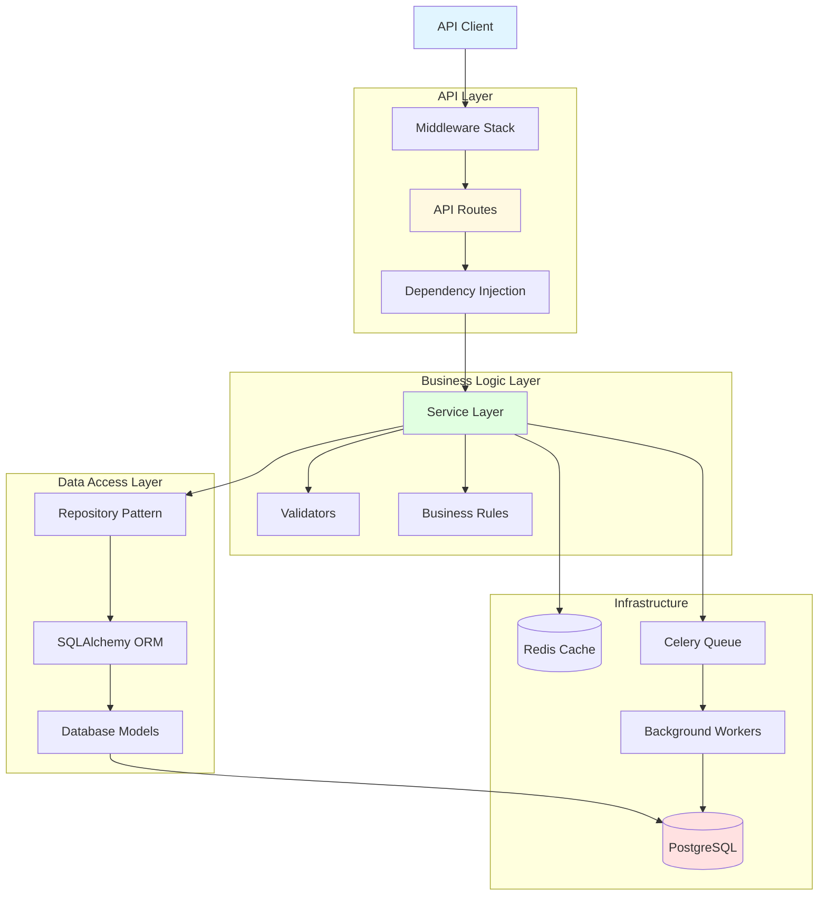
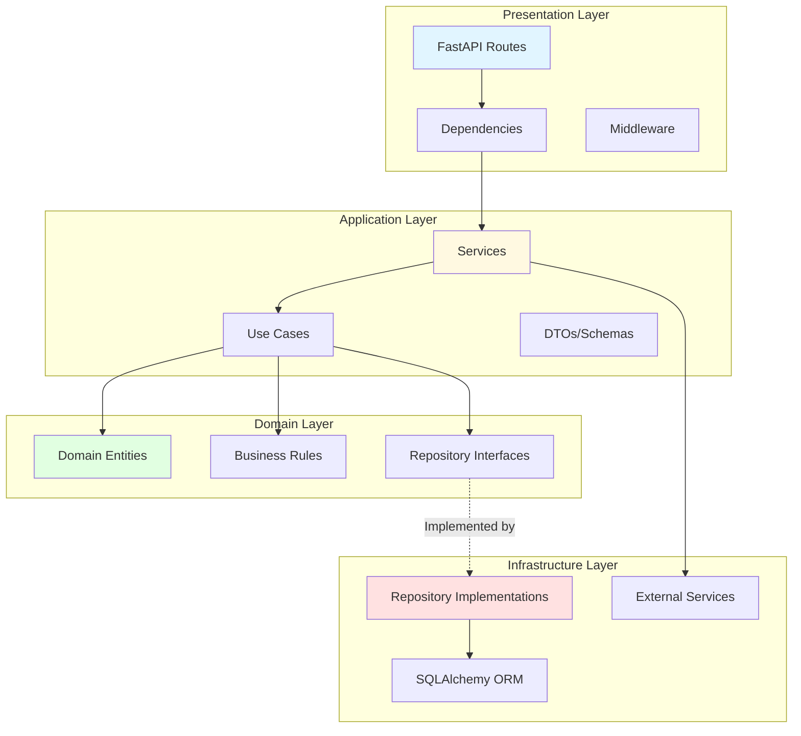
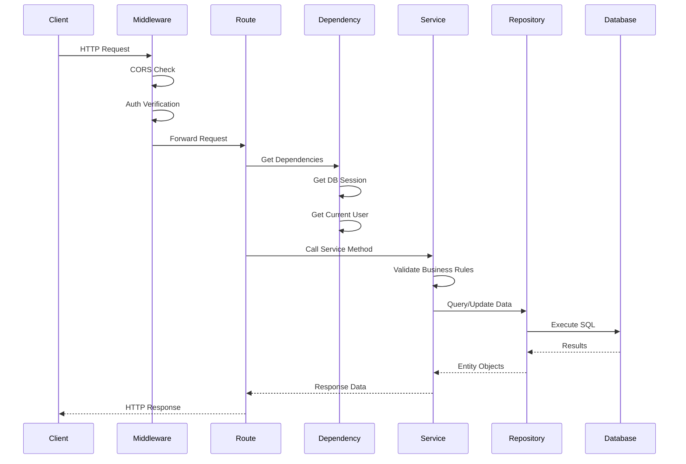
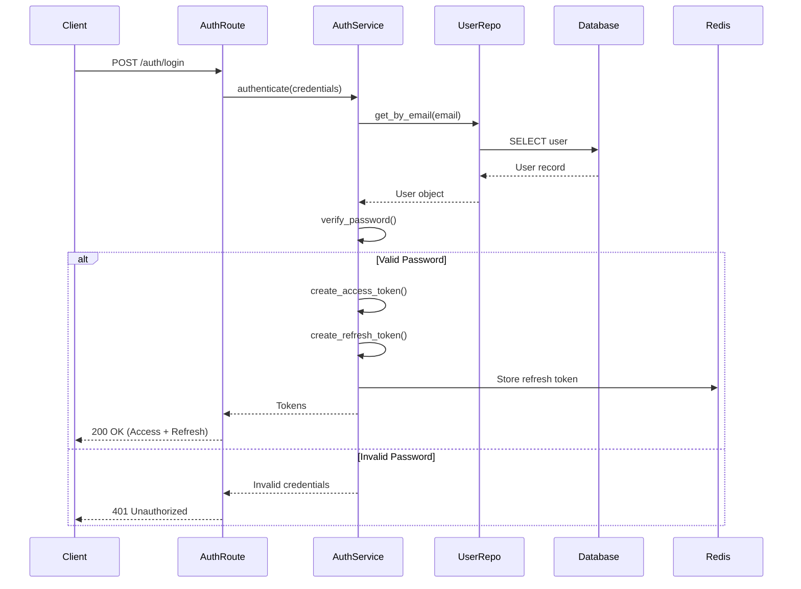
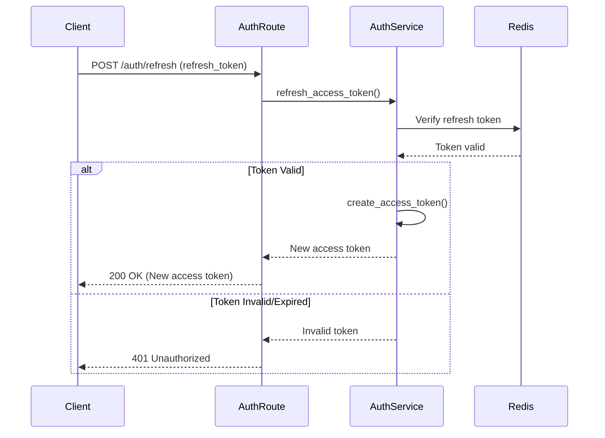
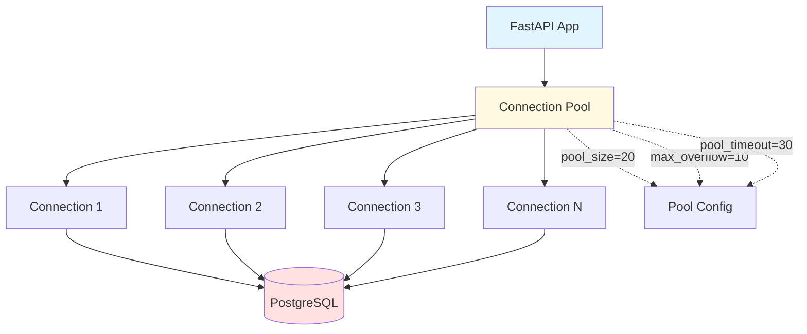
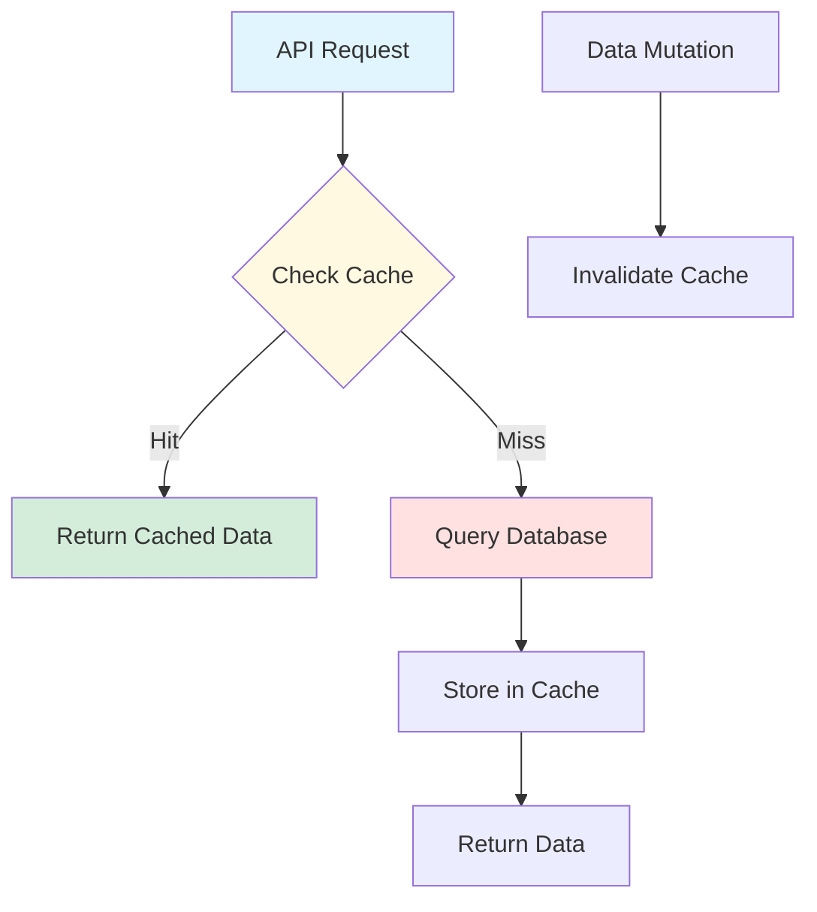
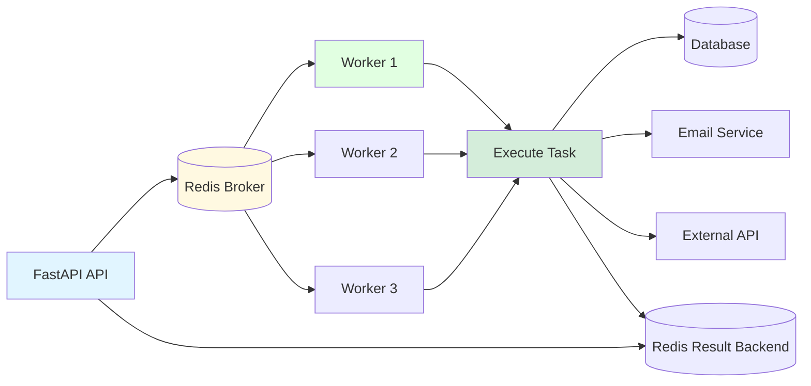
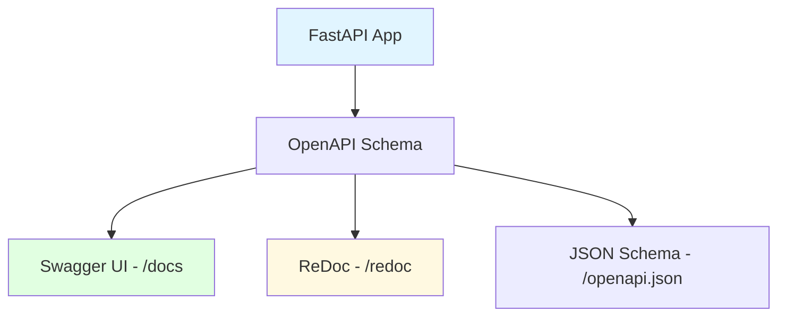
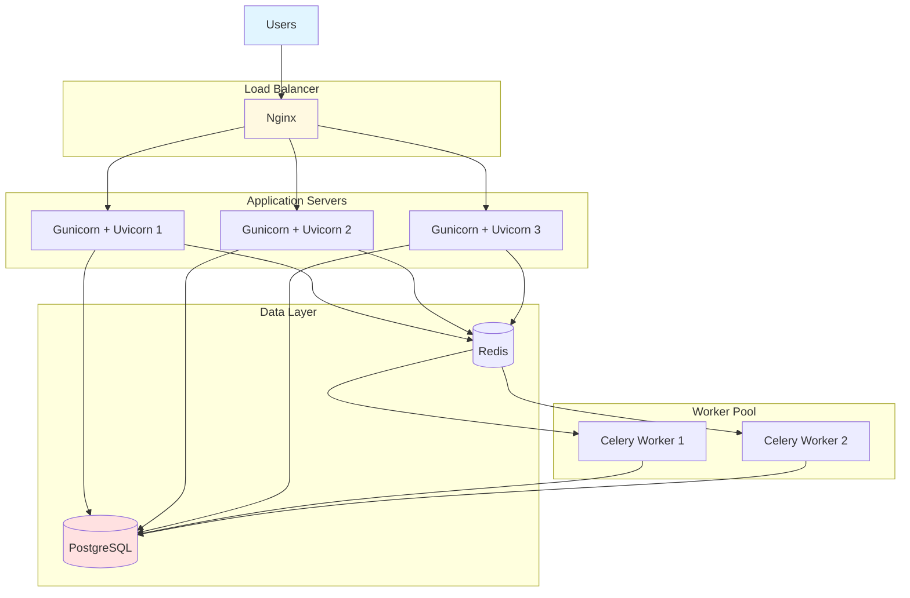

# Example: FastAPI Backend Architecture

> **Example Architecture**: Production-ready FastAPI backend with PostgreSQL
> **Last Updated**: 2025-01-01

## Overview

This example demonstrates a complete architecture for a FastAPI application following clean architecture principles, with async/await patterns, dependency injection, and modern best practices.

---

## Technology Stack

### Backend Framework
- **Framework**: FastAPI 0.110+
- **Python**: Python 3.12+
- **ASGI Server**: Uvicorn with Gunicorn
- **Async**: asyncio with async/await

### Database & ORM
- **Database**: PostgreSQL 16
- **ORM**: SQLAlchemy 2.0 (async)
- **Migrations**: Alembic
- **Connection Pooling**: asyncpg

### Authentication & Security
- **Authentication**: JWT with refresh tokens
- **Password Hashing**: bcrypt via passlib
- **Authorization**: Role-based access control (RBAC)
- **CORS**: FastAPI CORS middleware

### Additional Tools
- **Validation**: Pydantic v2
- **Task Queue**: Celery + Redis
- **Caching**: Redis
- **Monitoring**: Prometheus + Grafana
- **Testing**: pytest + pytest-asyncio

---

## High-Level Architecture



---

## Project Structure

```
app/
├── api/                      # API layer
│   ├── __init__.py
│   ├── deps.py              # Dependencies
│   ├── v1/                  # API v1
│   │   ├── __init__.py
│   │   ├── routes/
│   │   │   ├── auth.py
│   │   │   ├── users.py
│   │   │   ├── posts.py
│   │   │   └── health.py
│   │   └── router.py
│   └── middleware/
│       ├── auth.py
│       ├── cors.py
│       └── logging.py
├── core/                    # Core configuration
│   ├── __init__.py
│   ├── config.py           # Settings
│   ├── security.py         # Auth utils
│   └── database.py         # DB connection
├── models/                  # SQLAlchemy models
│   ├── __init__.py
│   ├── user.py
│   ├── post.py
│   └── base.py
├── schemas/                 # Pydantic schemas
│   ├── __init__.py
│   ├── user.py
│   ├── post.py
│   └── token.py
├── services/               # Business logic
│   ├── __init__.py
│   ├── user_service.py
│   ├── post_service.py
│   └── auth_service.py
├── repositories/           # Data access
│   ├── __init__.py
│   ├── base.py
│   ├── user_repository.py
│   └── post_repository.py
├── tasks/                  # Celery tasks
│   ├── __init__.py
│   ├── email.py
│   └── notifications.py
├── utils/                  # Utilities
│   ├── __init__.py
│   ├── cache.py
│   └── validators.py
├── tests/
│   ├── conftest.py
│   ├── test_auth.py
│   └── test_users.py
├── alembic/               # Database migrations
│   └── versions/
├── main.py                # Application entry
└── worker.py              # Celery worker
```

---

## Layered Architecture

### Clean Architecture Layers



---

## Request Flow

### Standard API Request



---

## Dependency Injection

### FastAPI Dependencies

```python
# app/api/deps.py
from fastapi import Depends, HTTPException, status
from sqlalchemy.ext.asyncio import AsyncSession
from app.core.database import get_db
from app.core.security import verify_token
from app.models.user import User
from app.repositories.user_repository import UserRepository

async def get_current_user(
    token: str = Depends(oauth2_scheme),
    db: AsyncSession = Depends(get_db)
) -> User:
    """Get current authenticated user."""
    payload = verify_token(token)
    user_id = payload.get("sub")

    if not user_id:
        raise HTTPException(
            status_code=status.HTTP_401_UNAUTHORIZED,
            detail="Could not validate credentials"
        )

    repo = UserRepository(db)
    user = await repo.get_by_id(user_id)

    if not user:
        raise HTTPException(
            status_code=status.HTTP_404_NOT_FOUND,
            detail="User not found"
        )

    return user

def get_user_repository(
    db: AsyncSession = Depends(get_db)
) -> UserRepository:
    """Get user repository instance."""
    return UserRepository(db)
```

### Using Dependencies in Routes

```python
# app/api/v1/routes/users.py
from fastapi import APIRouter, Depends
from app.api.deps import get_current_user, get_user_repository
from app.schemas.user import User, UserUpdate
from app.services.user_service import UserService

router = APIRouter()

@router.get("/me", response_model=User)
async def get_current_user_profile(
    current_user: User = Depends(get_current_user)
):
    """Get current user profile."""
    return current_user

@router.put("/me", response_model=User)
async def update_current_user(
    user_update: UserUpdate,
    current_user: User = Depends(get_current_user),
    repo: UserRepository = Depends(get_user_repository)
):
    """Update current user profile."""
    service = UserService(repo)
    return await service.update_user(current_user.id, user_update)
```

---

## Repository Pattern

### Base Repository

```python
# app/repositories/base.py
from typing import Generic, TypeVar, Type, Optional, List
from sqlalchemy import select
from sqlalchemy.ext.asyncio import AsyncSession

ModelType = TypeVar("ModelType")

class BaseRepository(Generic[ModelType]):
    def __init__(self, model: Type[ModelType], db: AsyncSession):
        self.model = model
        self.db = db

    async def get_by_id(self, id: int) -> Optional[ModelType]:
        result = await self.db.execute(
            select(self.model).where(self.model.id == id)
        )
        return result.scalar_one_or_none()

    async def get_all(self, skip: int = 0, limit: int = 100) -> List[ModelType]:
        result = await self.db.execute(
            select(self.model).offset(skip).limit(limit)
        )
        return result.scalars().all()

    async def create(self, obj_in: dict) -> ModelType:
        db_obj = self.model(**obj_in)
        self.db.add(db_obj)
        await self.db.commit()
        await self.db.refresh(db_obj)
        return db_obj

    async def update(self, id: int, obj_in: dict) -> Optional[ModelType]:
        db_obj = await self.get_by_id(id)
        if not db_obj:
            return None

        for field, value in obj_in.items():
            setattr(db_obj, field, value)

        await self.db.commit()
        await self.db.refresh(db_obj)
        return db_obj

    async def delete(self, id: int) -> bool:
        db_obj = await self.get_by_id(id)
        if not db_obj:
            return False

        await self.db.delete(db_obj)
        await self.db.commit()
        return True
```

---

## Service Layer

### Service Pattern

```python
# app/services/user_service.py
from typing import Optional, List
from app.repositories.user_repository import UserRepository
from app.schemas.user import UserCreate, UserUpdate
from app.models.user import User
from app.core.security import get_password_hash

class UserService:
    def __init__(self, repository: UserRepository):
        self.repository = repository

    async def create_user(self, user_in: UserCreate) -> User:
        """Create new user with hashed password."""
        # Business logic
        existing_user = await self.repository.get_by_email(user_in.email)
        if existing_user:
            raise ValueError("Email already registered")

        # Hash password
        hashed_password = get_password_hash(user_in.password)

        # Create user
        user_data = user_in.dict(exclude={"password"})
        user_data["hashed_password"] = hashed_password

        return await self.repository.create(user_data)

    async def get_user(self, user_id: int) -> Optional[User]:
        """Get user by ID."""
        return await self.repository.get_by_id(user_id)

    async def list_users(self, skip: int = 0, limit: int = 100) -> List[User]:
        """List users with pagination."""
        return await self.repository.get_all(skip=skip, limit=limit)

    async def update_user(self, user_id: int, user_in: UserUpdate) -> User:
        """Update user."""
        user = await self.repository.get_by_id(user_id)
        if not user:
            raise ValueError("User not found")

        update_data = user_in.dict(exclude_unset=True)
        return await self.repository.update(user_id, update_data)
```

---

## Authentication Flow

### JWT Authentication



### Token Refresh Flow



---

## Database Architecture

### SQLAlchemy Async Models

```python
# app/models/base.py
from sqlalchemy.orm import DeclarativeBase, Mapped, mapped_column
from sqlalchemy import DateTime, func
from datetime import datetime

class Base(DeclarativeBase):
    pass

class TimestampMixin:
    created_at: Mapped[datetime] = mapped_column(
        DateTime(timezone=True),
        server_default=func.now()
    )
    updated_at: Mapped[datetime] = mapped_column(
        DateTime(timezone=True),
        server_default=func.now(),
        onupdate=func.now()
    )
```

```python
# app/models/user.py
from sqlalchemy import String, Boolean
from sqlalchemy.orm import Mapped, mapped_column, relationship
from app.models.base import Base, TimestampMixin

class User(Base, TimestampMixin):
    __tablename__ = "users"

    id: Mapped[int] = mapped_column(primary_key=True)
    email: Mapped[str] = mapped_column(String(255), unique=True, index=True)
    hashed_password: Mapped[str] = mapped_column(String(255))
    is_active: Mapped[bool] = mapped_column(Boolean, default=True)
    is_superuser: Mapped[bool] = mapped_column(Boolean, default=False)

    # Relationships
    posts: Mapped[List["Post"]] = relationship(back_populates="author")
```

### Connection Pool Configuration



---

## Caching Strategy

### Redis Caching



```python
# app/utils/cache.py
import json
from typing import Optional, Any
import redis.asyncio as redis
from app.core.config import settings

class CacheService:
    def __init__(self):
        self.redis = redis.from_url(settings.REDIS_URL)

    async def get(self, key: str) -> Optional[Any]:
        """Get value from cache."""
        value = await self.redis.get(key)
        if value:
            return json.loads(value)
        return None

    async def set(self, key: str, value: Any, expire: int = 3600):
        """Set value in cache with expiration."""
        await self.redis.set(key, json.dumps(value), ex=expire)

    async def delete(self, key: str):
        """Delete key from cache."""
        await self.redis.delete(key)

    async def invalidate_pattern(self, pattern: str):
        """Invalidate all keys matching pattern."""
        async for key in self.redis.scan_iter(match=pattern):
            await self.redis.delete(key)
```

---

## Background Tasks

### Celery Architecture



```python
# app/tasks/email.py
from celery import Celery
from app.core.config import settings

celery_app = Celery(
    "worker",
    broker=settings.CELERY_BROKER_URL,
    backend=settings.CELERY_RESULT_BACKEND
)

@celery_app.task
def send_welcome_email(user_email: str, user_name: str):
    """Send welcome email to new user."""
    # Email sending logic
    pass

@celery_app.task
def send_password_reset(user_email: str, reset_token: str):
    """Send password reset email."""
    # Email sending logic
    pass
```

---

## API Documentation

### Auto-Generated OpenAPI Docs



---

## Deployment Architecture

### Production Deployment



---

## Key Takeaways

1. **Use async/await**: Leverage Python's async features for I/O operations
2. **Dependency Injection**: Use FastAPI's DI system for clean, testable code
3. **Repository Pattern**: Abstract data access for flexibility
4. **Service Layer**: Encapsulate business logic separate from routes
5. **Caching**: Use Redis for frequently accessed data
6. **Background Tasks**: Offload heavy operations to Celery
7. **Connection Pooling**: Configure proper database connection pools
8. **API Documentation**: Leverage FastAPI's auto-generated docs

---

## References

- [FastAPI Documentation](https://fastapi.tiangolo.com/)
- [SQLAlchemy 2.0 Documentation](https://docs.sqlalchemy.org/)
- [Celery Documentation](https://docs.celeryq.dev/)
