# Example: Microservices Architecture

> **Example Architecture**: Event-driven microservices with API gateway
> **Last Updated**: 2025-01-01

## Overview

This example demonstrates a production microservices architecture with API gateway, service mesh, event-driven communication, and centralized monitoring.

---

## Technology Stack

### Core Services
- **API Gateway**: Kong / AWS API Gateway
- **Service Mesh**: Istio / Linkerd
- **Service Registry**: Consul / Eureka
- **Event Bus**: Kafka / RabbitMQ

### Services Stack
- **User Service**: Node.js (Express)
- **Order Service**: Python (FastAPI)
- **Product Service**: Go
- **Payment Service**: Node.js (Express)
- **Notification Service**: Python (FastAPI)

### Infrastructure
- **Orchestration**: Kubernetes
- **Service Discovery**: Consul
- **Config Management**: Consul KV / etcd
- **Monitoring**: Prometheus + Grafana
- **Tracing**: Jaeger / Zipkin
- **Logging**: ELK Stack (Elasticsearch, Logstash, Kibana)

---

## High-Level Architecture

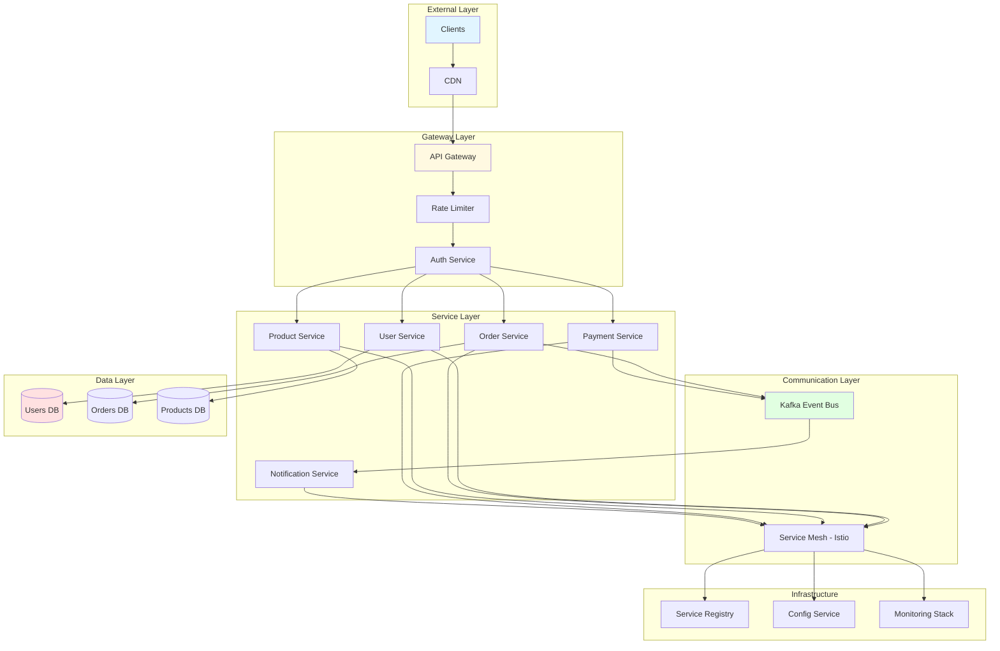

---

## Service Communication Patterns

### Synchronous Communication (REST)

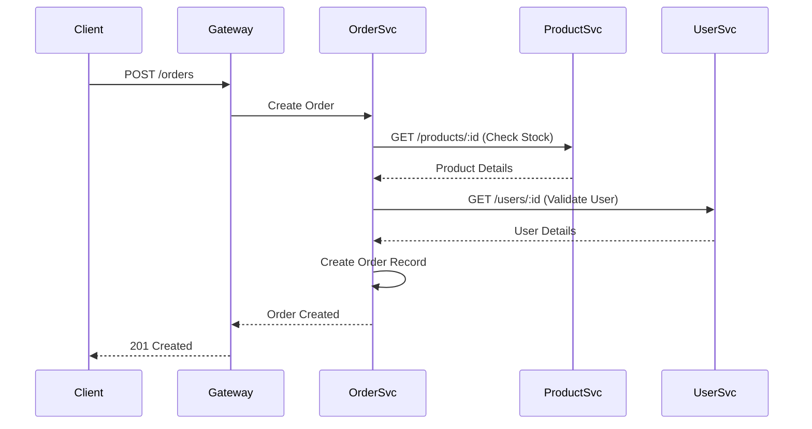

### Asynchronous Communication (Events)

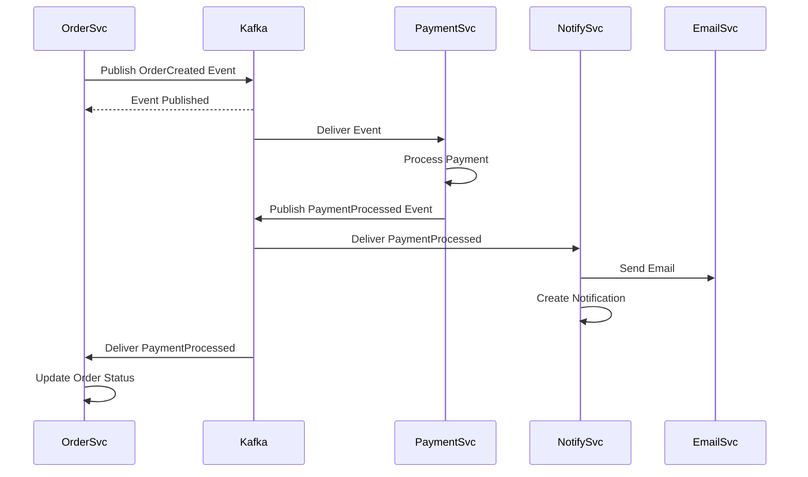

---

## API Gateway Pattern

### Gateway Responsibilities

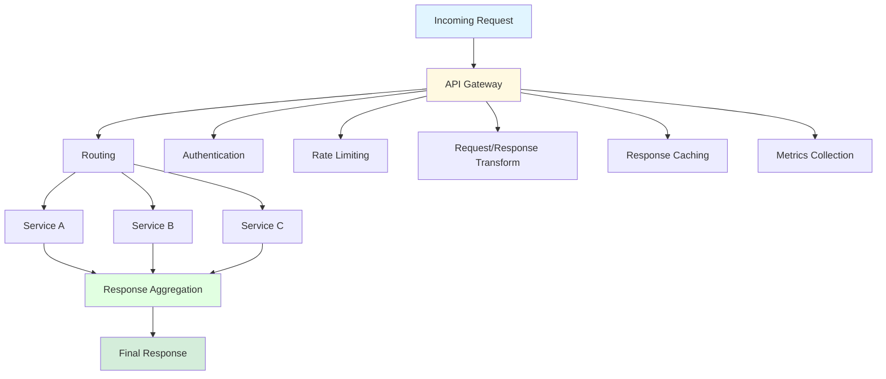

---

## Service Mesh Architecture

### Istio Service Mesh

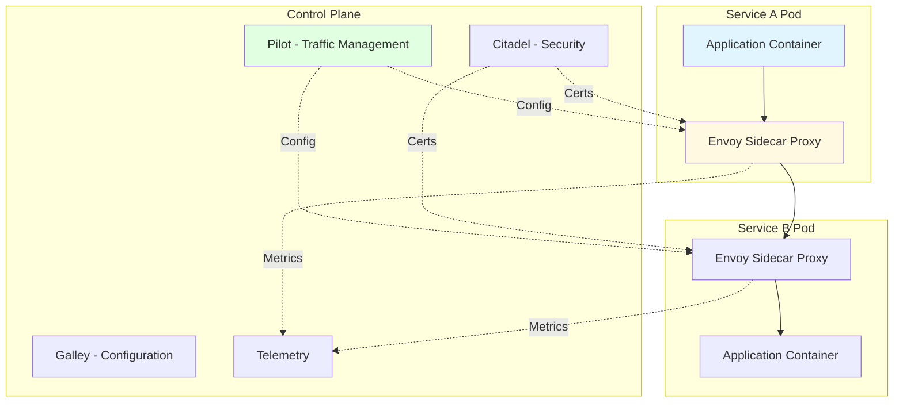

---

## Event-Driven Architecture

### Kafka Event Bus

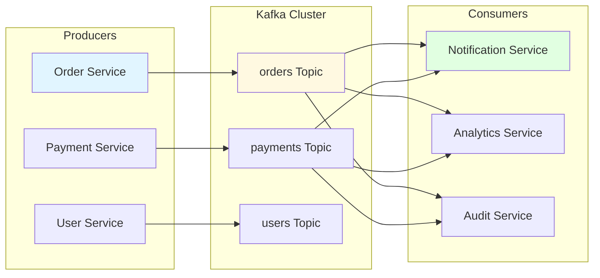

### Event Schema

```json
{
  "event_id": "uuid-v4",
  "event_type": "order.created",
  "event_version": "1.0",
  "timestamp": "2025-01-01T00:00:00Z",
  "source": "order-service",
  "data": {
    "order_id": "ord-123",
    "user_id": "usr-456",
    "total_amount": 99.99,
    "items": [
      {
        "product_id": "prd-789",
        "quantity": 2,
        "price": 49.99
      }
    ]
  },
  "metadata": {
    "correlation_id": "req-abc",
    "trace_id": "trace-xyz"
  }
}
```

---

## Database Per Service Pattern

### Service-Specific Databases

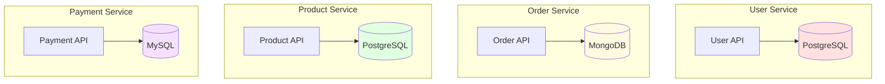

---

## Saga Pattern for Distributed Transactions

### Choreography-Based Saga

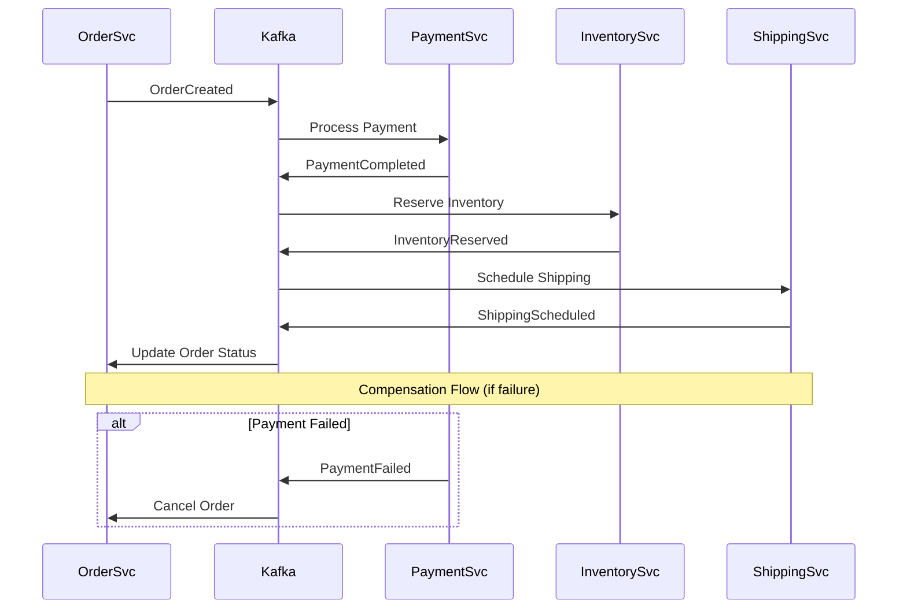

---

## Service Discovery

### Consul Service Registry

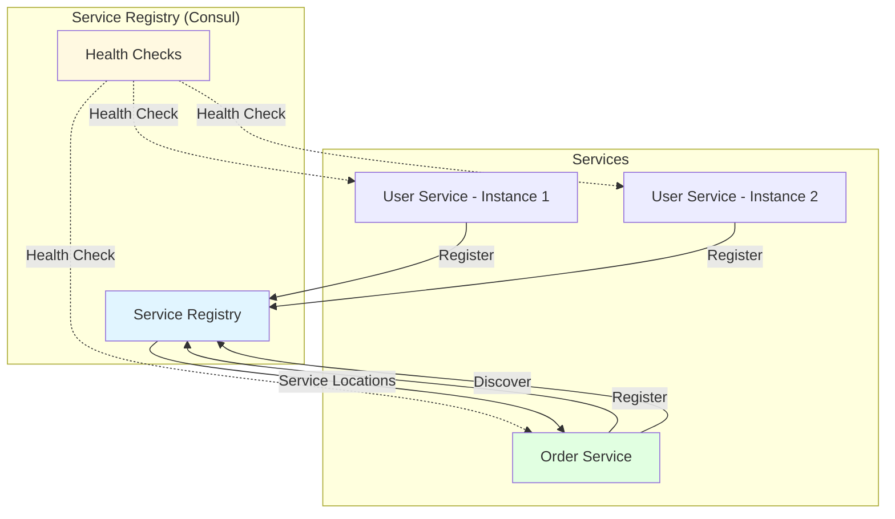

---

## Circuit Breaker Pattern

### Resilience Pattern

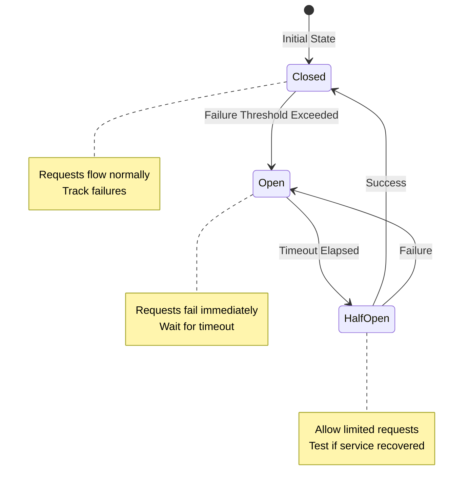

---

## Distributed Tracing

### Request Tracing with Jaeger

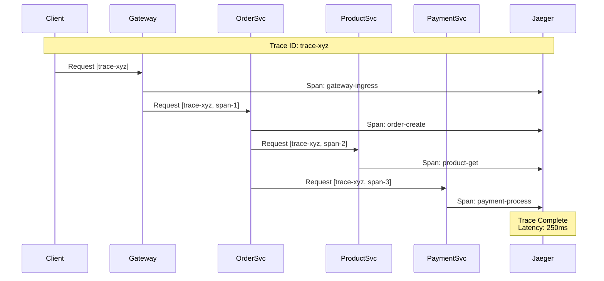

---

## Monitoring & Observability

### Observability Stack

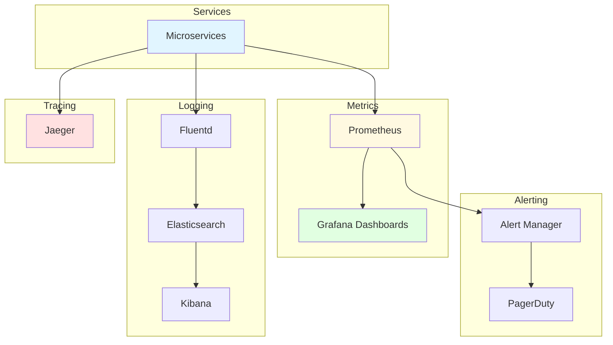

---

## Deployment Architecture

### Kubernetes Deployment

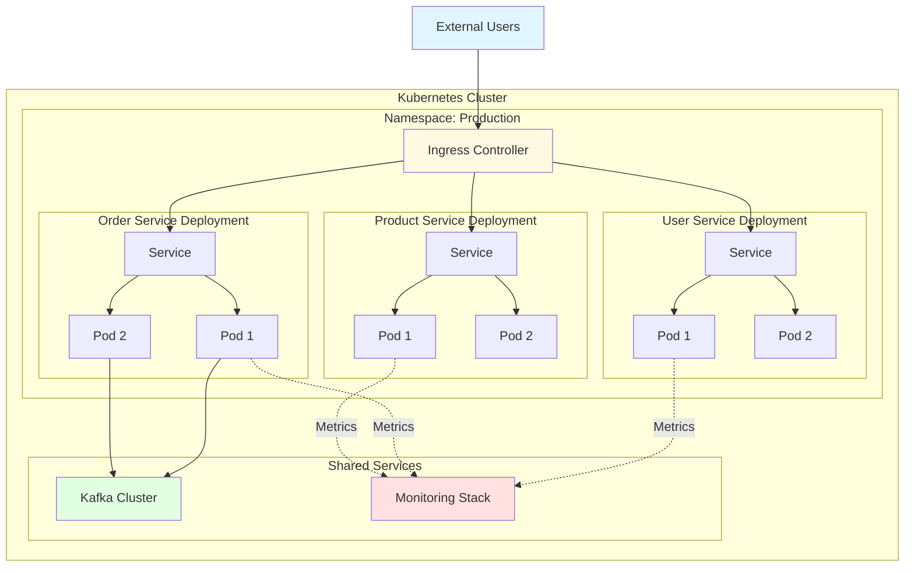

---

## Security Architecture

### Service-to-Service Authentication

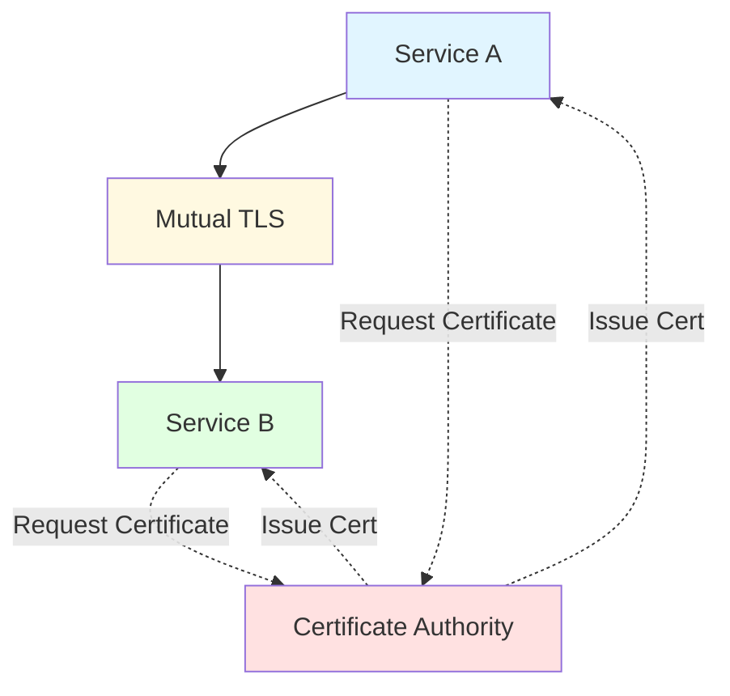

---

## Key Takeaways

1. **API Gateway**: Centralize cross-cutting concerns
2. **Service Mesh**: Handle service-to-service communication
3. **Event-Driven**: Use asynchronous communication for loose coupling
4. **Database Per Service**: Each service owns its data
5. **Circuit Breaker**: Implement resilience patterns
6. **Distributed Tracing**: Track requests across services
7. **Service Discovery**: Dynamic service location
8. **Saga Pattern**: Handle distributed transactions

---

## Challenges & Solutions

| Challenge | Solution |
|-----------|----------|
| Distributed Transactions | Saga pattern (choreography/orchestration) |
| Service Discovery | Consul / Kubernetes DNS |
| Data Consistency | Event sourcing + CQRS |
| Network Latency | Caching, async communication |
| Debugging | Distributed tracing (Jaeger) |
| Monitoring | Centralized logging + metrics |
| Security | mTLS + API Gateway auth |

---

## References

- [Kubernetes Documentation](https://kubernetes.io/docs/)
- [Istio Service Mesh](https://istio.io/latest/docs/)
- [Apache Kafka](https://kafka.apache.org/documentation/)
- [Microservices Patterns](https://microservices.io/patterns/)
