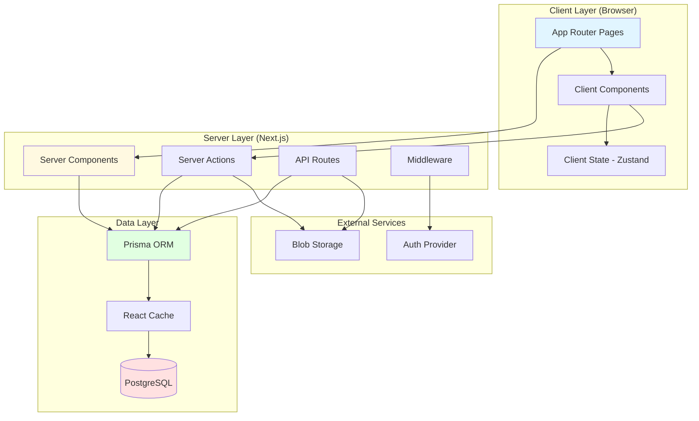
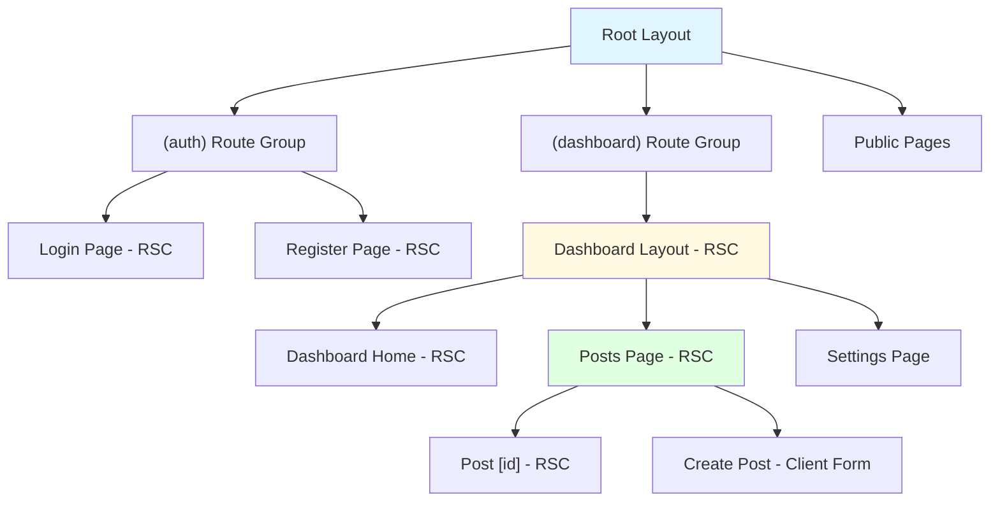
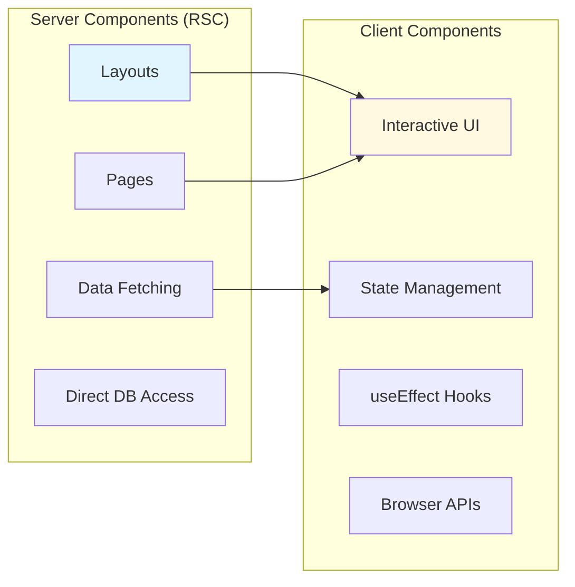
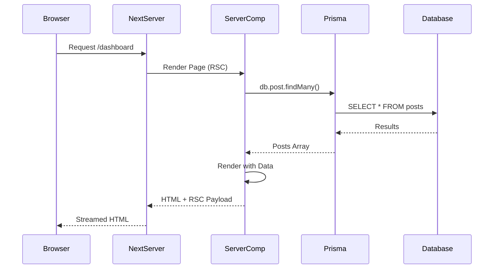
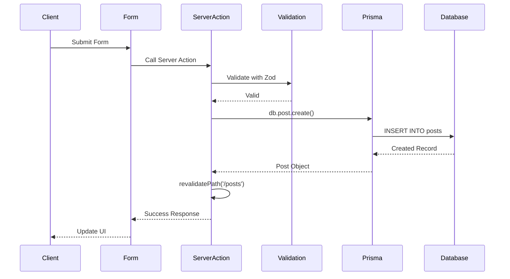
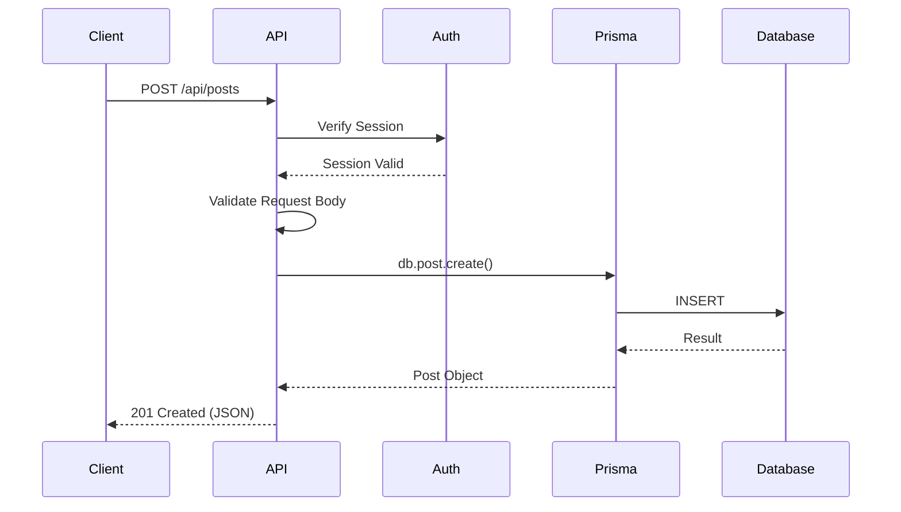
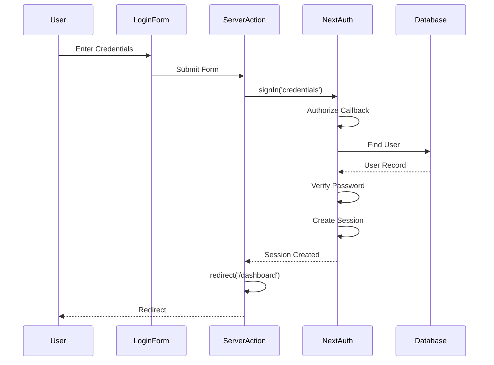
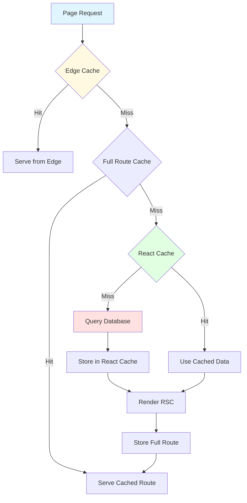
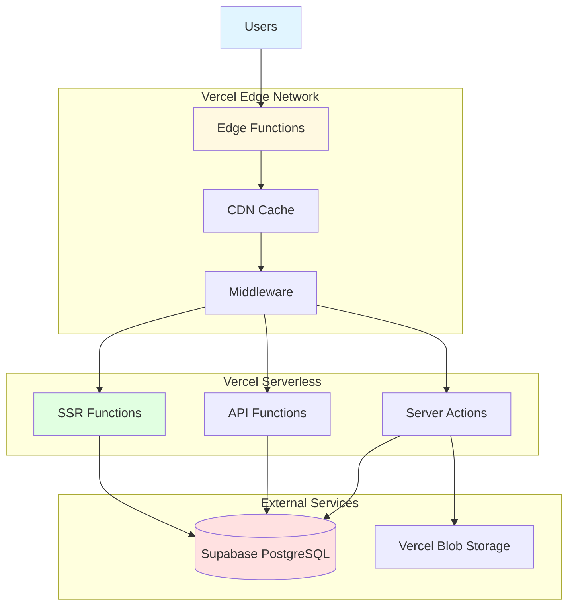

# Example: Next.js 15 App Router Architecture

> **Example Architecture**: Full-stack Next.js 15 application with App Router
> **Last Updated**: 2025-01-01

## Overview

This example demonstrates a complete architecture for a Next.js 15 application using the App Router, React Server Components (RSC), Server Actions, and modern best practices.

---

## Technology Stack

### Frontend
- **Framework**: Next.js 15 with App Router
- **React**: React 19 with Server Components
- **UI Components**: shadcn/ui + Radix UI
- **Styling**: Tailwind CSS
- **State Management**: Zustand (client state only)
- **Form Handling**: React Hook Form + Zod validation

### Backend (Next.js API)
- **API Routes**: Next.js App Router API routes
- **Server Actions**: For form mutations
- **Database ORM**: Prisma
- **Authentication**: NextAuth.js v5
- **File Upload**: UploadThing

### Infrastructure
- **Hosting**: Vercel
- **Database**: Supabase PostgreSQL
- **File Storage**: Vercel Blob / S3
- **Caching**: Vercel Edge Cache + React Cache

---

## High-Level Architecture



---

## Directory Structure

```
app/
├── (auth)/                    # Auth route group
│   ├── login/
│   │   └── page.tsx          # Server Component
│   └── register/
│       └── page.tsx
├── (dashboard)/              # Dashboard route group
│   ├── layout.tsx            # Shared layout
│   ├── page.tsx              # Dashboard home
│   ├── posts/
│   │   ├── page.tsx          # Posts list (RSC)
│   │   ├── [id]/
│   │   │   └── page.tsx      # Post detail (RSC)
│   │   └── create/
│   │       └── page.tsx
│   └── settings/
│       └── page.tsx
├── api/                      # API Routes
│   ├── auth/
│   │   └── [...nextauth]/
│   │       └── route.ts
│   ├── posts/
│   │   └── route.ts
│   └── upload/
│       └── route.ts
├── actions/                  # Server Actions
│   ├── auth.ts
│   ├── posts.ts
│   └── users.ts
├── components/               # Shared components
│   ├── ui/                   # shadcn components
│   ├── forms/
│   └── layout/
├── lib/                      # Utilities
│   ├── db.ts                 # Prisma client
│   ├── auth.ts               # Auth config
│   ├── utils.ts
│   └── validations.ts
├── middleware.ts             # Next.js middleware
├── layout.tsx                # Root layout
└── page.tsx                  # Home page
```

---

## Component Architecture

### App Router Structure



### Server vs Client Components



---

## Data Flow

### Server Component Data Fetching



### Server Action Flow



### API Route Flow



---

## Authentication Flow

### NextAuth.js with Credentials



### Protected Routes with Middleware

```typescript
// middleware.ts
import { NextResponse } from 'next/server';
import { getToken } from 'next-auth/jwt';

export async function middleware(request) {
  const token = await getToken({ req: request });
  const isAuthPage = request.nextUrl.pathname.startsWith('/login');

  if (!token && !isAuthPage) {
    return NextResponse.redirect(new URL('/login', request.url));
  }

  if (token && isAuthPage) {
    return NextResponse.redirect(new URL('/dashboard', request.url));
  }

  return NextResponse.next();
}

export const config = {
  matcher: ['/((?!api|_next/static|_next/image|favicon.ico).*)'],
};
```

---

## Caching Strategy

### Multi-Layer Caching



### Cache Configuration

```typescript
// app/posts/page.tsx - Static with revalidation
export const revalidate = 3600; // Revalidate every hour

export default async function PostsPage() {
  const posts = await db.post.findMany();
  return <PostsList posts={posts} />;
}

// app/posts/[id]/page.tsx - Static with on-demand revalidation
export default async function PostDetail({ params }) {
  const post = await db.post.findUnique({ where: { id: params.id } });
  return <PostDetail post={post} />;
}

// In Server Action - Revalidate after mutation
'use server';
import { revalidatePath } from 'next/cache';

export async function createPost(data) {
  await db.post.create({ data });
  revalidatePath('/posts');
  revalidatePath('/dashboard');
}
```

---

## Server Actions Example

### Form with Server Action

```typescript
// app/actions/posts.ts
'use server';

import { z } from 'zod';
import { db } from '@/lib/db';
import { revalidatePath } from 'next/cache';
import { redirect } from 'next/navigation';

const createPostSchema = z.object({
  title: z.string().min(1).max(200),
  content: z.string().min(1),
  published: z.boolean().default(false),
});

export async function createPost(formData: FormData) {
  const validatedFields = createPostSchema.safeParse({
    title: formData.get('title'),
    content: formData.get('content'),
    published: formData.get('published') === 'true',
  });

  if (!validatedFields.success) {
    return {
      errors: validatedFields.error.flatten().fieldErrors,
    };
  }

  const post = await db.post.create({
    data: validatedFields.data,
  });

  revalidatePath('/posts');
  redirect(`/posts/${post.id}`);
}
```

```typescript
// app/posts/create/page.tsx
import { createPost } from '@/app/actions/posts';

export default function CreatePostPage() {
  return (
    <form action={createPost}>
      <input name="title" required />
      <textarea name="content" required />
      <button type="submit">Create Post</button>
    </form>
  );
}
```

---

## Deployment Architecture

### Vercel Deployment



---

## Performance Optimizations

### Image Optimization

```typescript
import Image from 'next/image';

<Image
  src="/hero.jpg"
  alt="Hero"
  width={1920}
  height={1080}
  priority // Above fold
  placeholder="blur"
  blurDataURL="..."
/>
```

### Streaming with Suspense

```typescript
import { Suspense } from 'react';

export default function DashboardPage() {
  return (
    <div>
      <h1>Dashboard</h1>
      <Suspense fallback={<PostsSkeleton />}>
        <Posts />
      </Suspense>
      <Suspense fallback={<StatsSkeleton />}>
        <Stats />
      </Suspense>
    </div>
  );
}
```

### Parallel Data Fetching

```typescript
async function getPosts() {
  return db.post.findMany();
}

async function getUsers() {
  return db.user.findMany();
}

export default async function DashboardPage() {
  // Parallel fetching
  const [posts, users] = await Promise.all([
    getPosts(),
    getUsers(),
  ]);

  return <Dashboard posts={posts} users={users} />;
}
```

---

## Key Takeaways

1. **Maximize Server Components**: Fetch data in RSC for better performance
2. **Use Server Actions**: Simplify form handling without API routes
3. **Cache Strategically**: Leverage Edge, Full Route, and React caching
4. **Stream with Suspense**: Improve perceived performance
5. **Minimize Client JavaScript**: Only use 'use client' when necessary
6. **Optimize Images**: Always use next/image for automatic optimization

---

## References

- [Next.js 15 Documentation](https://nextjs.org/docs)
- [React Server Components](https://react.dev/reference/rsc/server-components)
- [Vercel Deployment](https://vercel.com/docs)
