# API Architecture

> **Document**: API Architecture Diagram
> **Last Updated**: [Date]

## Overview

This document describes the API architecture, including API design, endpoint structure, authentication, rate limiting, and API gateway patterns.

---

## API Gateway Architecture

### Gateway Components

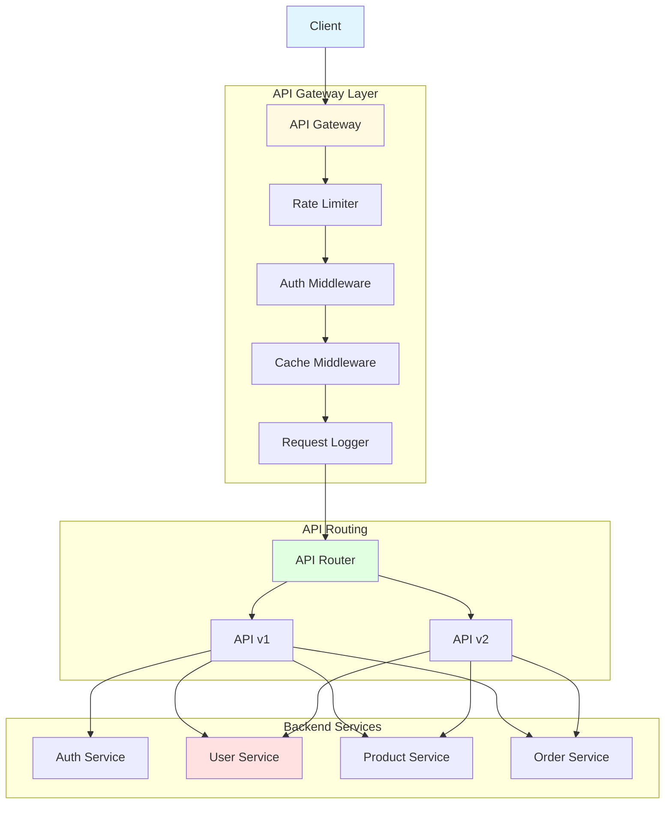

---

## API Endpoints Structure

### Resource-Based API

```mermaid
graph TB
    API[API Root /api/v1]

    API --> USERS[/users]
    API --> PRODUCTS[/products]
    API --> ORDERS[/orders]
    API --> AUTH[/auth]

    USERS --> USER_LIST[GET /users]
    USERS --> USER_CREATE[POST /users]
    USERS --> USER_DETAIL[GET /users/:id]
    USERS --> USER_UPDATE[PUT /users/:id]
    USERS --> USER_DELETE[DELETE /users/:id]

    PRODUCTS --> PRODUCT_LIST[GET /products]
    PRODUCTS --> PRODUCT_CREATE[POST /products]
    PRODUCTS --> PRODUCT_DETAIL[GET /products/:id]
    PRODUCTS --> PRODUCT_UPDATE[PUT /products/:id]

    ORDERS --> ORDER_LIST[GET /orders]
    ORDERS --> ORDER_CREATE[POST /orders]
    ORDERS --> ORDER_DETAIL[GET /orders/:id]
    ORDERS --> ORDER_CANCEL[POST /orders/:id/cancel]

    AUTH --> LOGIN[POST /auth/login]
    AUTH --> LOGOUT[POST /auth/logout]
    AUTH --> REFRESH[POST /auth/refresh]

    style API fill:#e1f5ff
    style USERS fill:#fff9e1
    style PRODUCTS fill:#e1ffe1
    style ORDERS fill:#ffe1e1
```

---

## API Request Flow

### Standard Request Processing

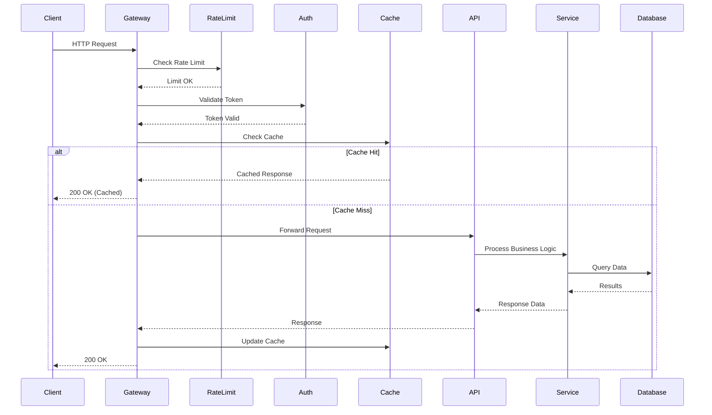

### Error Handling Flow

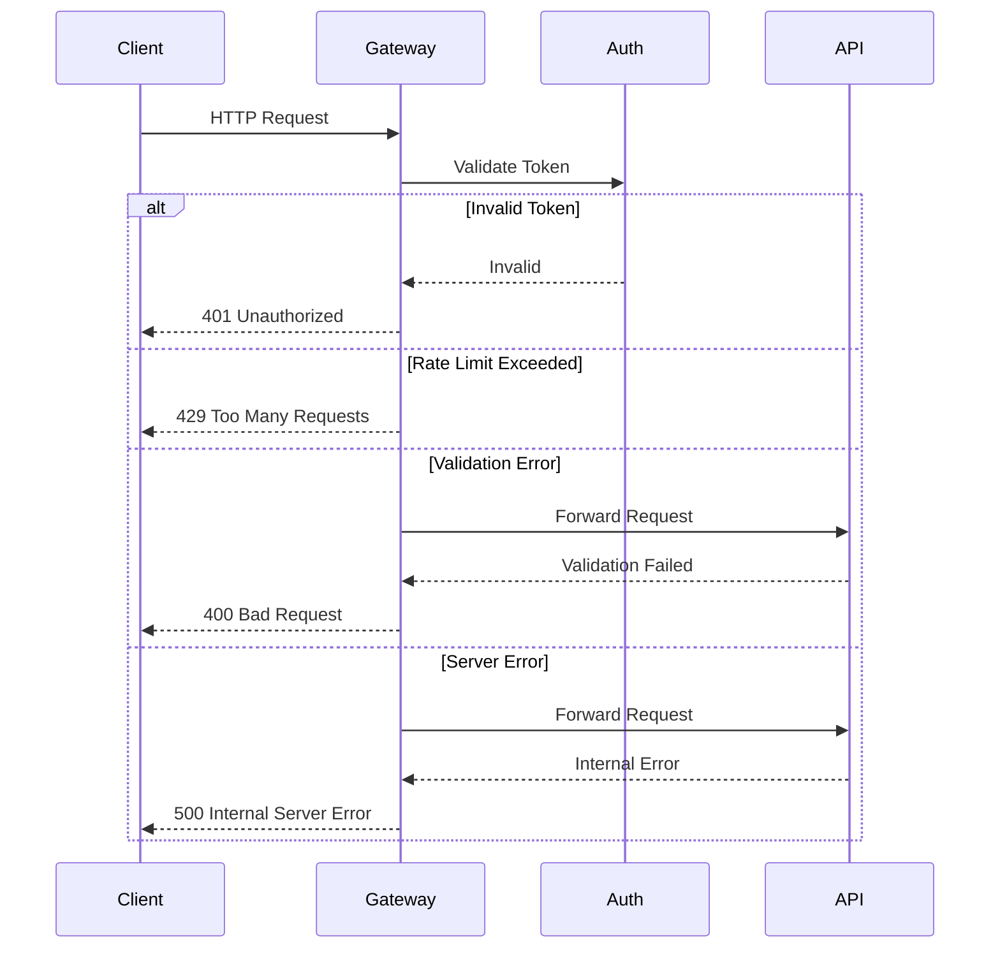

---

## Authentication & Authorization

### JWT Authentication Flow

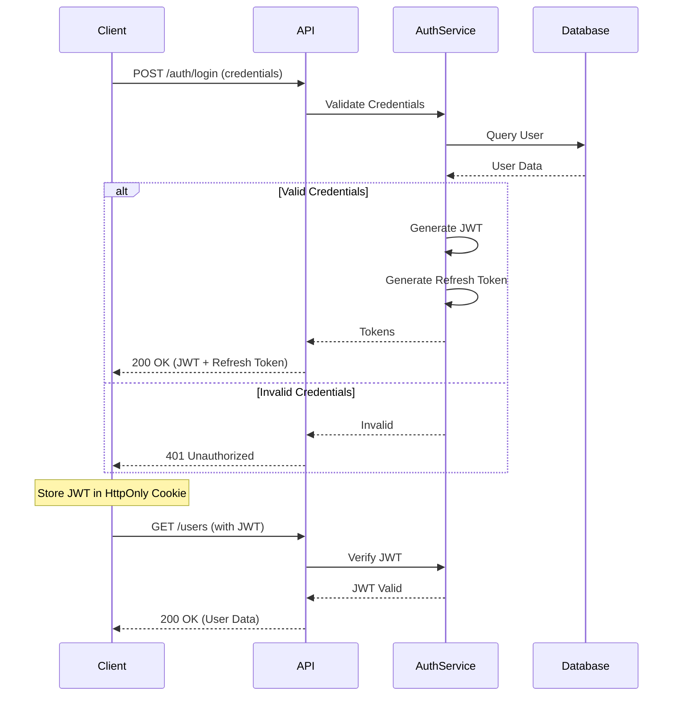

### OAuth 2.0 Flow

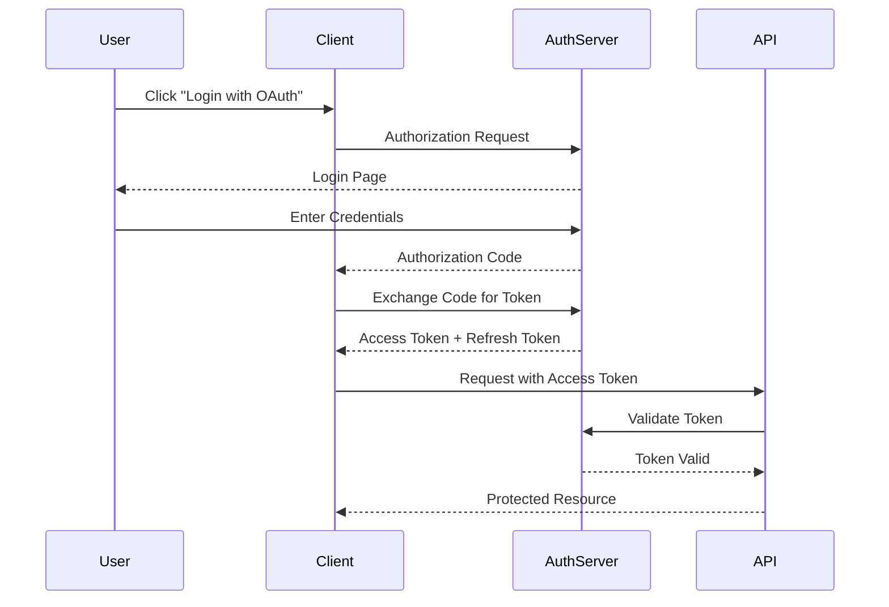

### RBAC Authorization

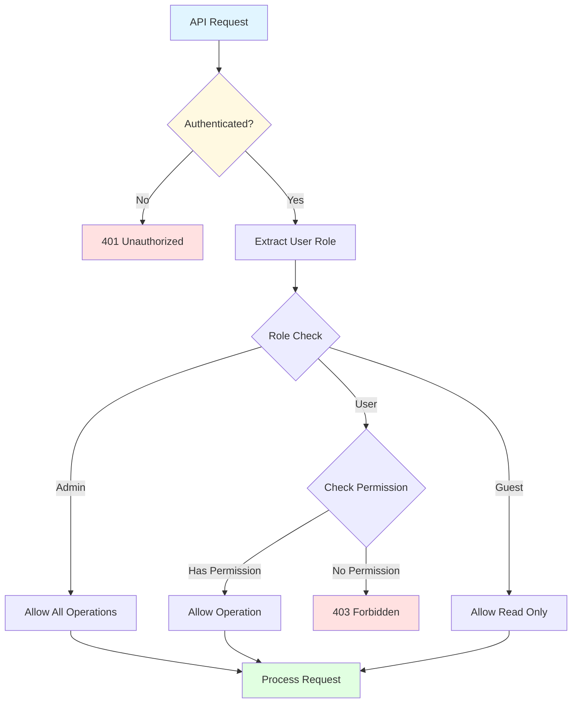

---

## Rate Limiting

### Rate Limit Strategy

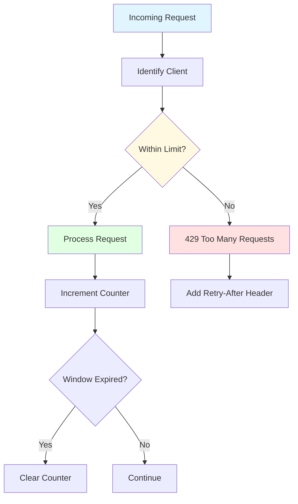

### Rate Limit Tiers

| User Type | Requests/Minute | Requests/Hour | Requests/Day |
|-----------|----------------|---------------|--------------|
| Anonymous | 10 | 100 | 1,000 |
| Authenticated | 100 | 1,000 | 10,000 |
| Premium | 500 | 5,000 | 50,000 |
| Enterprise | Unlimited | Unlimited | Unlimited |

---

## API Versioning

### Version Strategy

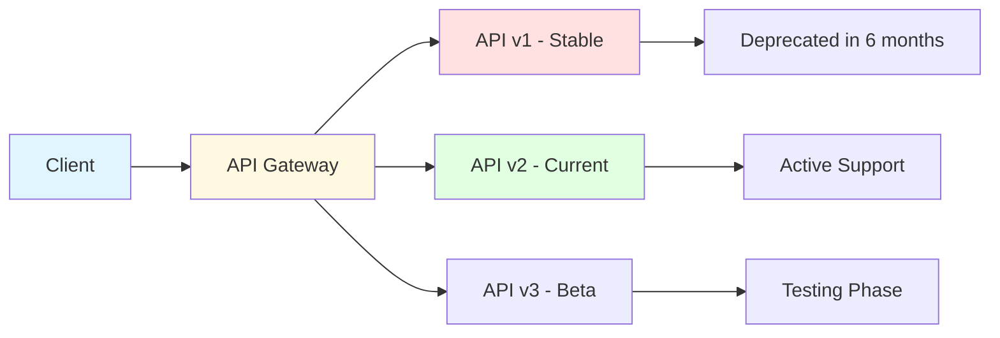

### Version Migration Path

1. **v1 (Legacy)**: Deprecated, maintenance only
2. **v2 (Current)**: Active development, full support
3. **v3 (Beta)**: Testing, breaking changes allowed

---

## API Documentation

### OpenAPI/Swagger Structure

```mermaid
graph TB
    SPEC[OpenAPI Spec]

    SPEC --> INFO[API Info]
    SPEC --> SERVERS[Server URLs]
    SPEC --> PATHS[API Paths]
    SPEC --> COMPONENTS[Components]
    SPEC --> SECURITY[Security Schemes]

    PATHS --> ENDPOINT1[/users]
    PATHS --> ENDPOINT2[/products]
    PATHS --> ENDPOINT3[/orders]

    COMPONENTS --> SCHEMAS[Data Schemas]
    COMPONENTS --> RESPONSES[Response Templates]
    COMPONENTS --> PARAMS[Parameters]

    SECURITY --> JWT[JWT Auth]
    SECURITY --> OAUTH[OAuth 2.0]
    SECURITY --> API_KEY[API Keys]

    style SPEC fill:#e1f5ff
    style PATHS fill:#fff9e1
    style COMPONENTS fill:#e1ffe1
```

---

## API Endpoints Reference

### Authentication Endpoints

#### POST /api/v1/auth/login
**Description**: Authenticate user and obtain tokens

**Request Body**:
```json
{
  "email": "user@example.com",
  "password": "password123"
}
```

**Response** (200 OK):
```json
{
  "access_token": "eyJhbGciOiJIUzI1NiIsInR5cCI6IkpXVCJ9...",
  "refresh_token": "eyJhbGciOiJIUzI1NiIsInR5cCI6IkpXVCJ9...",
  "expires_in": 3600,
  "token_type": "Bearer"
}
```

#### POST /api/v1/auth/refresh
**Description**: Refresh access token using refresh token

#### POST /api/v1/auth/logout
**Description**: Invalidate tokens and logout user

---

### User Endpoints

#### GET /api/v1/users
**Description**: List all users (paginated)

**Query Parameters**:
- `page` (integer): Page number (default: 1)
- `limit` (integer): Items per page (default: 20)
- `sort` (string): Sort field (default: created_at)
- `order` (string): Sort order - asc/desc (default: desc)

**Response** (200 OK):
```json
{
  "data": [
    {
      "id": "user-123",
      "email": "user@example.com",
      "name": "John Doe",
      "role": "user",
      "created_at": "2024-01-01T00:00:00Z"
    }
  ],
  "pagination": {
    "page": 1,
    "limit": 20,
    "total": 100,
    "pages": 5
  }
}
```

#### GET /api/v1/users/:id
**Description**: Get user by ID

#### POST /api/v1/users
**Description**: Create new user

#### PUT /api/v1/users/:id
**Description**: Update user

#### DELETE /api/v1/users/:id
**Description**: Delete user

---

### Product Endpoints

#### GET /api/v1/products
**Description**: List all products

#### POST /api/v1/products
**Description**: Create new product

#### GET /api/v1/products/:id
**Description**: Get product details

#### PUT /api/v1/products/:id
**Description**: Update product

---

### Order Endpoints

#### GET /api/v1/orders
**Description**: List user's orders

#### POST /api/v1/orders
**Description**: Create new order

#### GET /api/v1/orders/:id
**Description**: Get order details

#### POST /api/v1/orders/:id/cancel
**Description**: Cancel order

---

## Error Responses

### Standard Error Format

```json
{
  "error": {
    "code": "VALIDATION_ERROR",
    "message": "Invalid input data",
    "details": [
      {
        "field": "email",
        "message": "Invalid email format"
      }
    ],
    "request_id": "req-123456",
    "timestamp": "2024-01-01T00:00:00Z"
  }
}
```

### HTTP Status Codes

| Code | Meaning | Usage |
|------|---------|-------|
| 200 | OK | Successful GET, PUT, PATCH |
| 201 | Created | Successful POST (resource created) |
| 204 | No Content | Successful DELETE |
| 400 | Bad Request | Invalid input data |
| 401 | Unauthorized | Missing or invalid authentication |
| 403 | Forbidden | Insufficient permissions |
| 404 | Not Found | Resource not found |
| 409 | Conflict | Resource conflict (duplicate) |
| 422 | Unprocessable Entity | Validation failed |
| 429 | Too Many Requests | Rate limit exceeded |
| 500 | Internal Server Error | Server error |
| 503 | Service Unavailable | Service temporarily unavailable |

---

## Caching Strategy

### Cache Layers

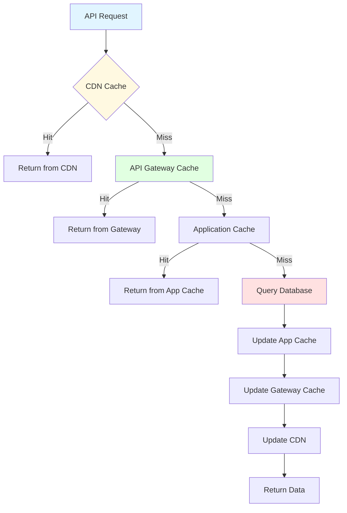

### Cache Control Headers

```http
Cache-Control: public, max-age=3600
Cache-Control: private, max-age=300
Cache-Control: no-cache
Cache-Control: no-store
```

---

## API Performance Optimization

### Response Compression

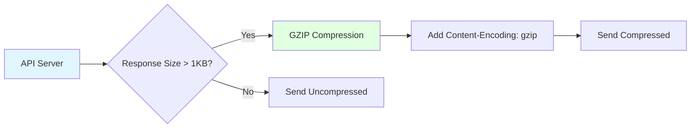

### Field Selection

```http
GET /api/v1/users?fields=id,name,email
```

Response includes only requested fields, reducing payload size.

---

## WebSocket API

### WebSocket Connection Flow

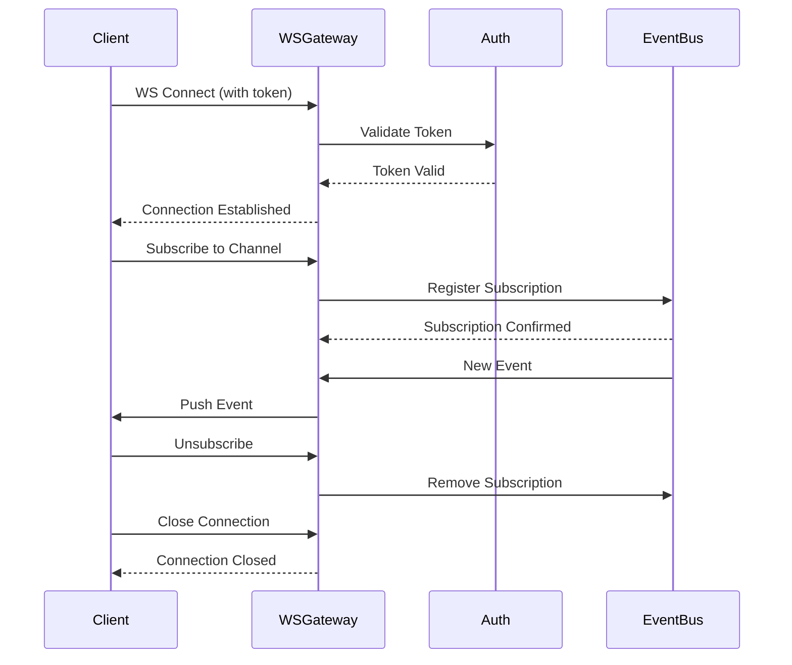

---

## API Monitoring

### Metrics Collection

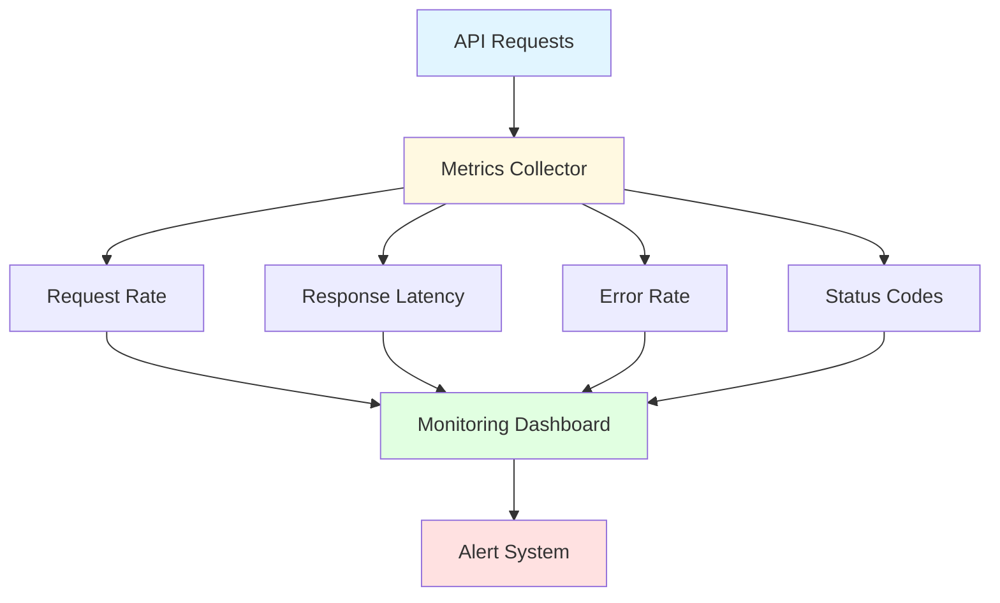

### Key API Metrics

- **Request Rate**: Requests per second
- **Response Time**: P50, P95, P99 latency
- **Error Rate**: Percentage of 4xx and 5xx responses
- **Throughput**: Bytes per second
- **Active Connections**: Current WebSocket connections

---

## References

- [Architecture Overview](./overview.md)
- [Component Architecture](./components.md)
- [Security Architecture](./security.md)

---

**Document Version**: 1.0.0
**Last Review**: [Date]
