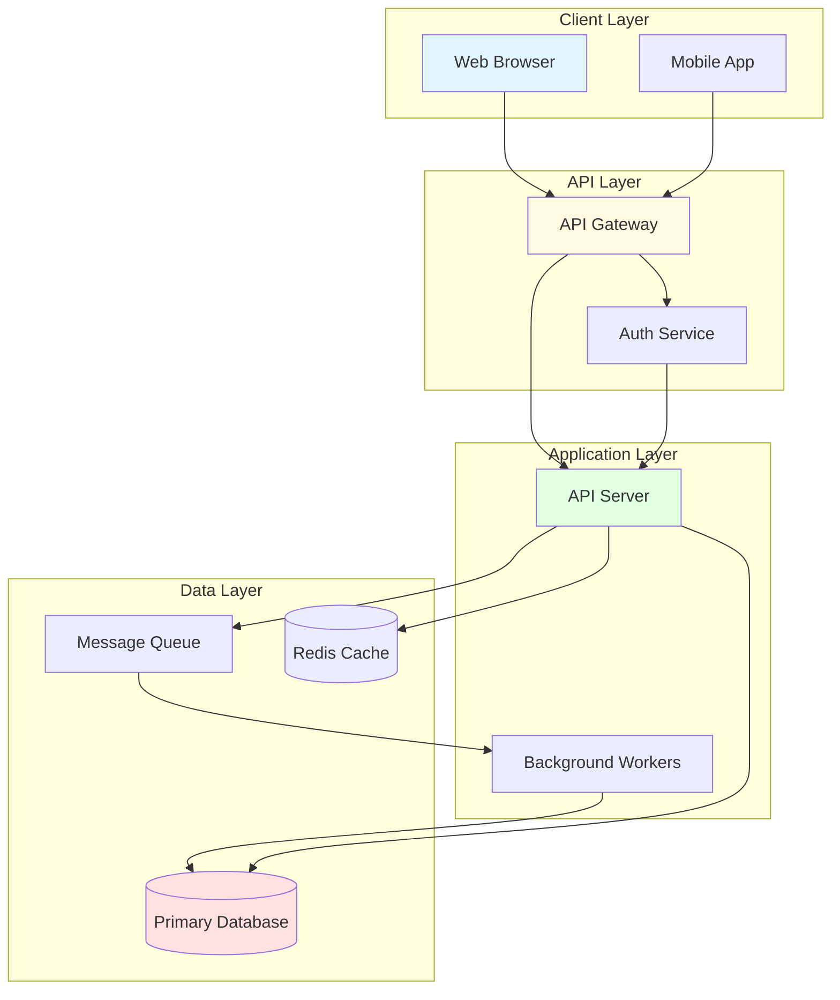
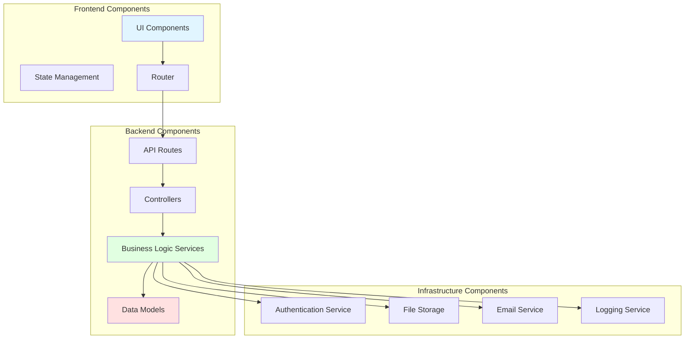
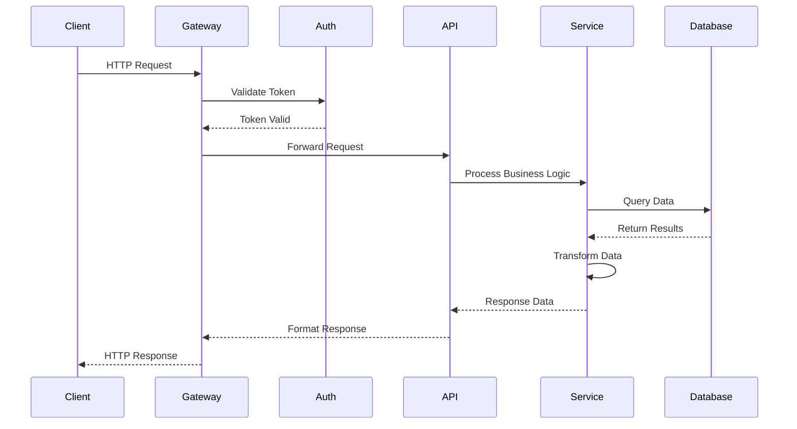
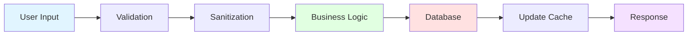
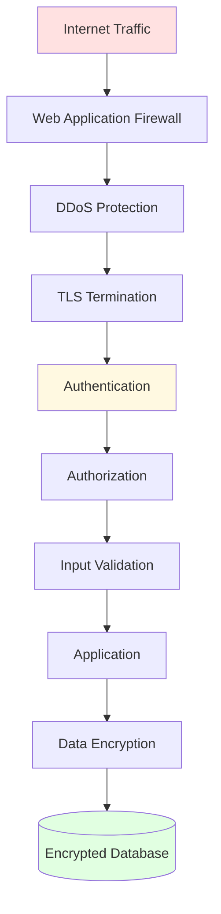
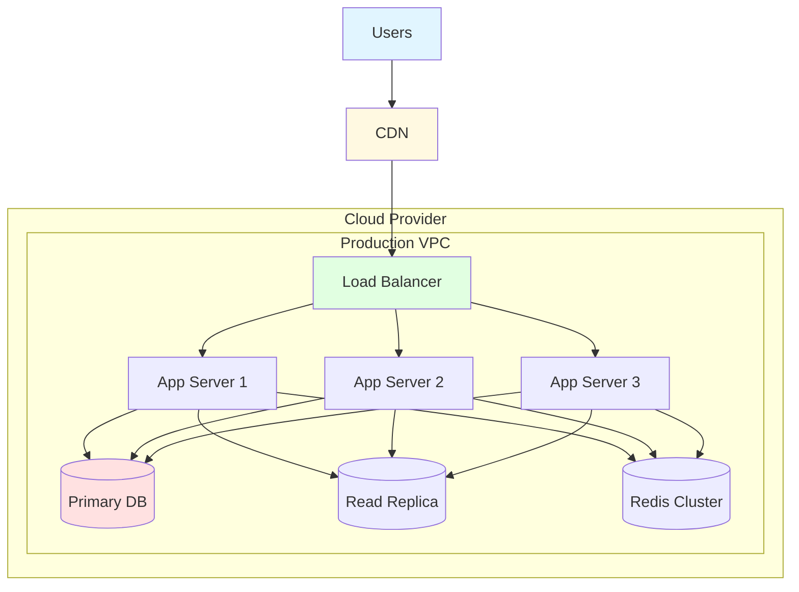

# Architecture Overview

> **Project**: [Project Name]
> **Version**: 1.0.0
> **Last Updated**: [Date]
> **Maintained by**: [Team/Person]

## Table of Contents

1. [System Overview](#system-overview)
2. [Architecture Principles](#architecture-principles)
3. [High-Level Architecture](#high-level-architecture)
4. [Technology Stack](#technology-stack)
5. [Key Components](#key-components)
6. [Data Flow](#data-flow)
7. [Security Architecture](#security-architecture)
8. [Deployment Architecture](#deployment-architecture)
9. [Scalability & Performance](#scalability--performance)
10. [Future Considerations](#future-considerations)

---

## System Overview

### Purpose

[Describe the purpose and goals of the system]

### Key Features

- Feature 1: [Description]
- Feature 2: [Description]
- Feature 3: [Description]

### Stakeholders

- **End Users**: [Description]
- **Administrators**: [Description]
- **Developers**: [Description]

---

## Architecture Principles

### Design Principles

1. **Modularity**: Components are loosely coupled and highly cohesive
2. **Scalability**: System can scale horizontally and vertically
3. **Maintainability**: Code is well-documented and follows best practices
4. **Security**: Security is built-in at every layer
5. **Performance**: Optimized for speed and efficiency

### Architectural Patterns

- **Pattern 1**: [e.g., Microservices, Monolithic, Serverless]
- **Pattern 2**: [e.g., Event-Driven, Request-Response]
- **Pattern 3**: [e.g., Layered Architecture, Hexagonal]

---

## High-Level Architecture

### System Architecture Diagram

### Architecture Description

[Describe the overall architecture, how components interact, and why this design was chosen]

---

## Technology Stack

### Frontend

- **Framework**: [e.g., Next.js 15, React 18]
- **State Management**: [e.g., Zustand, Redux]
- **UI Library**: [e.g., shadcn/ui, Material-UI]
- **Styling**: [e.g., Tailwind CSS]

### Backend

- **Framework**: [e.g., FastAPI, Express, Django]
- **Language**: [e.g., Python 3.12, Node.js 20]
- **API Style**: [e.g., REST, GraphQL]

### Database

- **Primary Database**: [e.g., PostgreSQL 16]
- **Cache**: [e.g., Redis 7]
- **Search**: [e.g., Elasticsearch]
- **Vector DB**: [e.g., pgvector, Pinecone]

### Infrastructure

- **Cloud Provider**: [e.g., AWS, GCP, Azure]
- **Container Orchestration**: [e.g., Kubernetes, Docker Swarm]
- **CI/CD**: [e.g., GitHub Actions, GitLab CI]
- **Monitoring**: [e.g., Datadog, New Relic]

### AI/ML Stack (if applicable)

- **LLM Provider**: [e.g., Anthropic Claude, OpenAI]
- **Framework**: [e.g., Vercel AI SDK, LangChain]
- **Vector Database**: [e.g., pgvector, Pinecone]
- **Embeddings**: [e.g., OpenAI, Cohere]

---

## Key Components

### Component Architecture

### Component Descriptions

#### Frontend Components

- **UI Components**: [Description]
- **State Management**: [Description]
- **Router**: [Description]

#### Backend Components

- **API Routes**: [Description]
- **Controllers**: [Description]
- **Services**: [Description]
- **Models**: [Description]

#### Infrastructure Components

- **Authentication Service**: [Description]
- **File Storage**: [Description]
- **Email Service**: [Description]
- **Logging Service**: [Description]

---

## Data Flow

### Request Flow

### Data Processing Pipeline

---

## Security Architecture

### Security Layers

### Security Measures

- **Authentication**: [JWT, OAuth 2.0, etc.]
- **Authorization**: [RBAC, ABAC, etc.]
- **Data Encryption**: [AES-256 at rest, TLS 1.3 in transit]
- **Input Validation**: [Server-side validation, sanitization]
- **Rate Limiting**: [Throttling, IP-based limits]

---

## Deployment Architecture

### Production Environment

### Environment Specifications

- **Development**: [Specs]
- **Staging**: [Specs]
- **Production**: [Specs]

---

## Scalability & Performance

### Scaling Strategy

#### Horizontal Scaling
- Application servers can scale from 3 to 20 instances
- Auto-scaling based on CPU and memory usage
- Load balancing across all instances

#### Vertical Scaling
- Database can be upgraded to larger instance types
- Cache memory can be increased as needed

### Performance Optimizations

- **Caching**: Redis for frequently accessed data
- **CDN**: Static assets served via CDN
- **Database Indexing**: Optimized queries with proper indexes
- **Connection Pooling**: Reuse database connections
- **Async Processing**: Background jobs for heavy operations

### Performance Targets

- **API Response Time**: < 200ms (p95)
- **Page Load Time**: < 2s (p95)
- **Database Query Time**: < 50ms (p95)
- **Uptime**: 99.9%

---

## Future Considerations

### Planned Improvements

1. **Microservices Migration**: Break monolith into services
2. **Multi-Region Deployment**: Deploy to multiple regions for better latency
3. **Advanced Caching**: Implement distributed caching strategies
4. **GraphQL API**: Add GraphQL layer alongside REST
5. **Real-time Features**: WebSocket support for live updates

### Technical Debt

- [Item 1]
- [Item 2]
- [Item 3]

### Constraints

- [Constraint 1]
- [Constraint 2]
- [Constraint 3]

---

## References

- [Related Documentation]
- [Component Diagrams](./components.md)
- [Data Flow Diagrams](./data-flow.md)
- [Deployment Details](./deployment.md)
- [API Documentation](./api.md)
- [Security Details](./security.md)

---

**Document Version**: 1.0.0
**Last Review**: [Date]
**Next Review**: [Date]
