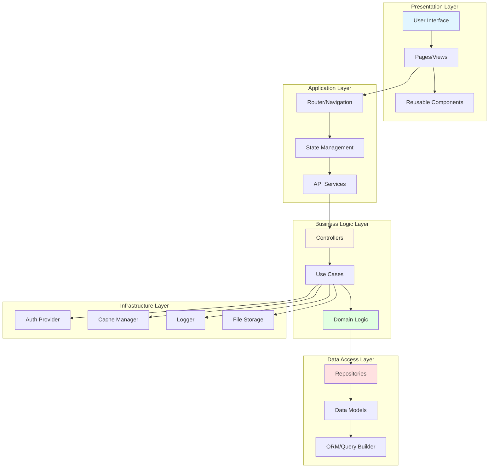
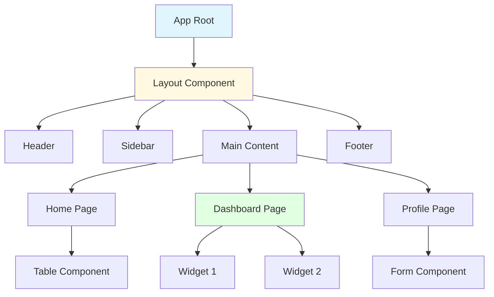
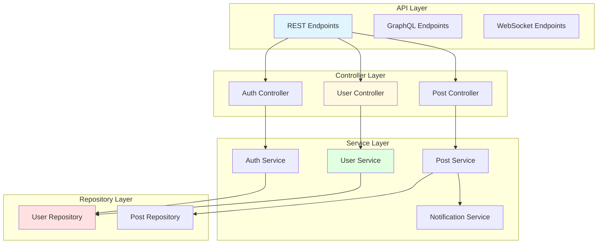
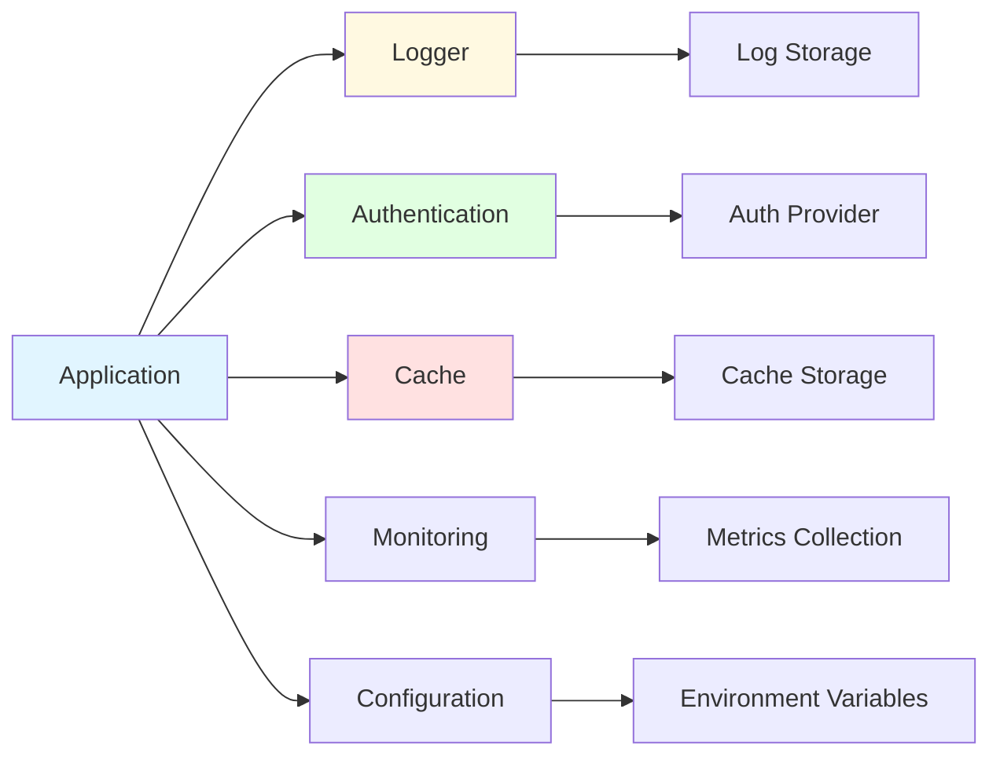
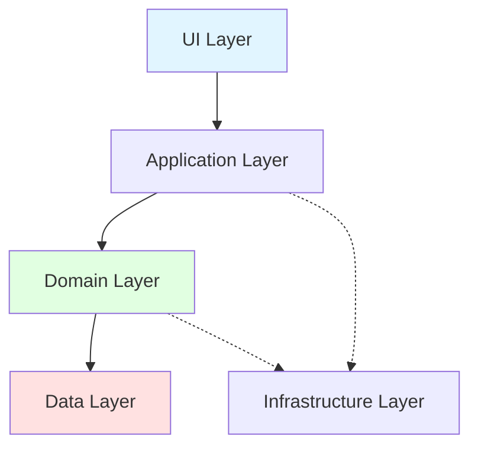
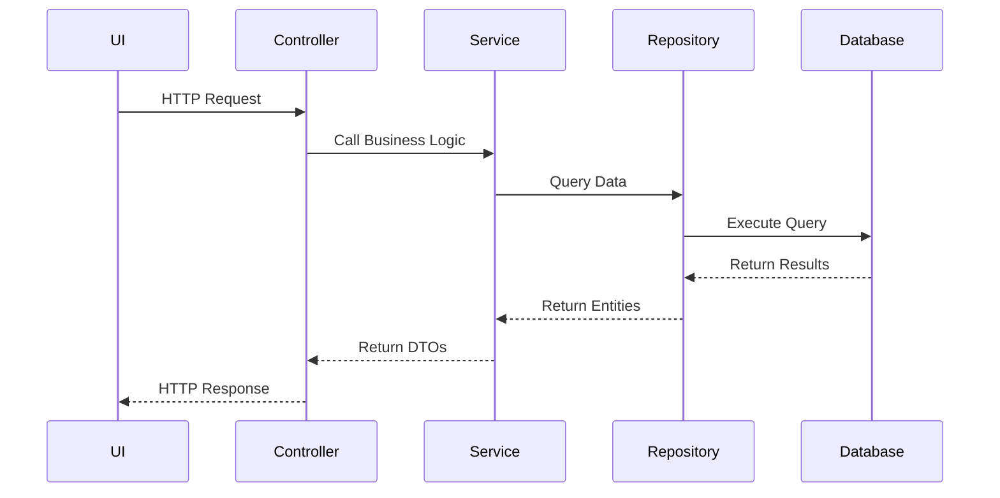
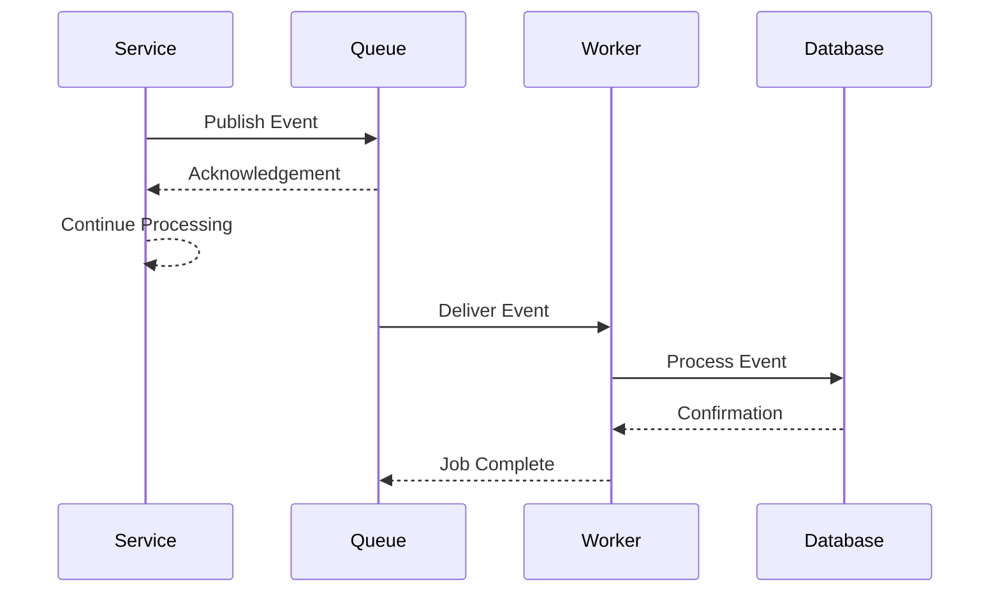
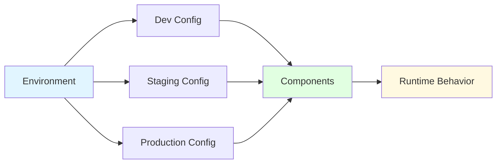
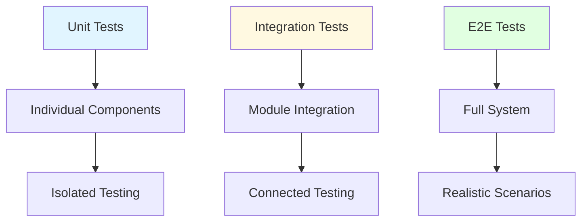
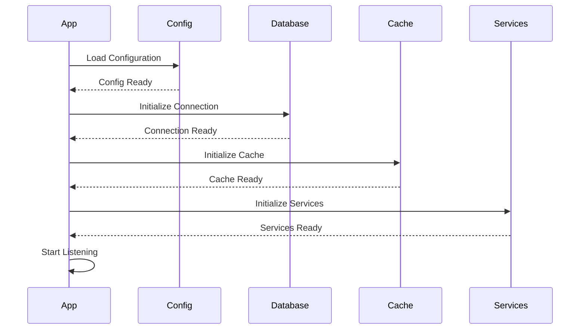

# Component Architecture

> **Document**: Component Architecture Diagram
> **Last Updated**: [Date]

## Overview

This document details the component architecture, showing how different parts of the system are organized, their responsibilities, and how they interact with each other.

---

## Component Organization

### High-Level Component View



---

## Frontend Components

### Component Hierarchy



### Component Descriptions

#### Presentation Components
- **User Interface**: Top-level UI container and theme provider
- **Pages/Views**: Page-level components corresponding to routes
- **Reusable Components**: Shared UI components (buttons, forms, modals)

#### Application Components
- **Router/Navigation**: Handles routing and navigation logic
- **State Management**: Global and local state management
- **API Services**: Client-side API communication layer

---

## Backend Components

### Service Architecture



### Component Descriptions

#### API Layer
- **REST Endpoints**: RESTful API routes
- **GraphQL Endpoints**: GraphQL schema and resolvers
- **WebSocket Endpoints**: Real-time communication channels

#### Controller Layer
- **User Controller**: Handles user-related requests
- **Post Controller**: Manages post CRUD operations
- **Auth Controller**: Authentication and authorization

#### Service Layer
- **User Service**: User business logic
- **Post Service**: Post processing and validation
- **Auth Service**: Authentication logic
- **Notification Service**: Notification delivery

#### Repository Layer
- **User Repository**: User data access
- **Post Repository**: Post data access

---

## Shared Components

### Cross-Cutting Concerns



### Infrastructure Components

- **Logger**: Centralized logging
- **Authentication**: JWT/OAuth provider
- **Cache Manager**: Redis/Memory cache
- **Monitoring**: Metrics and tracing
- **Configuration**: Environment config management

---

## Component Dependencies

### Dependency Graph



### Dependency Rules

1. **UI Layer** depends on Application Layer (no direct access to Domain)
2. **Application Layer** orchestrates Domain and Infrastructure
3. **Domain Layer** is independent (core business logic)
4. **Data Layer** is accessed only through Domain
5. **Infrastructure** provides services to Application and Domain

---

## Component Communication

### Synchronous Communication



### Asynchronous Communication



---

## Component Responsibilities

### Frontend Components

| Component | Responsibility | Dependencies |
|-----------|---------------|--------------|
| UI Components | Presentation and user interaction | React, CSS |
| State Management | Global application state | Zustand/Redux |
| API Services | Server communication | Axios/Fetch |
| Router | Navigation and routing | React Router |

### Backend Components

| Component | Responsibility | Dependencies |
|-----------|---------------|--------------|
| Controllers | Request handling and validation | Framework |
| Services | Business logic implementation | Domain Models |
| Repositories | Data access abstraction | ORM |
| Models | Data structure and validation | ORM/Pydantic |

### Infrastructure Components

| Component | Responsibility | Dependencies |
|-----------|---------------|--------------|
| Auth Provider | Authentication/Authorization | JWT/OAuth |
| Cache Manager | Caching strategy | Redis |
| Logger | Centralized logging | Winston/Pino |
| File Storage | File upload/retrieval | S3/Local |

---

## Component Interfaces

### Example: User Service Interface

```typescript
interface IUserService {
  // User CRUD operations
  createUser(data: CreateUserDto): Promise<User>;
  getUserById(id: string): Promise<User | null>;
  updateUser(id: string, data: UpdateUserDto): Promise<User>;
  deleteUser(id: string): Promise<void>;

  // User queries
  listUsers(filter: UserFilter): Promise<User[]>;
  searchUsers(query: string): Promise<User[]>;

  // User authentication
  authenticate(credentials: LoginDto): Promise<AuthToken>;
  refreshToken(token: string): Promise<AuthToken>;
}
```

### Example: Repository Interface

```typescript
interface IUserRepository {
  // Basic CRUD
  create(user: User): Promise<User>;
  findById(id: string): Promise<User | null>;
  update(id: string, data: Partial<User>): Promise<User>;
  delete(id: string): Promise<void>;

  // Queries
  findAll(options?: QueryOptions): Promise<User[]>;
  findByEmail(email: string): Promise<User | null>;
  findByUsername(username: string): Promise<User | null>;
}
```

---

## Component Configuration

### Environment-Based Configuration



### Configuration Management

- **Development**: Loose validation, verbose logging, mock services
- **Staging**: Production-like, moderate logging, real services
- **Production**: Strict validation, error-only logging, real services

---

## Testing Strategy

### Component Testing



### Test Coverage

- **Unit Tests**: 80%+ coverage for services and utilities
- **Integration Tests**: Critical paths and API endpoints
- **E2E Tests**: Core user flows and business processes

---

## Component Lifecycle

### Initialization Flow



---

## References

- [Architecture Overview](./overview.md)
- [Data Flow Diagrams](./data-flow.md)
- [API Documentation](./api.md)

---

**Document Version**: 1.0.0
**Last Review**: [Date]
