# Data Flow Architecture

> **Document**: Data Flow Diagram
> **Last Updated**: [Date]

## Overview

This document illustrates how data flows through the system, including data transformations, validation steps, and storage strategies.

---

## Request/Response Flow

### Standard Request Flow

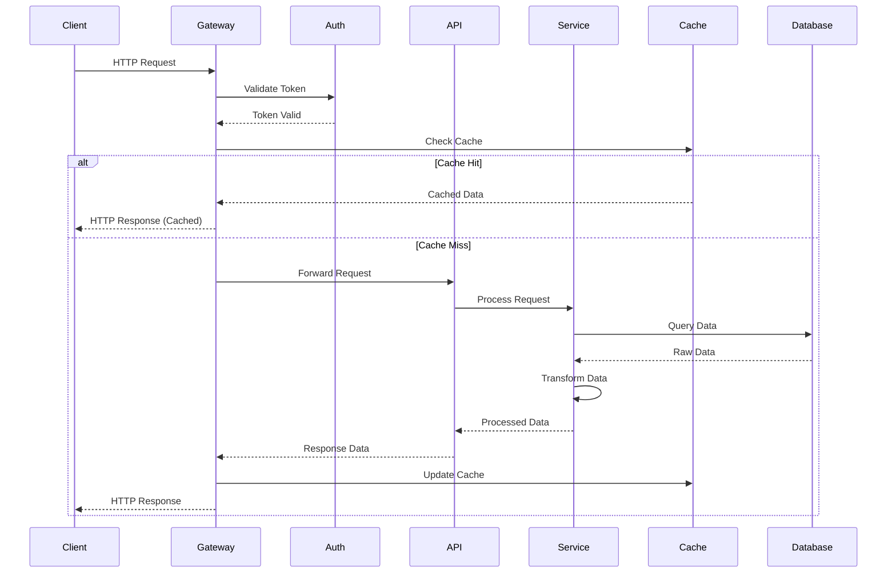

### Write Operation Flow

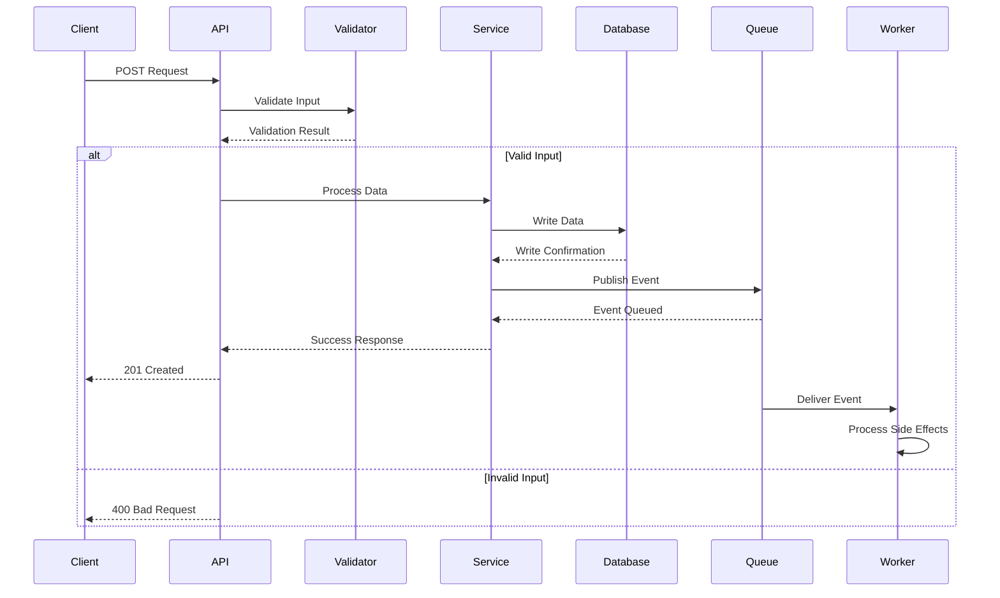

---

## Data Processing Pipeline

### Input to Output Pipeline

```mermaid
graph LR
    INPUT[Raw Input] --> VALIDATE[Validation]
    VALIDATE --> SANITIZE[Sanitization]
    SANITIZE --> PARSE[Parsing]
    PARSE --> TRANSFORM[Transformation]
    TRANSFORM --> ENRICH[Enrichment]
    ENRICH --> BUSINESS[Business Logic]
    BUSINESS --> FORMAT[Formatting]
    FORMAT --> OUTPUT[Output]

    style INPUT fill:#ffe1e1
    style VALIDATE fill:#fff9e1
    style BUSINESS fill:#e1ffe1
    style OUTPUT fill:#e1f5ff
```

### Data Transformation Stages

1. **Validation**: Check data structure and types
2. **Sanitization**: Remove harmful content
3. **Parsing**: Extract meaningful information
4. **Transformation**: Convert to internal format
5. **Enrichment**: Add derived or external data
6. **Business Logic**: Apply business rules
7. **Formatting**: Convert to output format
8. **Output**: Return processed data

---

## Data Storage Flow

### Write Path

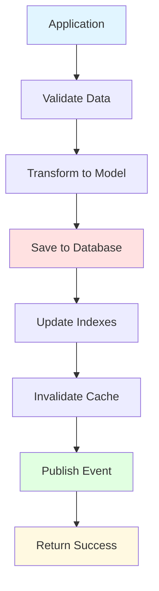

### Read Path

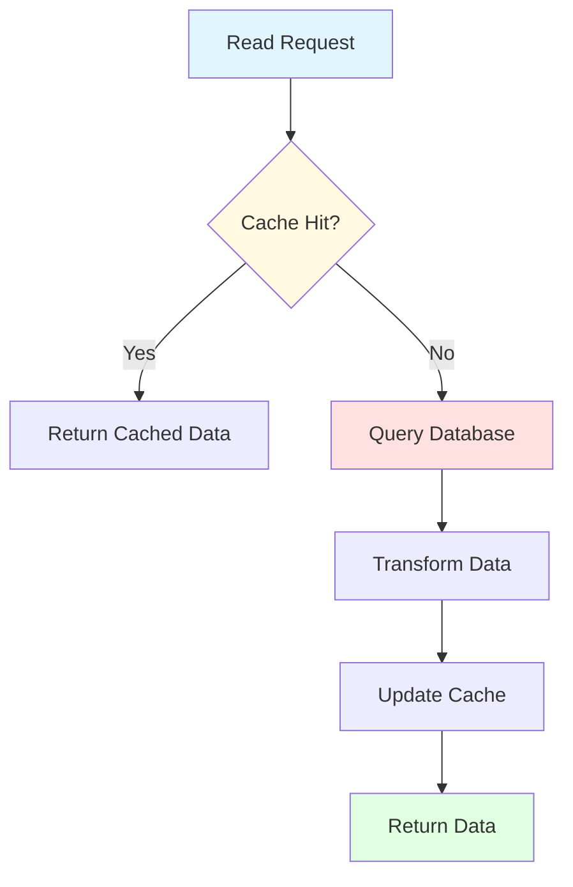

---

## Event-Driven Data Flow

### Event Processing Pipeline

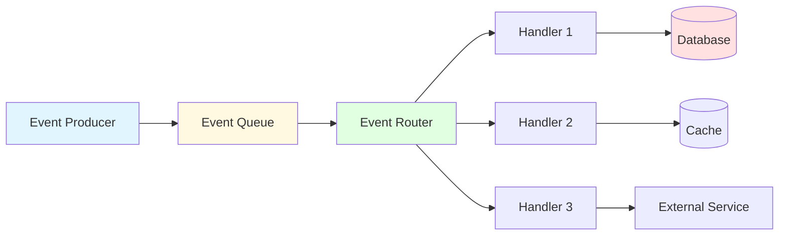

### Event Flow Sequence

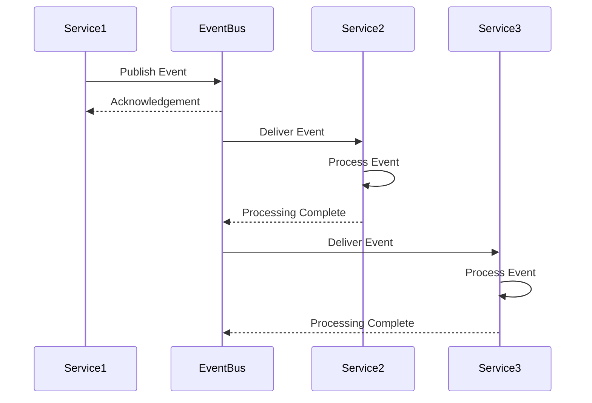

---

## Data Synchronization

### Master-Replica Sync

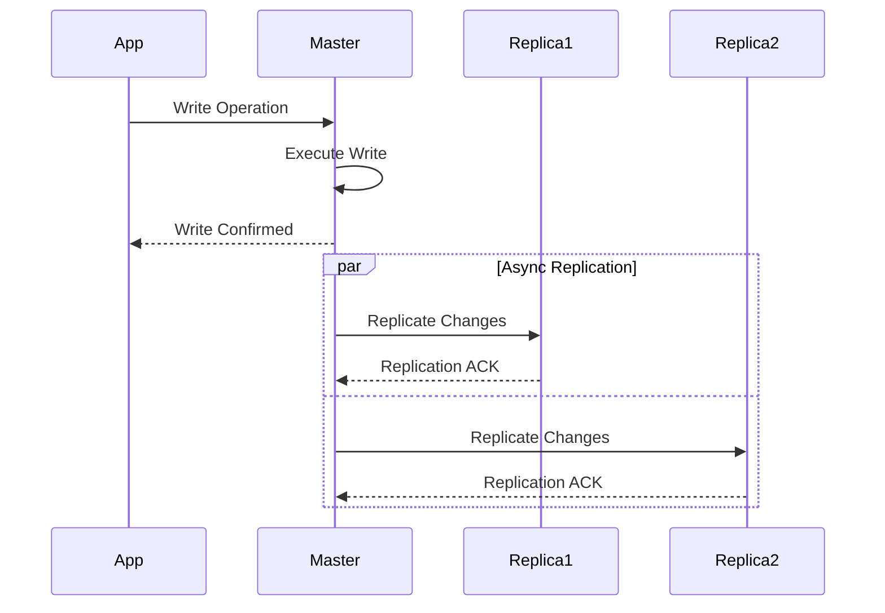

### Cache Invalidation Flow

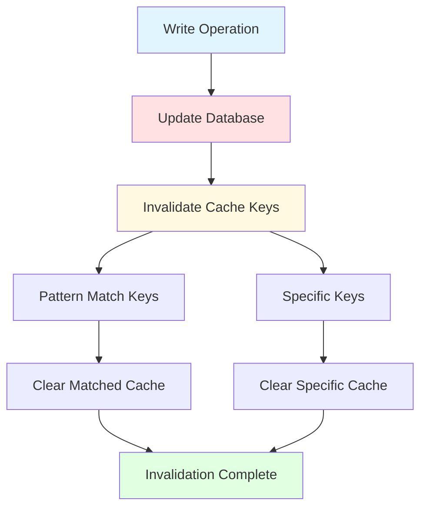

---

## Data Aggregation

### Multi-Source Aggregation

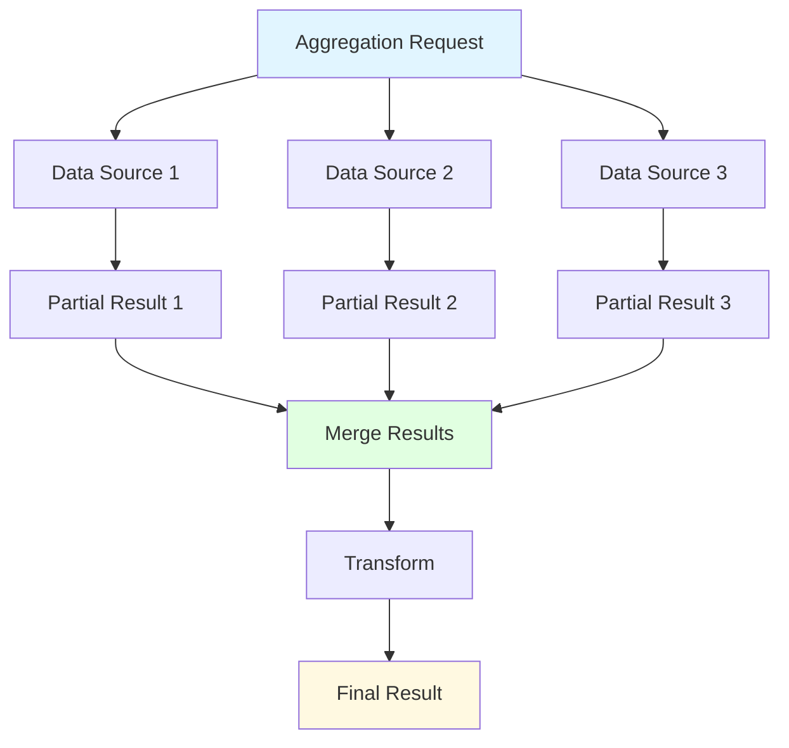

### Parallel Query Execution

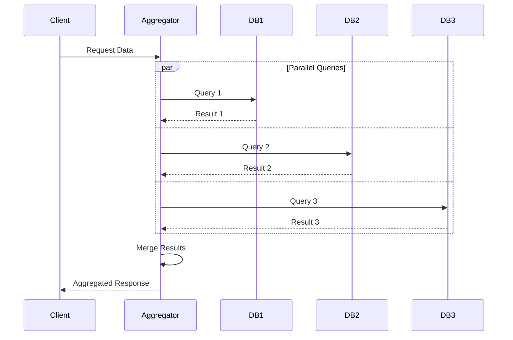

---

## Real-Time Data Flow

### WebSocket Data Stream

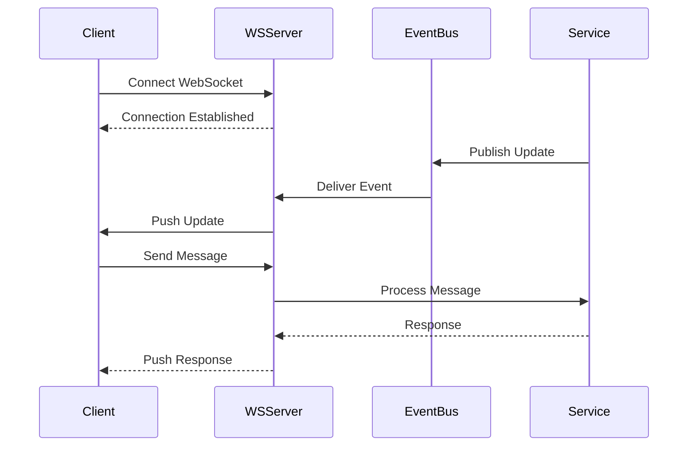

### Server-Sent Events (SSE)

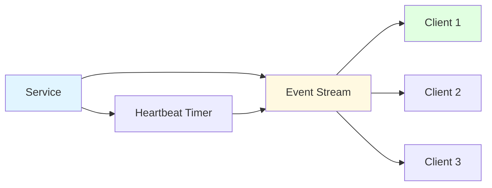

---

## Batch Processing Flow

### Batch Job Pipeline

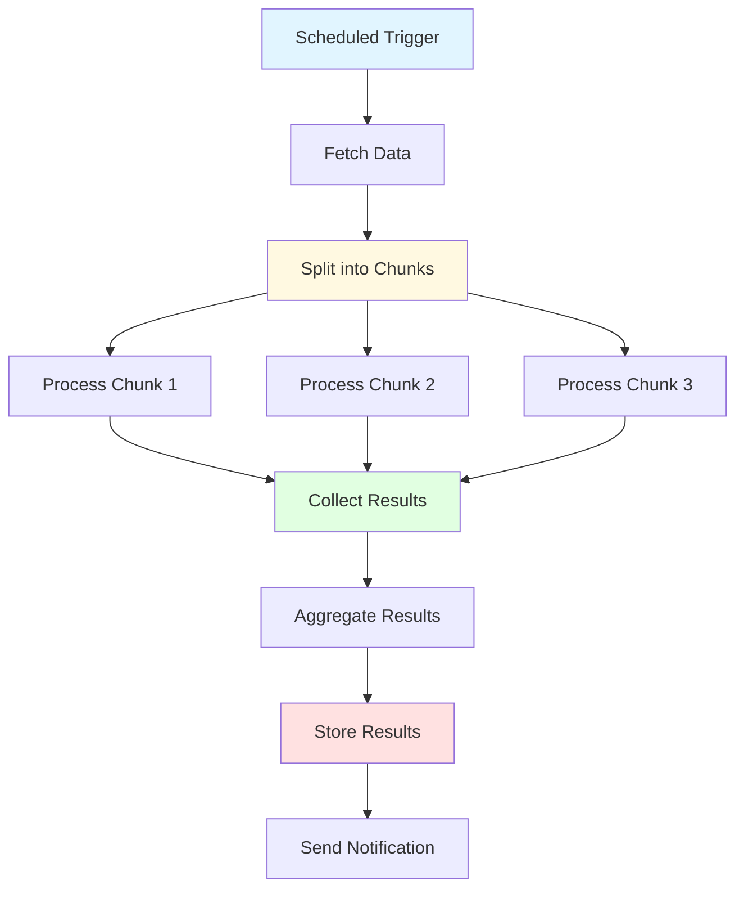

---

## Data Validation Flow

### Multi-Layer Validation

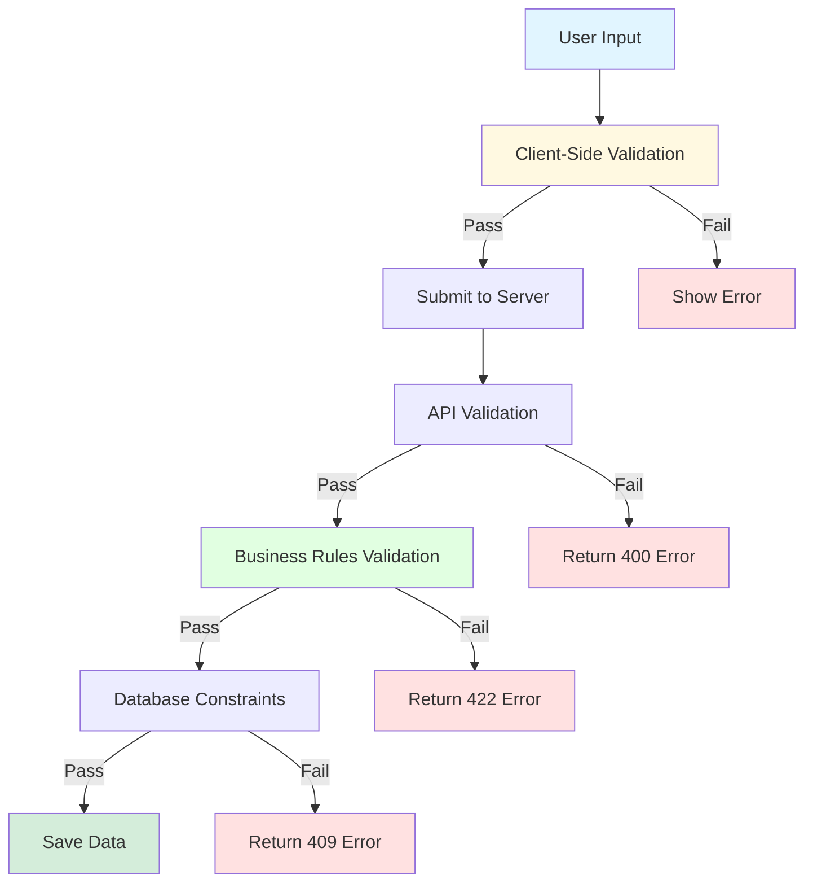

---

## Data Formats

### Data Transformation

#### Input Format (JSON)
```json
{
  "user_id": "123",
  "created_at": "2024-01-01T00:00:00Z",
  "items": ["item1", "item2"]
}
```

#### Internal Format (Domain Model)
```typescript
class Order {
  userId: UserId;
  createdAt: Date;
  items: OrderItem[];
}
```

#### Output Format (API Response)
```json
{
  "id": "order-456",
  "user": {
    "id": "123",
    "name": "John Doe"
  },
  "created": "2024-01-01T00:00:00Z",
  "items": [
    {"id": "item1", "name": "Product 1"},
    {"id": "item2", "name": "Product 2"}
  ]
}
```

---

## Error Handling Flow

### Error Propagation

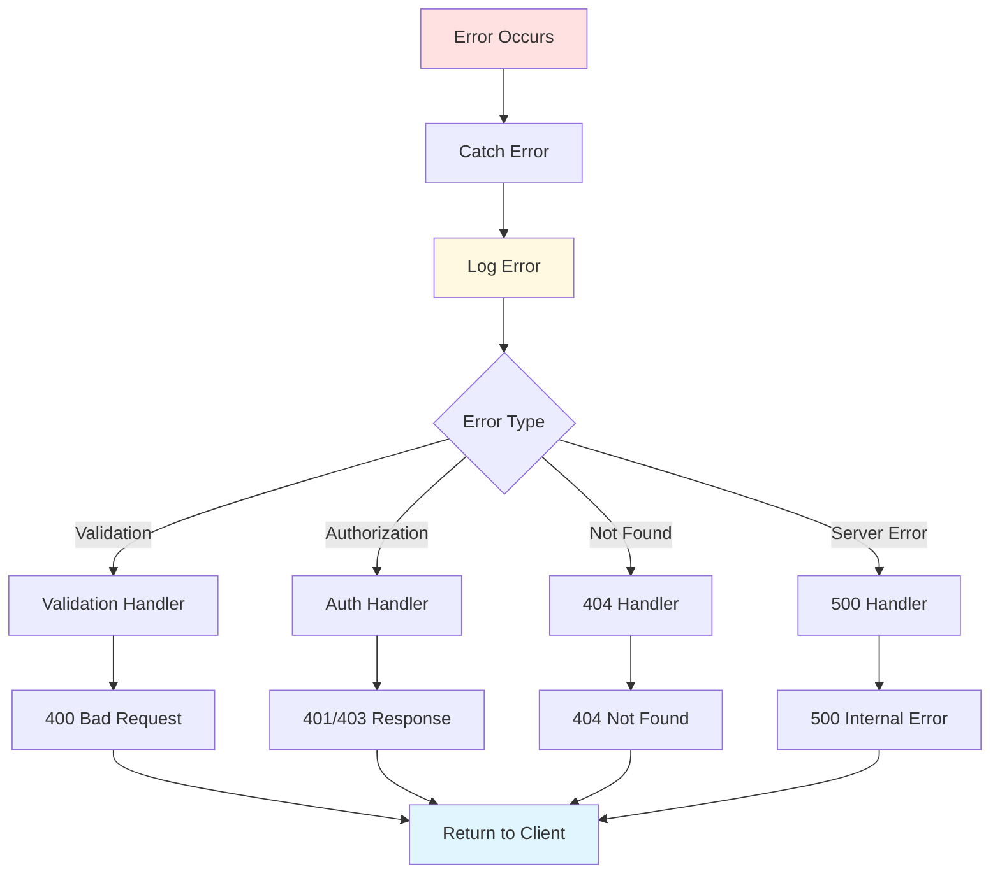

---

## Performance Optimization

### Caching Strategy

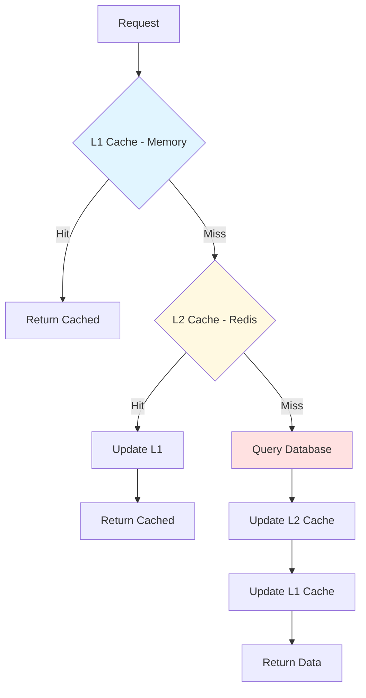

---

## References

- [Architecture Overview](./overview.md)
- [Component Architecture](./components.md)
- [API Documentation](./api.md)

---

**Document Version**: 1.0.0
**Last Review**: [Date]
