# Deployment Architecture

> **Document**: Deployment Architecture Diagram
> **Last Updated**: [Date]

## Overview

This document describes the deployment architecture, infrastructure components, environment specifications, and deployment strategies.

---

## Production Infrastructure

### High-Level Infrastructure

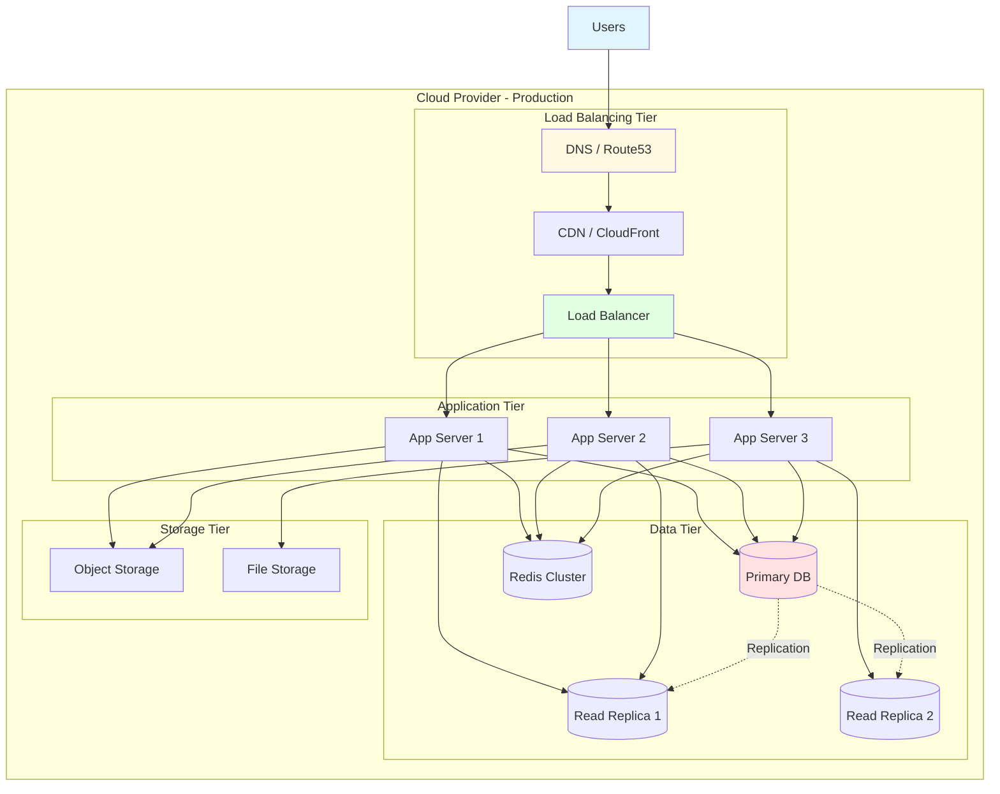

---

## Multi-Region Deployment

### Global Infrastructure

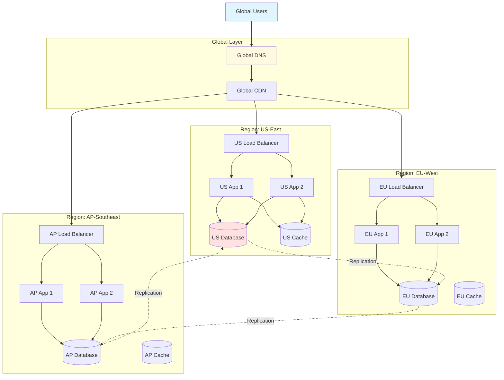

---

## Environment Architecture

### Development Environment

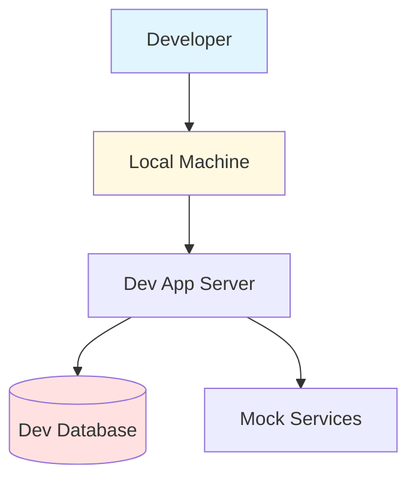

### Staging Environment

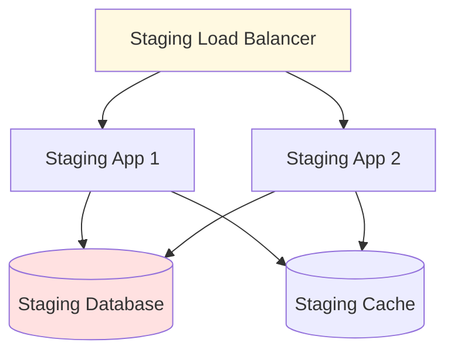

### Production Environment

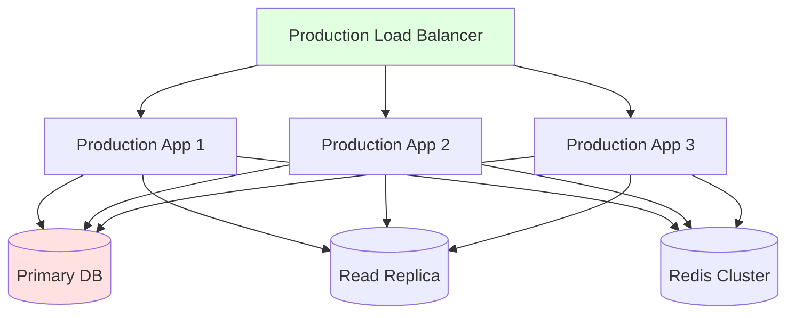

---

## Container Architecture

### Kubernetes Deployment

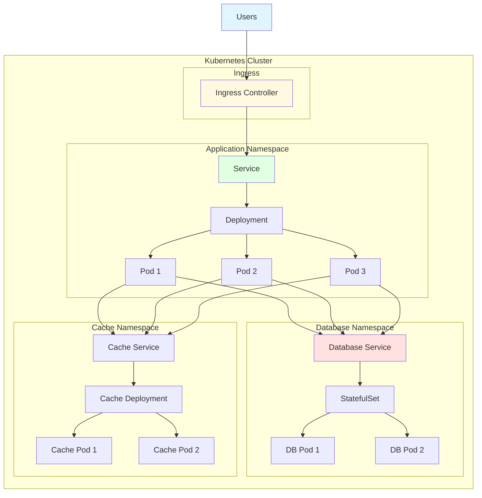

---

## Deployment Strategy

### Blue-Green Deployment

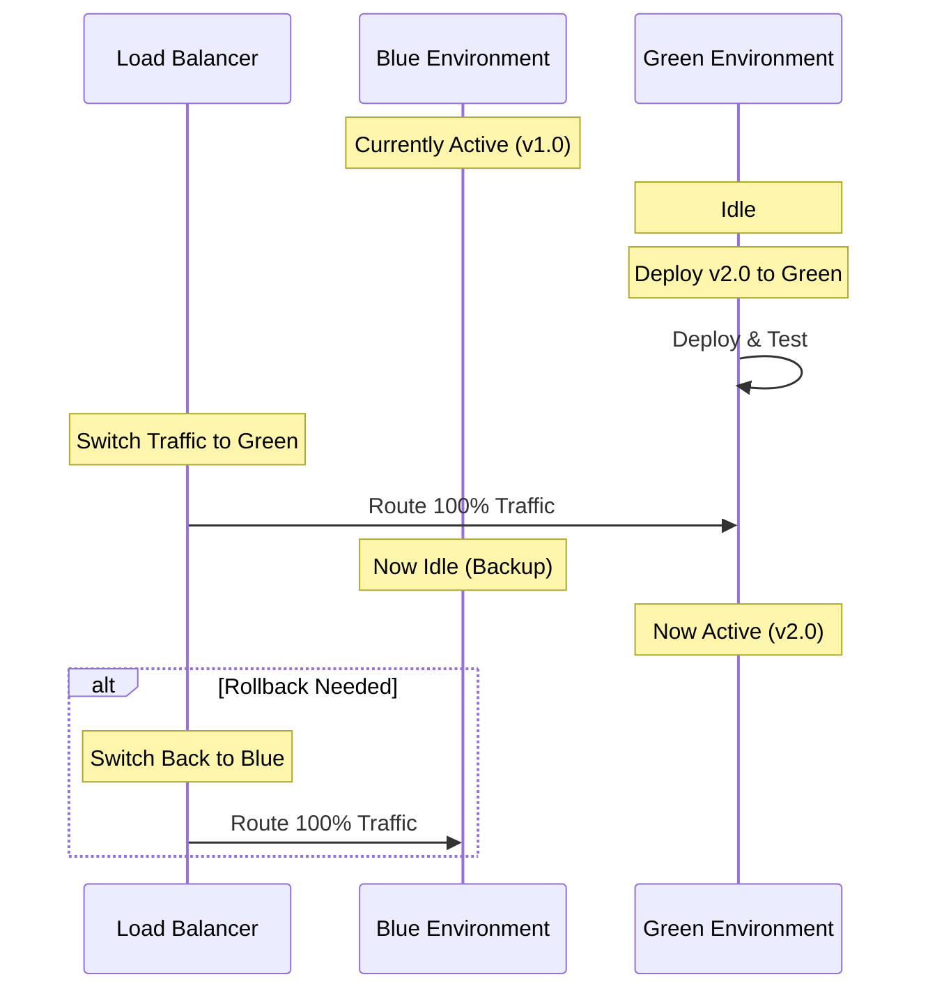

### Canary Deployment

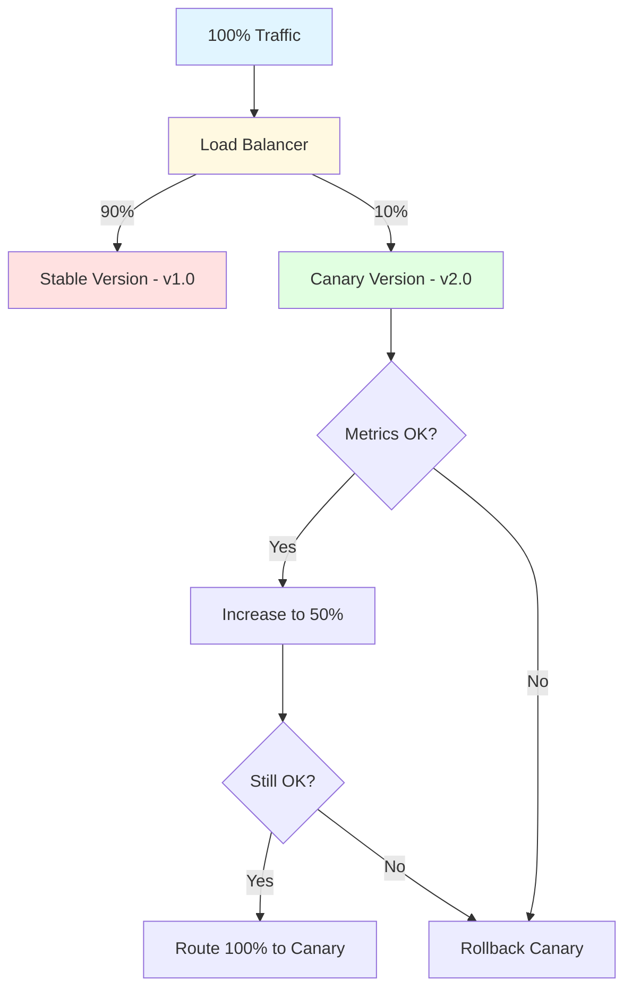

### Rolling Update

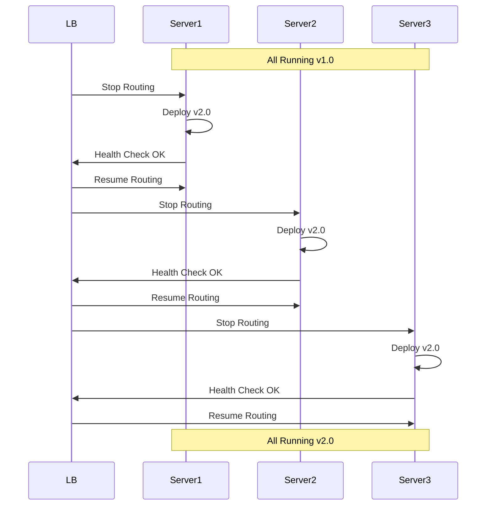

---

## CI/CD Pipeline

### Deployment Pipeline

```mermaid
graph LR
    CODE[Code Commit] --> BUILD[Build]
    BUILD --> TEST[Unit Tests]
    TEST --> LINT[Linting]
    LINT --> SECURITY[Security Scan]
    SECURITY --> ARTIFACT[Build Artifact]

    ARTIFACT --> DEPLOY_DEV[Deploy to Dev]
    DEPLOY_DEV --> TEST_DEV[Integration Tests]

    TEST_DEV --> DEPLOY_STAGING[Deploy to Staging]
    DEPLOY_STAGING --> TEST_STAGING[E2E Tests]

    TEST_STAGING --> APPROVE[Manual Approval]
    APPROVE --> DEPLOY_PROD[Deploy to Production]
    DEPLOY_PROD --> SMOKE_TEST[Smoke Tests]
    SMOKE_TEST --> MONITOR[Monitor Metrics]

    style CODE fill:#e1f5ff
    style BUILD fill:#fff9e1
    style DEPLOY_PROD fill:#e1ffe1
    style MONITOR fill:#d4edda
```

---

## Infrastructure Specifications

### Production Environment

#### Load Balancer
- **Type**: Application Load Balancer (Layer 7)
- **Capacity**: 10,000 concurrent connections
- **Health Checks**: HTTP GET /health every 30s
- **SSL/TLS**: TLS 1.3, Certificate auto-renewal

#### Application Servers
- **Instance Type**: [e.g., m5.xlarge]
- **Count**: 3-20 (auto-scaling)
- **CPU**: 4 vCPU per instance
- **Memory**: 16 GB per instance
- **Storage**: 100 GB SSD

#### Database
- **Engine**: PostgreSQL 16
- **Instance Type**: [e.g., db.r5.2xlarge]
- **Storage**: 500 GB SSD, auto-scaling to 2 TB
- **Backup**: Daily snapshots, 30-day retention
- **Replication**: 2 read replicas

#### Cache
- **Engine**: Redis 7
- **Instance Type**: [e.g., cache.r5.xlarge]
- **Memory**: 26 GB
- **Nodes**: 3 (1 primary, 2 replicas)
- **Eviction Policy**: LRU

---

## Monitoring & Observability

### Monitoring Stack

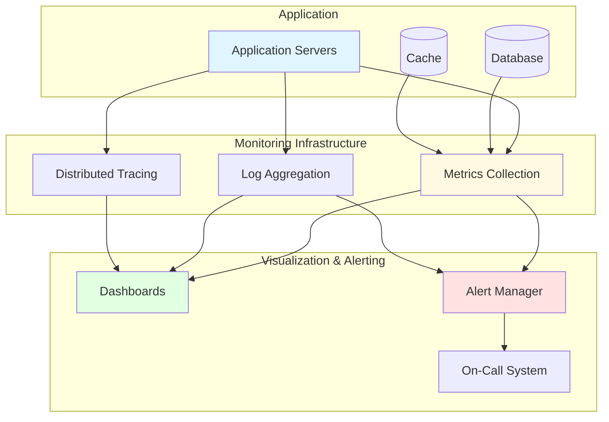

### Key Metrics

- **Application Metrics**: Request rate, response time, error rate
- **System Metrics**: CPU, memory, disk, network
- **Database Metrics**: Query time, connections, replication lag
- **Business Metrics**: User signups, transactions, revenue

---

## Disaster Recovery

### Backup Strategy

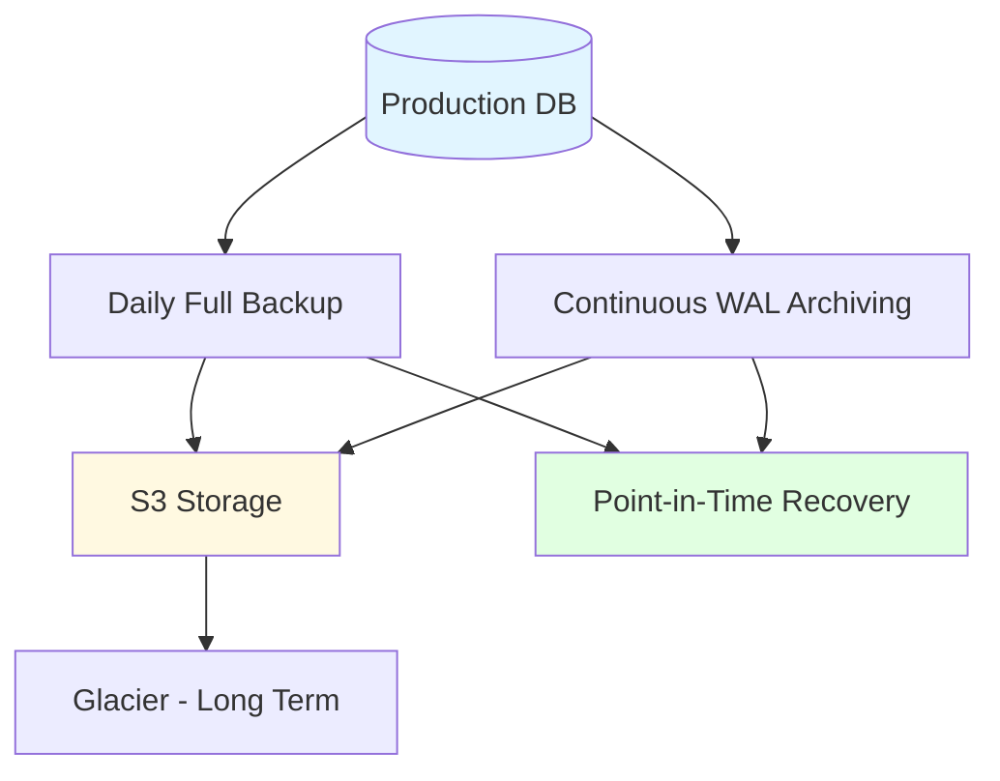

### Recovery Procedures

1. **Database Failure**: Promote read replica to primary (RTO: 5 minutes)
2. **Application Failure**: Auto-scaling launches new instances (RTO: 2 minutes)
3. **Regional Failure**: Failover to backup region (RTO: 15 minutes)
4. **Data Corruption**: Restore from backup (RTO: 1-4 hours)

---

## Security Infrastructure

### Network Security

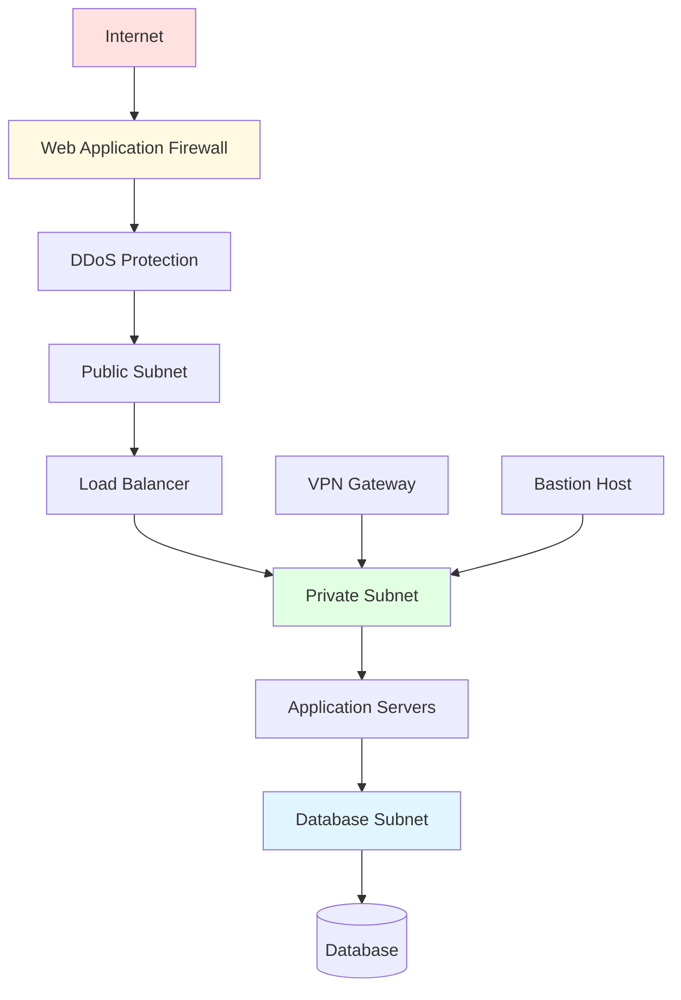

### Security Layers

- **Network Layer**: VPC, Security Groups, NACLs
- **Application Layer**: WAF rules, rate limiting
- **Transport Layer**: TLS 1.3 encryption
- **Data Layer**: Encryption at rest, encrypted backups

---

## Cost Optimization

### Resource Scaling

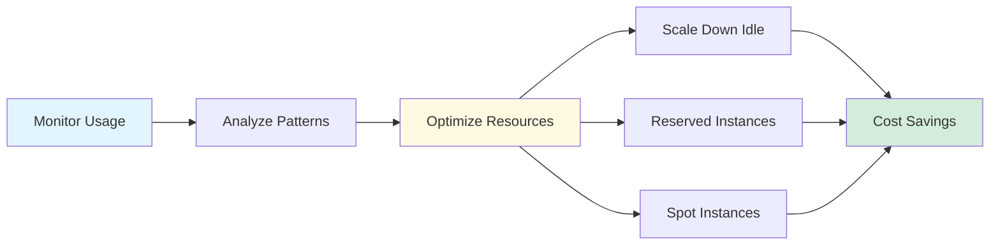

---

## References

- [Architecture Overview](./overview.md)
- [Component Architecture](./components.md)
- [Security Architecture](./security.md)

---

**Document Version**: 1.0.0
**Last Review**: [Date]
