# Security Architecture

> **Document**: Security Architecture Diagram
> **Last Updated**: [Date]

## Overview

This document describes the security architecture, including authentication, authorization, data protection, network security, and threat mitigation strategies.

---

## Security Layers

### Defense in Depth

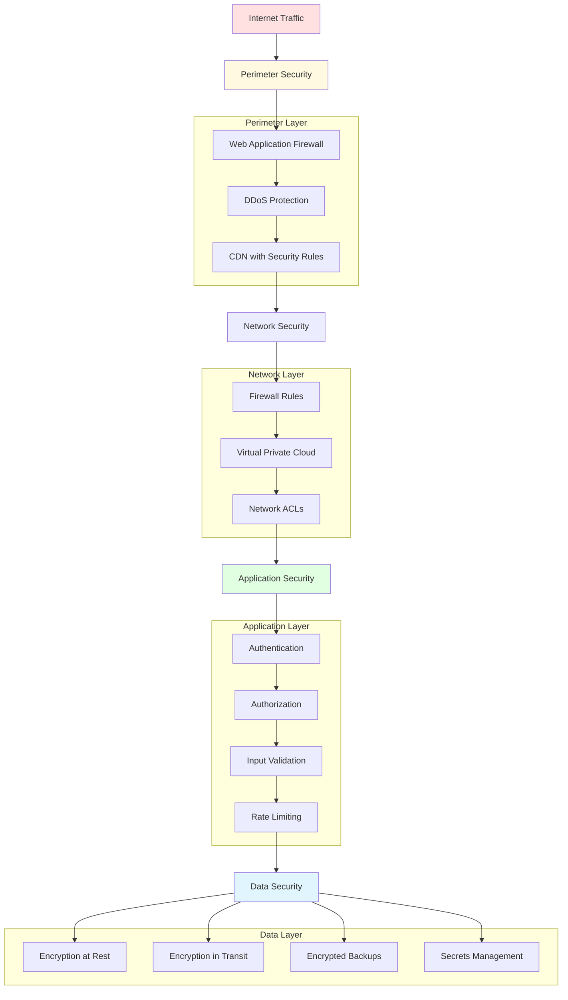
```mermaid
graph TB
    INTERNET[Internet Traffic] --> PERIMETER[Perimeter Security]

    subgraph "Perimeter Layer"
        WAF[Web Application Firewall]
        DDOS[DDoS Protection]
        CDN[CDN with Security Rules]
    end

    PERIMETER --> WAF
    WAF --> DDOS
    DDOS --> CDN

    CDN --> NETWORK[Network Security]

    subgraph "Network Layer"
        FIREWALL[Firewall Rules]
        VPC[Virtual Private Cloud]
        NACL[Network ACLs]
    end

    NETWORK --> FIREWALL
    FIREWALL --> VPC
    VPC --> NACL

    NACL --> APPLICATION[Application Security]

    subgraph "Application Layer"
        AUTH[Authentication]
        AUTHZ[Authorization]
        INPUT_VAL[Input Validation]
        RATE_LIMIT[Rate Limiting]
    end

    APPLICATION --> AUTH
    AUTH --> AUTHZ
    AUTHZ --> INPUT_VAL
    INPUT_VAL --> RATE_LIMIT

    RATE_LIMIT --> DATA[Data Security]

    subgraph "Data Layer"
        ENCRYPTION[Encryption at Rest]
        TLS[Encryption in Transit]
        BACKUP[Encrypted Backups]
        SECRETS[Secrets Management]
    end

    DATA --> ENCRYPTION
    DATA --> TLS
    DATA --> BACKUP
    DATA --> SECRETS

    style INTERNET fill:#ffe1e1
    style PERIMETER fill:#fff9e1
    style APPLICATION fill:#e1ffe1
    style DATA fill:#e1f5ff
```

---

## Authentication Architecture

### JWT Authentication Flow

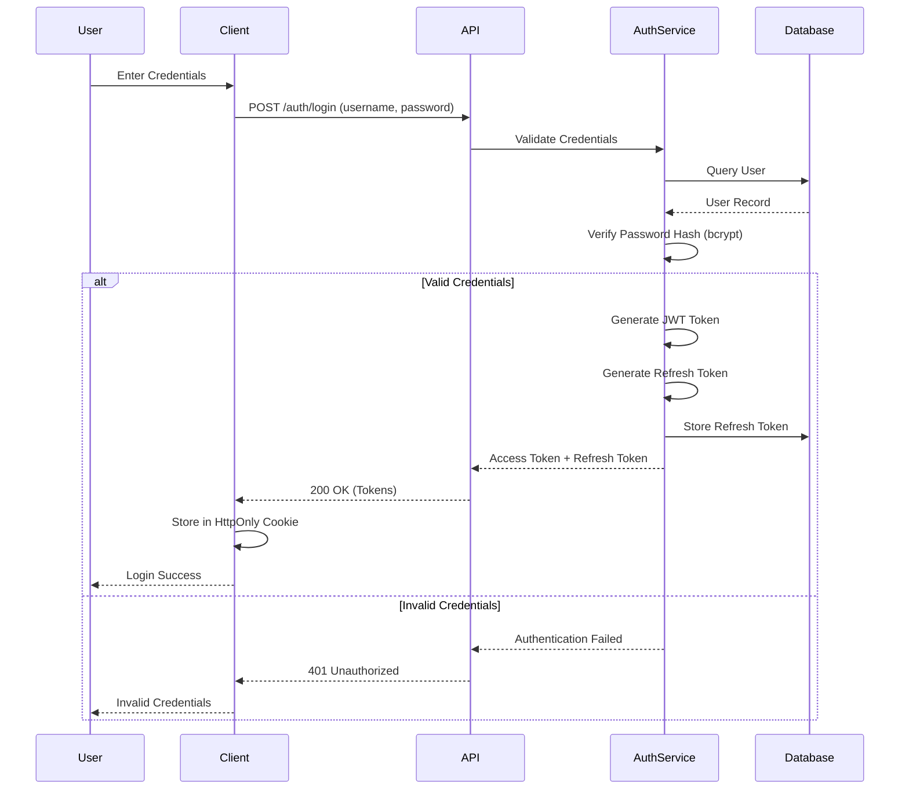
```mermaid
sequenceDiagram
    participant User
    participant Client
    participant API
    participant AuthService
    participant Database

    User->>Client: Enter Credentials
    Client->>API: POST /auth/login (username, password)
    API->>AuthService: Validate Credentials

    AuthService->>Database: Query User
    Database-->>AuthService: User Record

    AuthService->>AuthService: Verify Password Hash (bcrypt)

    alt Valid Credentials
        AuthService->>AuthService: Generate JWT Token
        AuthService->>AuthService: Generate Refresh Token
        AuthService->>Database: Store Refresh Token
        AuthService-->>API: Access Token + Refresh Token
        API-->>Client: 200 OK (Tokens)
        Client->>Client: Store in HttpOnly Cookie
        Client-->>User: Login Success
    else Invalid Credentials
        AuthService-->>API: Authentication Failed
        API-->>Client: 401 Unauthorized
        Client-->>User: Invalid Credentials
    end
```

### Multi-Factor Authentication (MFA)

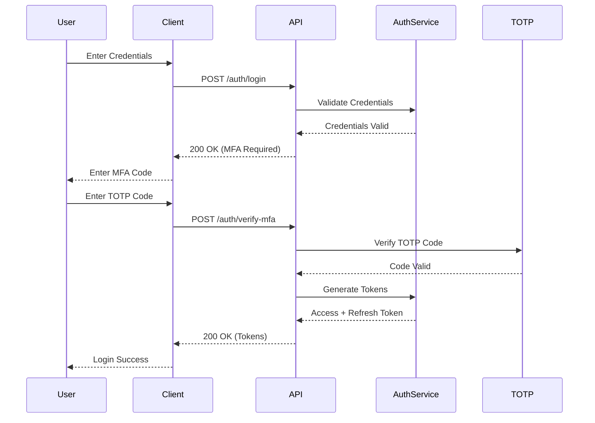
```mermaid
sequenceDiagram
    participant User
    participant Client
    participant API
    participant AuthService
    participant TOTP

    User->>Client: Enter Credentials
    Client->>API: POST /auth/login
    API->>AuthService: Validate Credentials
    AuthService-->>API: Credentials Valid

    API-->>Client: 200 OK (MFA Required)
    Client-->>User: Enter MFA Code

    User->>Client: Enter TOTP Code
    Client->>API: POST /auth/verify-mfa
    API->>TOTP: Verify TOTP Code
    TOTP-->>API: Code Valid

    API->>AuthService: Generate Tokens
    AuthService-->>API: Access + Refresh Token
    API-->>Client: 200 OK (Tokens)
    Client-->>User: Login Success
```

### OAuth 2.0 Authorization Code Flow

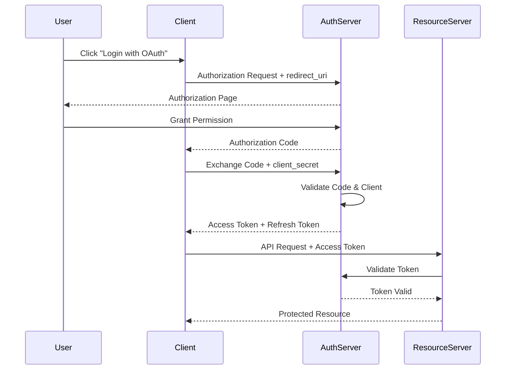
```mermaid
sequenceDiagram
    participant User
    participant Client
    participant AuthServer
    participant ResourceServer

    User->>Client: Click "Login with OAuth"
    Client->>AuthServer: Authorization Request + redirect_uri
    AuthServer-->>User: Authorization Page

    User->>AuthServer: Grant Permission
    AuthServer-->>Client: Authorization Code

    Client->>AuthServer: Exchange Code + client_secret
    AuthServer->>AuthServer: Validate Code & Client
    AuthServer-->>Client: Access Token + Refresh Token

    Client->>ResourceServer: API Request + Access Token
    ResourceServer->>AuthServer: Validate Token
    AuthServer-->>ResourceServer: Token Valid
    ResourceServer-->>Client: Protected Resource
```

---

## Authorization Architecture

### Role-Based Access Control (RBAC)

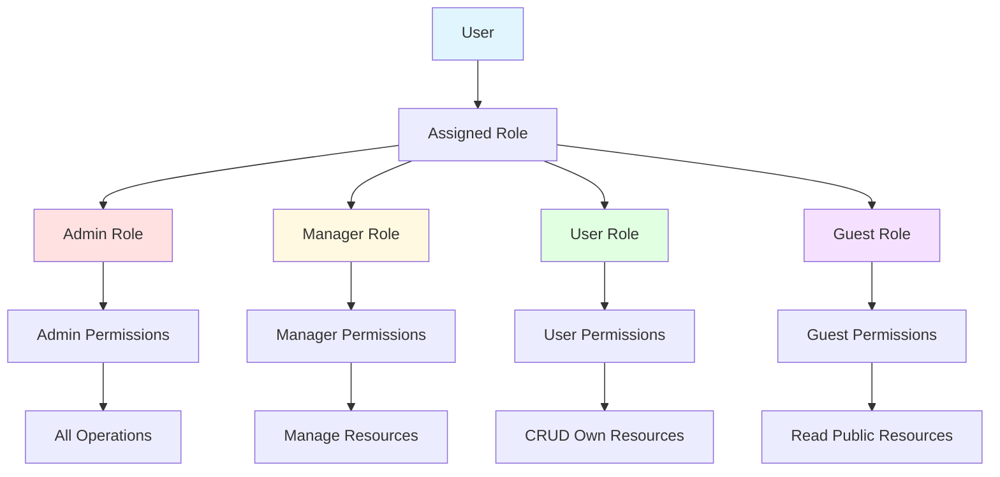
```mermaid
graph TB
    USER[User] --> ROLE[Assigned Role]

    ROLE --> ADMIN[Admin Role]
    ROLE --> MANAGER[Manager Role]
    ROLE --> USER_ROLE[User Role]
    ROLE --> GUEST[Guest Role]

    ADMIN --> ADMIN_PERMS[Admin Permissions]
    MANAGER --> MANAGER_PERMS[Manager Permissions]
    USER_ROLE --> USER_PERMS[User Permissions]
    GUEST --> GUEST_PERMS[Guest Permissions]

    ADMIN_PERMS --> ALL[All Operations]
    MANAGER_PERMS --> MANAGE[Manage Resources]
    USER_PERMS --> CRUD[CRUD Own Resources]
    GUEST_PERMS --> READ[Read Public Resources]

    style USER fill:#e1f5ff
    style ADMIN fill:#ffe1e1
    style MANAGER fill:#fff9e1
    style USER_ROLE fill:#e1ffe1
    style GUEST fill:#f5e1ff
```

### Attribute-Based Access Control (ABAC)

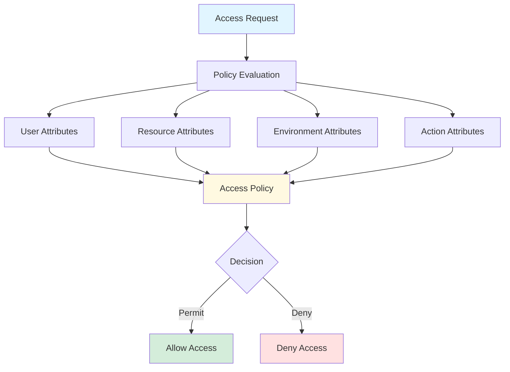
```mermaid
graph TB
    REQUEST[Access Request] --> EVALUATE[Policy Evaluation]

    EVALUATE --> USER_ATTR[User Attributes]
    EVALUATE --> RESOURCE_ATTR[Resource Attributes]
    EVALUATE --> ENV_ATTR[Environment Attributes]
    EVALUATE --> ACTION_ATTR[Action Attributes]

    USER_ATTR --> POLICY[Access Policy]
    RESOURCE_ATTR --> POLICY
    ENV_ATTR --> POLICY
    ACTION_ATTR --> POLICY

    POLICY --> DECISION{Decision}
    DECISION -->|Permit| ALLOW[Allow Access]
    DECISION -->|Deny| REJECT[Deny Access]

    style REQUEST fill:#e1f5ff
    style POLICY fill:#fff9e1
    style ALLOW fill:#d4edda
    style REJECT fill:#ffe1e1
```

### Permission Check Flow

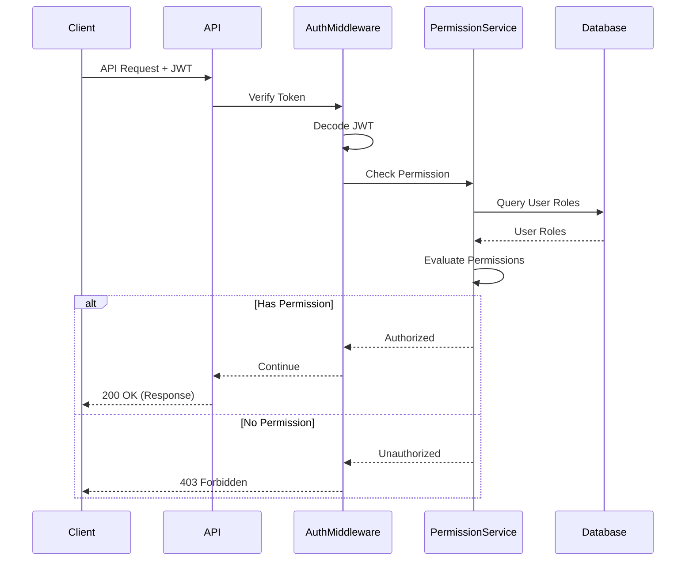
```mermaid
sequenceDiagram
    participant Client
    participant API
    participant AuthMiddleware
    participant PermissionService
    participant Database

    Client->>API: API Request + JWT
    API->>AuthMiddleware: Verify Token
    AuthMiddleware->>AuthMiddleware: Decode JWT

    AuthMiddleware->>PermissionService: Check Permission
    PermissionService->>Database: Query User Roles
    Database-->>PermissionService: User Roles

    PermissionService->>PermissionService: Evaluate Permissions

    alt Has Permission
        PermissionService-->>AuthMiddleware: Authorized
        AuthMiddleware-->>API: Continue
        API-->>Client: 200 OK (Response)
    else No Permission
        PermissionService-->>AuthMiddleware: Unauthorized
        AuthMiddleware-->>Client: 403 Forbidden
    end
```

---

## Data Security

### Encryption at Rest

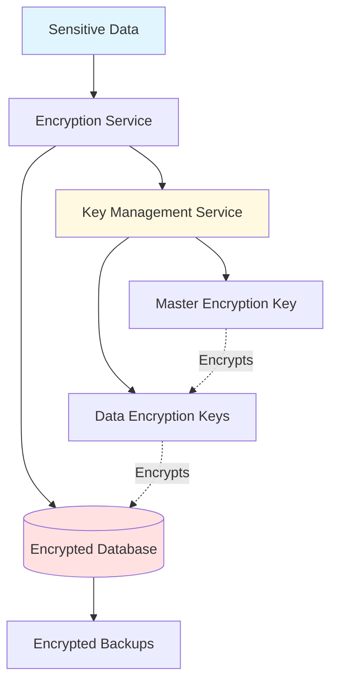
```mermaid
graph TB
    DATA[Sensitive Data] --> ENCRYPT[Encryption Service]
    ENCRYPT --> KEY_MGMT[Key Management Service]

    KEY_MGMT --> MASTER_KEY[Master Encryption Key]
    KEY_MGMT --> DATA_KEY[Data Encryption Keys]

    ENCRYPT --> ENCRYPTED_DATA[(Encrypted Database)]
    ENCRYPTED_DATA --> BACKUPS[Encrypted Backups]

    MASTER_KEY -.->|Encrypts| DATA_KEY
    DATA_KEY -.->|Encrypts| ENCRYPTED_DATA

    style DATA fill:#e1f5ff
    style KEY_MGMT fill:#fff9e1
    style ENCRYPTED_DATA fill:#ffe1e1
```

### Encryption in Transit

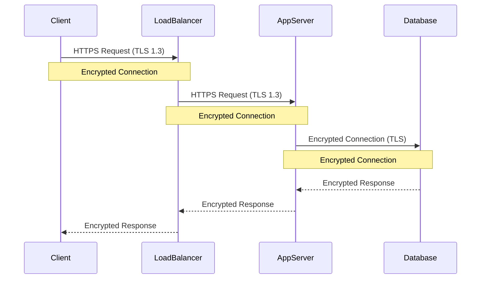
```mermaid
sequenceDiagram
    participant Client
    participant LoadBalancer
    participant AppServer
    participant Database

    Client->>LoadBalancer: HTTPS Request (TLS 1.3)
    Note over Client,LoadBalancer: Encrypted Connection

    LoadBalancer->>AppServer: HTTPS Request (TLS 1.3)
    Note over LoadBalancer,AppServer: Encrypted Connection

    AppServer->>Database: Encrypted Connection (TLS)
    Note over AppServer,Database: Encrypted Connection

    Database-->>AppServer: Encrypted Response
    AppServer-->>LoadBalancer: Encrypted Response
    LoadBalancer-->>Client: Encrypted Response
```

### Data Masking & Tokenization

```mermaid
graph LR
    SENSITIVE[Sensitive Data] --> DETECT[Detect PII]
    DETECT --> MASK[Mask/Tokenize]

    MASK --> EMAIL[email@example.com]
    MASK --> SSN[123-45-6789]
    MASK --> CREDIT[4111-1111-1111-1111]

    EMAIL --> MASKED_EMAIL[e***@example.com]
    SSN --> MASKED_SSN[***-**-6789]
    CREDIT --> TOKEN[tok_abc123xyz]

    style SENSITIVE fill:#ffe1e1
    style MASK fill:#fff9e1
    style MASKED_EMAIL fill:#e1ffe1
    style MASKED_SSN fill:#e1ffe1
    style TOKEN fill:#e1ffe1
```

---

## Network Security

### Network Segmentation

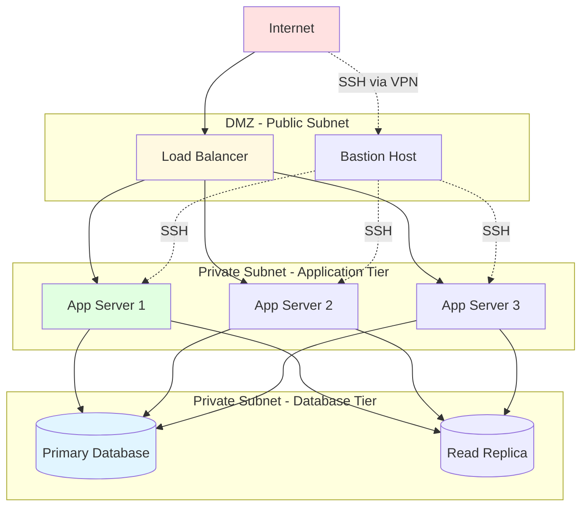
```mermaid
graph TB
    INTERNET[Internet]

    subgraph "DMZ - Public Subnet"
        LB[Load Balancer]
        BASTION[Bastion Host]
    end

    subgraph "Private Subnet - Application Tier"
        APP1[App Server 1]
        APP2[App Server 2]
        APP3[App Server 3]
    end

    subgraph "Private Subnet - Database Tier"
        DB_PRIMARY[(Primary Database)]
        DB_REPLICA[(Read Replica)]
    end

    INTERNET --> LB
    INTERNET -.->|SSH via VPN| BASTION

    LB --> APP1
    LB --> APP2
    LB --> APP3

    APP1 --> DB_PRIMARY
    APP2 --> DB_PRIMARY
    APP3 --> DB_PRIMARY

    APP1 --> DB_REPLICA
    APP2 --> DB_REPLICA
    APP3 --> DB_REPLICA

    BASTION -.->|SSH| APP1
    BASTION -.->|SSH| APP2
    BASTION -.->|SSH| APP3

    style INTERNET fill:#ffe1e1
    style LB fill:#fff9e1
    style APP1 fill:#e1ffe1
    style DB_PRIMARY fill:#e1f5ff
```

### Firewall Rules

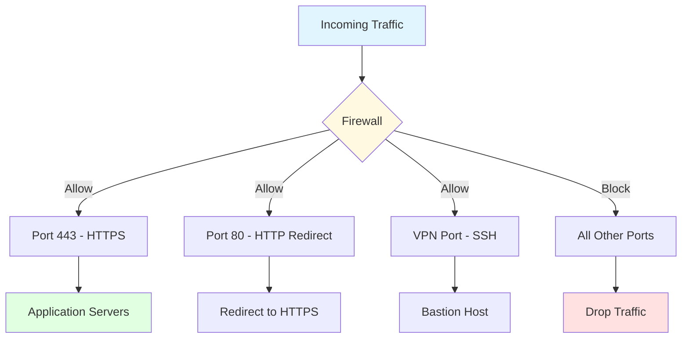
```mermaid
graph TB
    TRAFFIC[Incoming Traffic] --> FIREWALL{Firewall}

    FIREWALL -->|Allow| RULE1[Port 443 - HTTPS]
    FIREWALL -->|Allow| RULE2[Port 80 - HTTP Redirect]
    FIREWALL -->|Allow| RULE3[VPN Port - SSH]
    FIREWALL -->|Block| DEFAULT[All Other Ports]

    RULE1 --> APP[Application Servers]
    RULE2 --> REDIRECT[Redirect to HTTPS]
    RULE3 --> BASTION[Bastion Host]
    DEFAULT --> DROP[Drop Traffic]

    style TRAFFIC fill:#e1f5ff
    style FIREWALL fill:#fff9e1
    style APP fill:#e1ffe1
    style DROP fill:#ffe1e1
```

---

## Input Validation & Sanitization

### Validation Pipeline

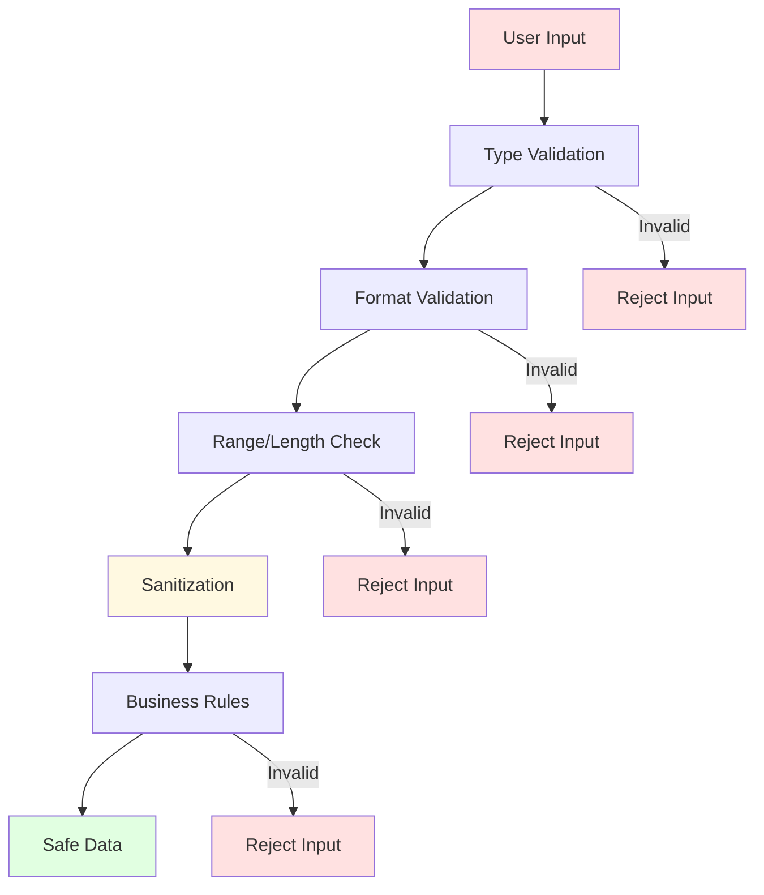
```mermaid
graph TB
    INPUT[User Input] --> TYPE_CHECK[Type Validation]
    TYPE_CHECK --> FORMAT_CHECK[Format Validation]
    FORMAT_CHECK --> RANGE_CHECK[Range/Length Check]
    RANGE_CHECK --> SANITIZE[Sanitization]
    SANITIZE --> BUSINESS_VAL[Business Rules]
    BUSINESS_VAL --> SAFE_DATA[Safe Data]

    TYPE_CHECK -->|Invalid| REJECT1[Reject Input]
    FORMAT_CHECK -->|Invalid| REJECT2[Reject Input]
    RANGE_CHECK -->|Invalid| REJECT3[Reject Input]
    BUSINESS_VAL -->|Invalid| REJECT4[Reject Input]

    style INPUT fill:#ffe1e1
    style SANITIZE fill:#fff9e1
    style SAFE_DATA fill:#e1ffe1
    style REJECT1 fill:#ffe1e1
    style REJECT2 fill:#ffe1e1
    style REJECT3 fill:#ffe1e1
    style REJECT4 fill:#ffe1e1
```

### SQL Injection Prevention

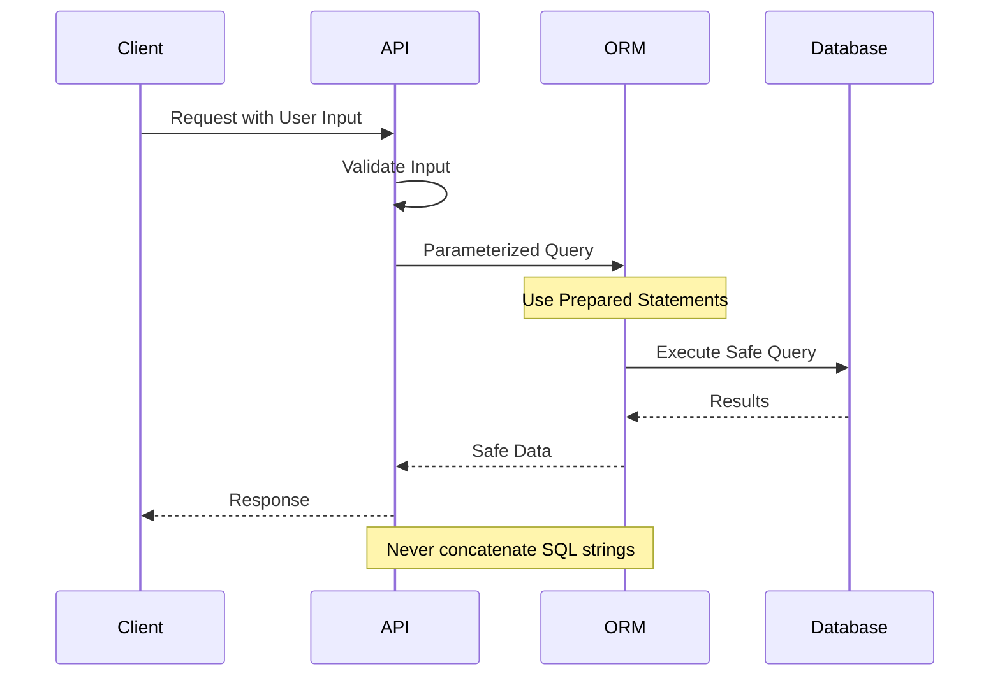
```mermaid
sequenceDiagram
    participant Client
    participant API
    participant ORM
    participant Database

    Client->>API: Request with User Input
    API->>API: Validate Input
    API->>ORM: Parameterized Query
    Note over ORM: Use Prepared Statements
    ORM->>Database: Execute Safe Query
    Database-->>ORM: Results
    ORM-->>API: Safe Data
    API-->>Client: Response

    Note over API,ORM: Never concatenate SQL strings
```

### XSS Prevention

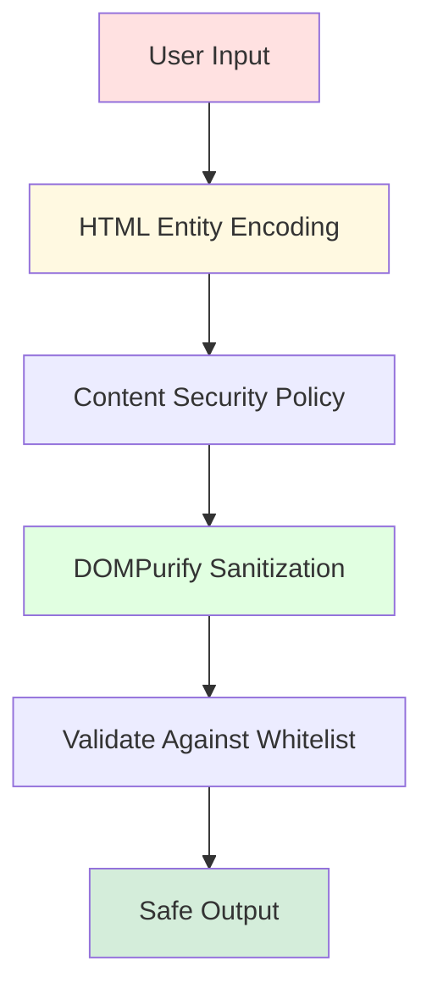
```mermaid
graph TB
    USER_INPUT[User Input] --> ENCODE[HTML Entity Encoding]
    ENCODE --> CSP[Content Security Policy]
    CSP --> SANITIZE[DOMPurify Sanitization]
    SANITIZE --> VALIDATE[Validate Against Whitelist]
    VALIDATE --> SAFE_OUTPUT[Safe Output]

    style USER_INPUT fill:#ffe1e1
    style ENCODE fill:#fff9e1
    style SANITIZE fill:#e1ffe1
    style SAFE_OUTPUT fill:#d4edda
```

---

## Secrets Management

### Secrets Storage

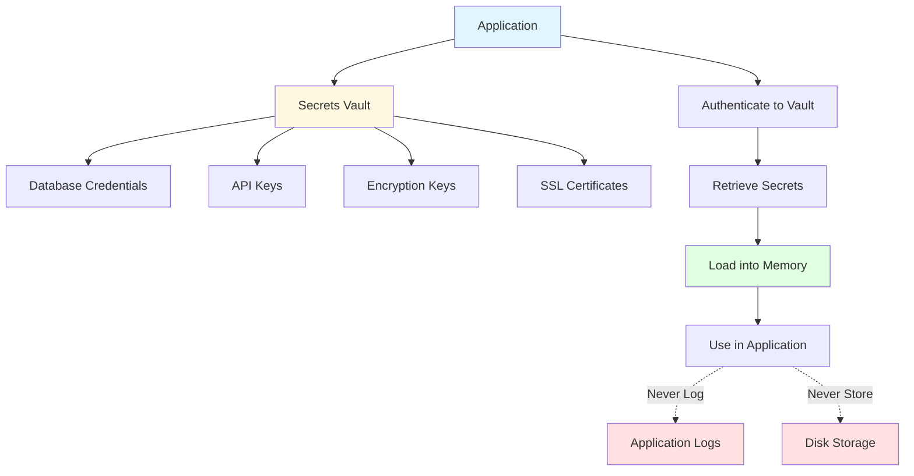
```mermaid
graph TB
    APP[Application] --> VAULT[Secrets Vault]

    VAULT --> DB_CREDS[Database Credentials]
    VAULT --> API_KEYS[API Keys]
    VAULT --> ENCRYPTION_KEYS[Encryption Keys]
    VAULT --> CERTIFICATES[SSL Certificates]

    APP --> AUTH_VAULT[Authenticate to Vault]
    AUTH_VAULT --> RETRIEVE[Retrieve Secrets]
    RETRIEVE --> MEMORY[Load into Memory]
    MEMORY --> USE[Use in Application]

    USE -.->|Never Log| LOGS[Application Logs]
    USE -.->|Never Store| DISK[Disk Storage]

    style APP fill:#e1f5ff
    style VAULT fill:#fff9e1
    style MEMORY fill:#e1ffe1
    style LOGS fill:#ffe1e1
    style DISK fill:#ffe1e1
```

### Secret Rotation

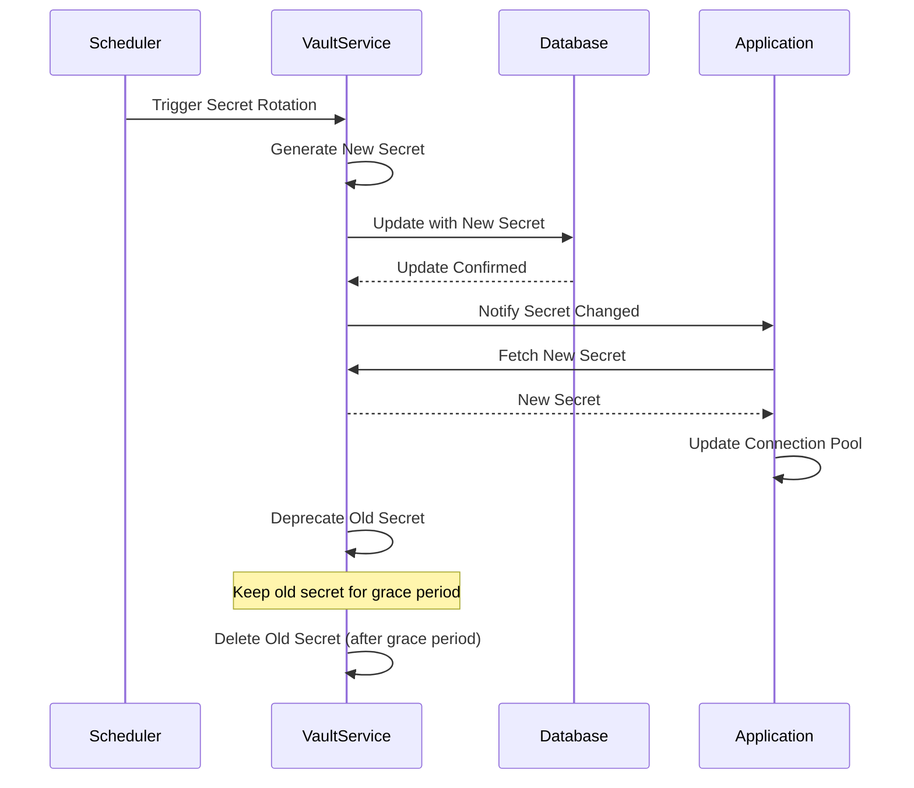
```mermaid
sequenceDiagram
    participant Scheduler
    participant VaultService
    participant Database
    participant Application

    Scheduler->>VaultService: Trigger Secret Rotation
    VaultService->>VaultService: Generate New Secret
    VaultService->>Database: Update with New Secret
    Database-->>VaultService: Update Confirmed

    VaultService->>Application: Notify Secret Changed
    Application->>VaultService: Fetch New Secret
    VaultService-->>Application: New Secret
    Application->>Application: Update Connection Pool

    VaultService->>VaultService: Deprecate Old Secret
    Note over VaultService: Keep old secret for grace period
    VaultService->>VaultService: Delete Old Secret (after grace period)
```

---

## Rate Limiting & DDoS Protection

### Rate Limiting Strategy

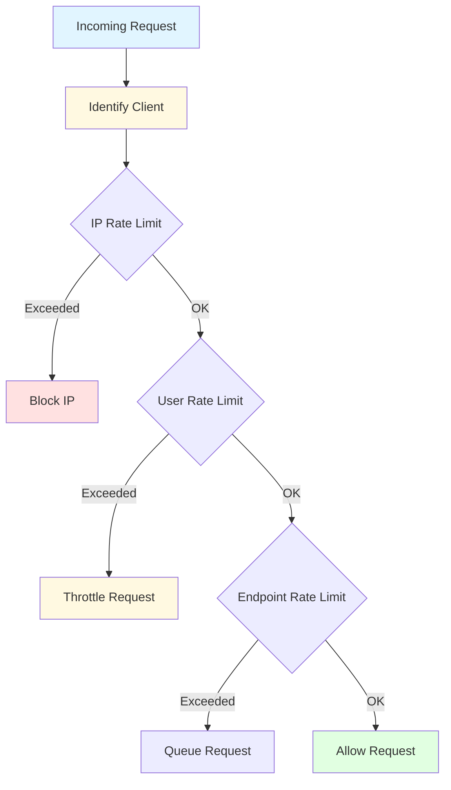
```mermaid
graph TB
    REQUEST[Incoming Request] --> IDENTIFY[Identify Client]
    IDENTIFY --> IP_LIMIT{IP Rate Limit}

    IP_LIMIT -->|Exceeded| BLOCK_IP[Block IP]
    IP_LIMIT -->|OK| USER_LIMIT{User Rate Limit}

    USER_LIMIT -->|Exceeded| THROTTLE[Throttle Request]
    USER_LIMIT -->|OK| ENDPOINT_LIMIT{Endpoint Rate Limit}

    ENDPOINT_LIMIT -->|Exceeded| QUEUE[Queue Request]
    ENDPOINT_LIMIT -->|OK| ALLOW[Allow Request]

    style REQUEST fill:#e1f5ff
    style IDENTIFY fill:#fff9e1
    style ALLOW fill:#e1ffe1
    style BLOCK_IP fill:#ffe1e1
    style THROTTLE fill:#fff9e1
```

### DDoS Mitigation

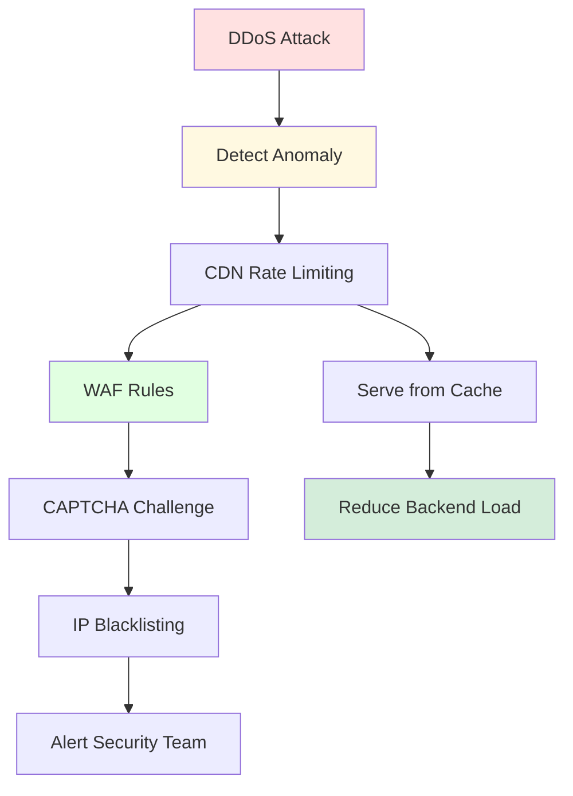
```mermaid
graph TB
    ATTACK[DDoS Attack] --> DETECT[Detect Anomaly]
    DETECT --> CDN[CDN Rate Limiting]
    CDN --> WAF[WAF Rules]
    WAF --> CAPTCHA[CAPTCHA Challenge]
    CAPTCHA --> BLOCK[IP Blacklisting]
    BLOCK --> NOTIFY[Alert Security Team]

    CDN --> CACHE[Serve from Cache]
    CACHE --> REDUCE_LOAD[Reduce Backend Load]

    style ATTACK fill:#ffe1e1
    style DETECT fill:#fff9e1
    style WAF fill:#e1ffe1
    style REDUCE_LOAD fill:#d4edda
```

---

## Security Monitoring

### Security Event Logging

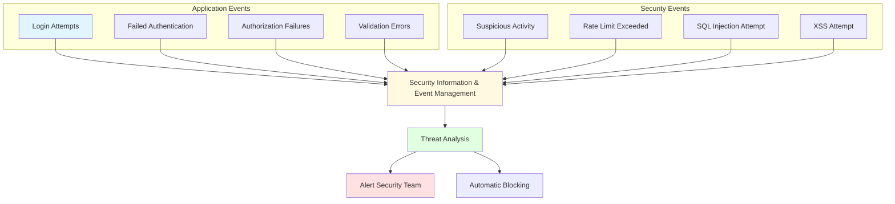
```mermaid
graph TB
    subgraph "Application Events"
        LOGIN[Login Attempts]
        FAILED_AUTH[Failed Authentication]
        AUTHZ_FAILURE[Authorization Failures]
        INPUT_VAL[Validation Errors]
    end

    subgraph "Security Events"
        SUSPICIOUS[Suspicious Activity]
        RATE_LIMIT_HIT[Rate Limit Exceeded]
        SQL_INJECT[SQL Injection Attempt]
        XSS_ATTEMPT[XSS Attempt]
    end

    LOGIN --> SIEM[Security Information & Event Management]
    FAILED_AUTH --> SIEM
    AUTHZ_FAILURE --> SIEM
    INPUT_VAL --> SIEM
    SUSPICIOUS --> SIEM
    RATE_LIMIT_HIT --> SIEM
    SQL_INJECT --> SIEM
    XSS_ATTEMPT --> SIEM

    SIEM --> ANALYZE[Threat Analysis]
    ANALYZE --> ALERT[Alert Security Team]
    ANALYZE --> AUTO_BLOCK[Automatic Blocking]

    style LOGIN fill:#e1f5ff
    style SIEM fill:#fff9e1
    style ANALYZE fill:#e1ffe1
    style ALERT fill:#ffe1e1
```

### Intrusion Detection

```mermaid
sequenceDiagram
    participant Attacker
    participant WAF
    participant IDS
    participant SecurityTeam

    Attacker->>WAF: Malicious Request
    WAF->>IDS: Forward for Analysis
    IDS->>IDS: Pattern Matching
    IDS->>IDS: Anomaly Detection

    alt Threat Detected
        IDS->>WAF: Block Request
        WAF-->>Attacker: 403 Forbidden
        IDS->>SecurityTeam: Alert
    else Normal Traffic
        IDS->>WAF: Allow
        WAF-->>Attacker: Response
    end
```

---

## Compliance & Audit

### Audit Trail

```mermaid
graph TB
    ACTION[User Action] --> LOG[Audit Log]

    LOG --> WHO[Who: User ID]
    LOG --> WHAT[What: Action Performed]
    LOG --> WHEN[When: Timestamp]
    LOG --> WHERE[Where: IP Address]
    LOG --> HOW[How: Request Details]
    LOG --> RESULT[Result: Success/Failure]

    WHO --> STORAGE[Immutable Storage]
    WHAT --> STORAGE
    WHEN --> STORAGE
    WHERE --> STORAGE
    HOW --> STORAGE
    RESULT --> STORAGE

    STORAGE --> RETENTION[90-Day Retention]
    RETENTION --> ARCHIVE[Long-Term Archive]

    style ACTION fill:#e1f5ff
    style LOG fill:#fff9e1
    style STORAGE fill:#e1ffe1
```

### Compliance Requirements

#### GDPR Compliance
- Data encryption at rest and in transit
- Right to access personal data
- Right to erasure (right to be forgotten)
- Data portability
- Consent management
- Breach notification (72 hours)

#### SOC 2 Compliance
- Access controls and authentication
- Encryption of sensitive data
- Security monitoring and logging
- Incident response procedures
- Vendor risk management

#### PCI DSS (if handling payments)
- Secure network architecture
- Protect cardholder data
- Vulnerability management
- Access control measures
- Regular security testing

---

## Incident Response

### Security Incident Workflow

```mermaid
graph TB
    DETECT[Detect Incident] --> ASSESS[Assess Severity]

    ASSESS --> CRITICAL{Severity}

    CRITICAL -->|Critical| IMMEDIATE[Immediate Response]
    CRITICAL -->|High| URGENT[Urgent Response]
    CRITICAL -->|Medium| SCHEDULED[Scheduled Response]
    CRITICAL -->|Low| MONITOR[Monitor]

    IMMEDIATE --> CONTAIN[Contain Threat]
    URGENT --> CONTAIN
    SCHEDULED --> CONTAIN

    CONTAIN --> INVESTIGATE[Investigate]
    INVESTIGATE --> REMEDIATE[Remediate]
    REMEDIATE --> DOCUMENT[Document]
    DOCUMENT --> REVIEW[Post-Mortem Review]

    style DETECT fill:#ffe1e1
    style ASSESS fill:#fff9e1
    style CONTAIN fill:#e1ffe1
    style REVIEW fill:#d4edda
```

---

## Security Best Practices

### Secure Development Lifecycle

1. **Threat Modeling**: Identify potential threats during design
2. **Secure Coding**: Follow secure coding guidelines
3. **Code Review**: Peer review for security issues
4. **Security Testing**: SAST, DAST, penetration testing
5. **Dependency Scanning**: Check for vulnerable dependencies
6. **Deployment**: Secure deployment pipelines
7. **Monitoring**: Continuous security monitoring
8. **Incident Response**: Prepared incident response plan

---

## References

- [Architecture Overview](./overview.md)
- [API Architecture](./api.md)
- [Deployment Architecture](./deployment.md)

---

**Document Version**: 1.0.0
**Last Review**: [Date]
