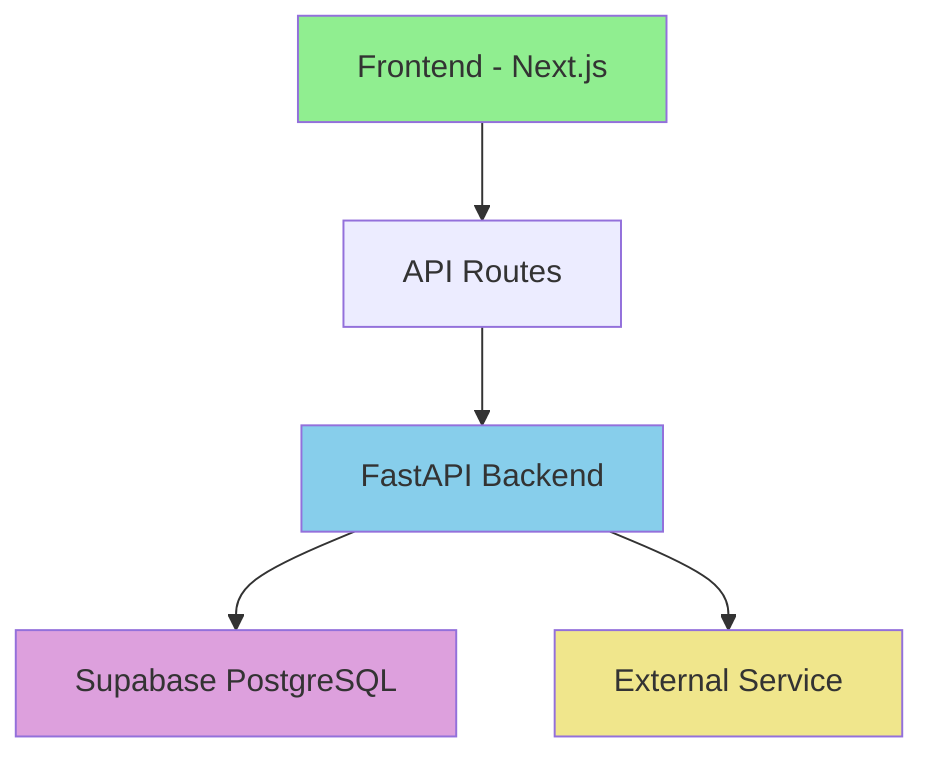
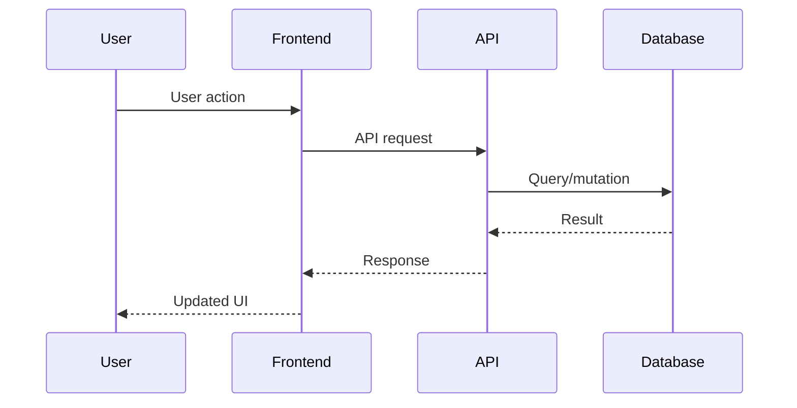

# [Feature Name] - Implementation Plan

## Technical Context

**Stack**:
- Frontend: [Framework - e.g., Next.js 15, React 19]
- Backend: [Framework - e.g., FastAPI, Python 3.11]
- Database: [Database - e.g., Supabase PostgreSQL]
- Authentication: [Auth system - e.g., Supabase Auth]

**External Integrations**:
- [Service 1 - e.g., Stripe for payments]
- [Service 2 - e.g., Eleven Labs for voice]

**Dependencies on Other Features**:
- [001-feature-name]: [What we need from it]
- [002-feature-name]: [What we need from it]

## Architecture

### Component Diagram



### Data Flow



## Database Schema

### Tables

#### `table_name`
**Description**: [What this table stores]

**Columns**:
- `id` (uuid, PK) - Unique identifier
- `field_1` (type) - [Description]
- `field_2` (type) - [Description]
- `created_at` (timestamptz) - Creation timestamp
- `updated_at` (timestamptz) - Last update timestamp

**Indexes**:
- `idx_table_field` on `(field_1)` - [Why this index]

**RLS Policies**:
- SELECT: [Who can read - e.g., "Authenticated users can read own records"]
- INSERT: [Who can create - e.g., "Authenticated users only"]
- UPDATE: [Who can update - e.g., "Users can update own records"]
- DELETE: [Who can delete - e.g., "Only admins"]

#### `related_table`
[Same structure as above]

### Relationships

- `table_name.field_id` → `related_table.id` (FK, CASCADE)
  - **Type**: One-to-Many
  - **Description**: [What this relationship represents]

## API Contracts

### Endpoints

#### `POST /api/feature/action`
**Description**: [What this endpoint does]

**Authentication**: Required (Bearer token)

**Request**:
```json
{
  "param1": "string",
  "param2": 123,
  "param3": {
    "nested": "value"
  }
}
```

**Response** (200 OK):
```json
{
  "success": true,
  "data": {
    "id": "uuid",
    "result": "value"
  }
}
```

**Error Responses**:
- `400 Bad Request`: Invalid input parameters
- `401 Unauthorized`: Missing or invalid authentication
- `403 Forbidden`: Insufficient permissions
- `404 Not Found`: Resource not found
- `500 Internal Server Error`: Server error

#### `GET /api/feature/resource/:id`
[Same structure as above]

## Integration Points

### Integration with [001-feature-name]

**What we use**:
- [Specific data/functionality from that feature]

**How we integrate**:
- [API calls, shared database tables, etc.]

**Example**:
```typescript
// Example integration code
import { getDataFrom001 } from '@/lib/001-feature';

const result = await getDataFrom001(userId);
```

### Integration with [External Service Name]

**What we use**:
- [Specific API or SDK functionality]

**Configuration**:
```typescript
// Environment variables needed
EXTERNAL_API_KEY=xxx
EXTERNAL_WEBHOOK_SECRET=xxx
```

**Example**:
```typescript
// Example external service integration
import ExternalSDK from 'external-sdk';

const client = new ExternalSDK(process.env.EXTERNAL_API_KEY);
```

## Technology Choices

### Choice 1: [Technology/Pattern Name]

**Decision**: [What was chosen - e.g., "Use Server Components for data fetching"]

**Rationale**:
- [Reason 1 - e.g., "Better performance with streaming"]
- [Reason 2 - e.g., "Reduced client-side JavaScript"]
- [Reason 3 - e.g., "Simplified data loading logic"]

**Alternatives Considered**:
- [Alternative 1]: [Why rejected - e.g., "Client-side fetching increases bundle size"]
- [Alternative 2]: [Why rejected]

**Trade-offs**:
- **Pros**: [Advantages of this choice]
- **Cons**: [Disadvantages we accept]

### Choice 2: [Another Technology/Pattern]
[Same structure as above]

## Security Considerations

### Authentication
- [How users authenticate - e.g., "Supabase Auth with JWT tokens"]
- [Session management - e.g., "Server-side session validation"]

### Authorization
- [Who can access what - e.g., "RLS policies enforce user isolation"]
- [Admin vs regular user permissions]

### Data Protection
- [Encryption - e.g., "Data encrypted at rest in Supabase"]
- [PII handling - e.g., "User emails hashed before logging"]
- [Input validation - e.g., "Zod schemas validate all inputs"]

### API Security
- [Rate limiting - e.g., "100 requests per minute per user"]
- [CORS configuration - e.g., "Allow only production domains"]
- [SQL injection prevention - e.g., "Parameterized queries only"]

## Performance Targets

### Response Times
- API endpoints: < 200ms p95
- Page loads: < 2 seconds initial load
- Interactions: < 100ms feedback

### Concurrent Users
- Support: [Number] concurrent users
- Database connections: [Pool size]

### Data Volumes
- Expected records: [Estimate]
- Growth rate: [Estimate]
- Retention: [Policy]

## Monitoring & Observability

### Metrics to Track
- [Metric 1 - e.g., "Request latency by endpoint"]
- [Metric 2 - e.g., "Error rate by error type"]
- [Metric 3 - e.g., "Database query performance"]

### Alerts
- [Alert 1 - e.g., "Error rate > 5% for 5 minutes"]
- [Alert 2 - e.g., "Response time > 1s for 10 minutes"]

### Logging
- [What to log - e.g., "All API requests with user context"]
- [What NOT to log - e.g., "Never log passwords or tokens"]

## Error Handling

### User-Facing Errors
- [Validation errors - e.g., "Show inline form validation"]
- [Network errors - e.g., "Retry with exponential backoff"]
- [Permission errors - e.g., "Redirect to login"]

### System Errors
- [Database errors - e.g., "Log and show generic error to user"]
- [External service failures - e.g., "Graceful degradation"]
- [Unexpected errors - e.g., "Error boundary with retry option"]

## Testing Strategy

### Unit Tests
- [Component tests - e.g., "Test all UI components in isolation"]
- [Function tests - e.g., "Test business logic functions"]

### Integration Tests
- [API tests - e.g., "Test all endpoints with Newman"]
- [Database tests - e.g., "Test migrations and RLS policies"]

### E2E Tests
- [User flows - e.g., "Playwright tests for primary scenarios"]
- [Edge cases - e.g., "Test error handling and recovery"]

---

**Plan Guidelines:**
- Focus on HOW to implement (this is technical, for developers)
- Include all technology choices with rationale
- Provide complete database schema with RLS
- Document all API contracts
- Show integration points clearly
- Address security, performance, monitoring
