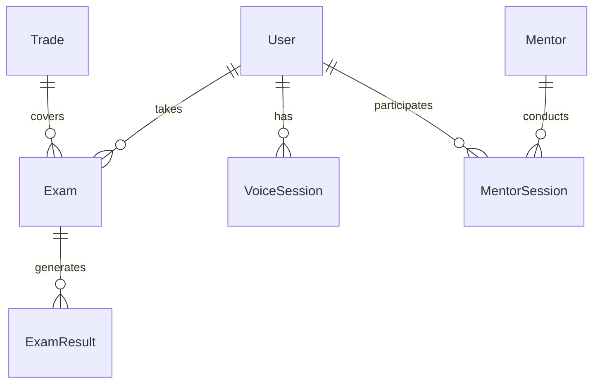
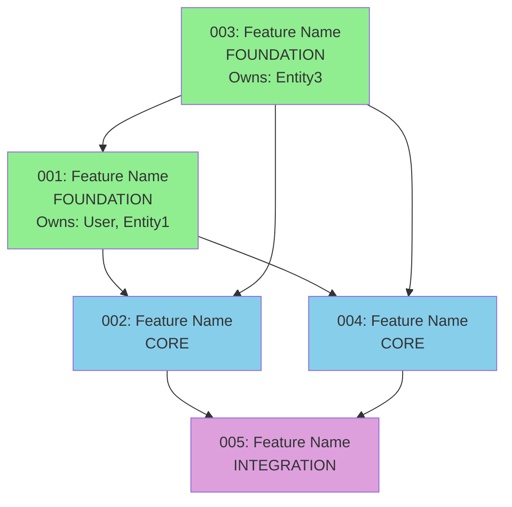

# [Project Name] - Project Overview

**Status**: [Draft/Active/Complete]
**Created**: [Date]
**Tech Stack**: [Framework list]

---

## Description

[2-3 paragraph description of the entire system - what it does, who it's for, what problem it solves]

---

## Features Overview

| # | Feature | Status | Build Phase | Dependencies | Description |
|---|---------|--------|-------------|--------------|-------------|
| 001 | [feature-name] | [Draft/Ready/In Progress/Complete] | 1 (Foundation) | - | [Brief description] |
| 002 | [feature-name] | [Draft/Ready/In Progress/Complete] | 2 (Core) | 001 | [Brief description] |
| 003 | [feature-name] | [Draft/Ready/In Progress/Complete] | 1 (Foundation) | - | [Brief description] |
| 004 | [feature-name] | [Draft/Ready/In Progress/Complete] | 2 (Core) | 001, 003 | [Brief description] |
| 005 | [feature-name] | [Draft/Ready/In Progress/Complete] | 3 (Integration) | 001, 002, 004 | [Brief description] |

**Quick Links**:
- [001-feature-name](./001-feature-name/spec.md)
- [002-feature-name](./002-feature-name/spec.md)
- [003-feature-name](./003-feature-name/spec.md)

---

## Tech Stack

### Frontend
- **Framework**: [Next.js 15, React 19]
- **Styling**: [Tailwind CSS, shadcn/ui]
- **State**: [Server Components, React hooks]

### Backend
- **Framework**: [FastAPI, Python 3.11]
- **Database**: [Supabase PostgreSQL]
- **Authentication**: [Supabase Auth]

### AI & Integrations
- **AI SDK**: [Vercel AI SDK, Claude, GPT-4]
- **Memory**: [Mem0 Platform/OSS]
- **Voice**: [Eleven Labs] (if applicable)
- **Payments**: [Stripe] (if applicable)

### Infrastructure
- **Hosting**: [Vercel (frontend), Fly.io (backend)]
- **Database**: [Supabase Cloud]
- **CDN**: [Vercel Edge Network]

---

## User Types

| User Type | Role | Primary Actions |
|-----------|------|-----------------|
| [User Type 1] | [Description] | [Key actions they perform] |
| [User Type 2] | [Description] | [Key actions they perform] |
| [User Type 3] | [Description] | [Key actions they perform] |

---

## Data Architecture

### Core Entities & Ownership

**Foundation Entities** (owned by Phase 1 specs):
- **User** → Owned by `001-[feature-name]`
  - Used by: 002, 003, 004, 005
  - Purpose: [Description]
- **[Entity]** → Owned by `003-[feature-name]`
  - Used by: 001, 004
  - Purpose: [Description]

**Core Entities** (owned by Phase 2 specs):
- **[Entity]** → Owned by `002-[feature-name]`
  - Used by: 005
  - Purpose: [Description]

**Integration Entities** (owned by Phase 3 specs):
- **[Entity]** → Owned by `005-[feature-name]`
  - Purpose: [Description]

### Entity Relationships



---

## Build Order & Phases

### ✅ Phase 1: Foundation (Build First)

**Must be completed before other features:**

- **001-[feature-name]**
  - Owns: [User, Entity1, Entity2]
  - Dependencies: None
  - Build time: ~X hours
  - Why first: All other features depend on these core entities

- **003-[feature-name]**
  - Owns: [Entity3, Entity4]
  - Dependencies: None
  - Build time: ~X hours
  - Why first: Multiple features reference this data

**Why Phase 1 First**: These specs own the foundational data entities. All other specs create foreign keys to these tables.

---

### ⚠️ Phase 2: Core Features (Build After Phase 1)

**Requires Phase 1 complete:**

- **002-[feature-name]**
  - Owns: [Entity5, Entity6]
  - References: User (from 001), Entity3 (from 003)
  - Dependencies: 001, 003
  - Build time: ~X hours
  - Why second: References Phase 1 tables via foreign keys

- **004-[feature-name]**
  - Owns: [Entity7]
  - References: User (from 001), Entity3 (from 003)
  - Dependencies: 001, 003
  - Build time: ~X hours
  - Why second: Builds on Phase 1 foundation

**Why Phase 2 Second**: These features create tables that reference Phase 1 entities. Cannot build migrations until Phase 1 tables exist.

---

### 🔗 Phase 3: Integration Features (Build Last)

**Requires Phase 1 + 2 complete:**

- **005-[feature-name]**
  - Owns: [Entity8, Entity9]
  - References: User (from 001), Entity5 (from 002), Entity7 (from 004)
  - Dependencies: 001, 002, 004
  - Build time: ~X hours
  - Why last: Connects multiple features together

**Why Phase 3 Last**: These features integrate data and functionality from multiple other specs. All dependencies must exist first.

---

## Dependency Graph

### Full Project Dependencies



**Legend**:
- 🟢 Green = Phase 1 (Foundation)
- 🔵 Blue = Phase 2 (Core)
- 🟣 Purple = Phase 3 (Integration)

### Critical Path

**Longest dependency chain** (determines minimum project timeline):

```
003-[feature] → 001-[feature] → 004-[feature] → 005-[feature]
```

**Estimated Critical Path Time**: [X hours/days]

---

## Parallel Work Opportunities

### Can Build Simultaneously:
- **Phase 1**: 001 and 003 have NO dependencies - build in parallel
- **Phase 2**: 002 and 004 both depend on (001 + 003) - build in parallel once Phase 1 complete
- **Phase 3**: 005 must wait for all previous phases

### Optimal Build Strategy:
1. Start 001 and 003 simultaneously (parallel)
2. Wait for both to complete
3. Start 002 and 004 simultaneously (parallel)
4. Wait for both to complete
5. Build 005 (final integration)

**Maximum parallelism**: 2 features at once
**Minimum timeline**: Critical path + parallel speedup

---

## Integration Map

### How Features Connect

**001-[feature-name]** integrates with:
- ← 002 (uses User entity)
- ← 004 (uses User entity)
- ← 005 (uses User entity)
- → 003 (references Entity3)

**002-[feature-name]** integrates with:
- → 001 (references User)
- → 003 (references Entity3)
- ← 005 (Entity5 used by 005)

**External Integrations**:
- Eleven Labs API (002-voice-feature)
- Stripe API (005-payment-feature)
- Mem0 Platform (001-core-feature)

---

## Next Steps

### For NEW Projects:
1. Review this overview
2. Start Phase 1 specs: `/planning:add-spec` or directly implement
3. Complete Phase 1 before moving to Phase 2
4. Follow dependency graph order

### For EXISTING Projects:
1. Run `/planning:analyze-project` to check completeness
2. Identify missing specs or incomplete implementations
3. Follow build order for new features

### Testing Strategy:
1. **Unit tests**: Each feature tests own functionality
2. **Integration tests**: Phase 2/3 test FK relationships work
3. **E2E tests**: Full user flows across features

---

## Project Files

- **Specs**: Individual feature specifications in `specs/XXX-feature-name/`
- **Planning Data**: `.planning/project-specs.json` (machine-readable)
- **Roadmap**: `docs/ROADMAP.md` (timeline and milestones)
- **Architecture**: `docs/architecture/` (technical diagrams)

---

**Last Updated**: [Date]
**Total Features**: [N]
**Completion**: [X%]
